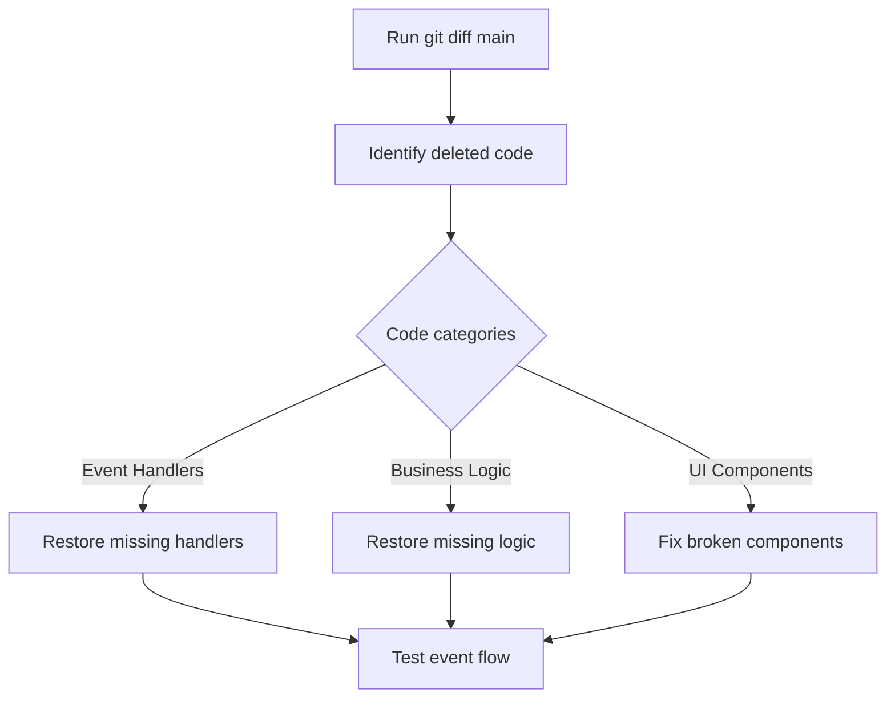

# Forge TUI Refactor Assessment & Recovery Plan

## Executive Summary

The TUI executor has been refactored from a single large file into multiple focused files. While the code structure appears sound, there are potential issues with event handling, overlay functionality, and possibly missing business logic that need investigation and remediation.

## Current State Analysis

### What Was Done ✅

The refactor successfully split `pkg/executor/tui/executor.go` into:

1. **executor.go** (100 lines) - Main executor and lifecycle
2. **model.go** (120 lines) - Core model structure  
3. **init.go** (60 lines) - Initialization logic
4. **update.go** (453 lines) - Bubble Tea Update function
5. **view.go** (290 lines) - Bubble Tea View rendering
6. **events.go** (425 lines) - Agent event processing
7. **helpers.go** (115 lines) - Utility functions
8. **styles.go** (141 lines) - Color schemes

Additional specialized files:
- **overlay.go** - Overlay system management
- **approval_overlay.go** - Generic approval overlays
- **diff_viewer.go** - Diff approval viewer
- **command_overlay.go** - Command execution overlay
- **result_display.go** - Tool result summarization
- **result_cache.go** - Result caching
- **slash_commands.go** - Slash command handling
- **bash_commands.go** - Bash mode support
- And ~15 more specialized files

### Code Quality Observations

**Positives:**
- Files are well-organized and focused
- Helper functions are being used consistently
- Overlay system has clear interface design
- Event handling is centralized in events.go
- Proper separation of concerns

**Concerns:**
- No obvious TODO/FIXME markers found (could indicate incomplete work was removed)
- Event flow through Update() → handleKeyPress() → overlay.Update() appears correct
- Overlay activation/deactivation logic seems sound but needs runtime verification

## Reported Issues 🚨

From user feedback:
1. **Events not firing or missing** - Some events may not be properly wired
2. **Overlays sometimes crash** - Potential nil pointer or state management issues  
3. **Lost business logic** - Some functionality from main branch may be missing
4. **UI not working well** - General usability problems

## Investigation Findings

### Event Handler Analysis

The event handling flow appears structurally sound:

```
AgentEvent → Update() → handleAgentEvent() → specific handlers
KeyMsg → Update() → handleKeyPress() → overlay updates OR app shortcuts
```

**Potential Issues:**
- Event handlers exist but may have incomplete logic
- Overlay Update() methods return (Overlay, tea.Cmd) - if returning nil, overlay closes
- Window resize events may not propagate to all overlays properly

### Overlay System Analysis

**Good:**
- Clear Overlay interface with Update/View/Focused/Width/Height methods
- Consistent activation via `overlay.activate(mode, overlayInstance)`
- Proper deactivation and nil checking in `isActive()`

**Potential Problems:**
- If overlay.overlay is nil when isActive() is true, creates inconsistent state
- Missing window resize handling in some overlay Update() methods could cause crashes
- Response callbacks in approval overlays use closures - need to verify channel safety

### Missing Functionality Detection

Without git diff against main, I cannot definitively identify lost logic. **Critical need**: Compare with main branch to find:
- Removed event handlers
- Missing approval workflow steps  
- Deleted helper methods
- Changed state management logic

## Recovery Plan

### Phase 1: Immediate Investigation (Priority: CRITICAL)



#### Task 1.1: Git Comparison Analysis
**Commands to run:**
```bash
git branch --show-current
git diff main --stat
git diff main pkg/executor/tui/ > tui_changes.diff
git log --oneline -20
```

**Deliverable:** Complete diff analysis document identifying:
- Lines added/removed per file
- Functions that were deleted entirely
- Logic that was simplified/removed
- State fields that were removed from model

#### Task 1.2: Build & Runtime Testing
```bash
go build ./...
go test ./pkg/executor/tui/...
# Manual TUI testing with debug logging enabled
```

**Test scenarios:**
1. Tool approval request → overlay appears → accept/reject works
2. Command execution → output streams → completes
3. Window resize → no crashes → overlays adapt
4. Result caching → Ctrl+V shows last result → Ctrl+L shows history
5. Slash commands → preview appears → execution works

### Phase 2: Specific Issue Remediation

#### Issue 2.1: Event Handler Gaps

**Investigation:**
- [ ] Compare event types in `types.AgentEvent` with handlers in `handleAgentEvent()`
- [ ] Verify all event cases have implementations (not just logging)
- [ ] Check for events that trigger overlays - ensure overlay creation succeeds

**Common missing patterns:**
```go
// BAD - handler exists but does nothing
case types.EventTypeSomething:
    debugLog.Printf("Processing EventTypeSomething")
    // Missing actual processing logic!

// GOOD - handler has business logic
case types.EventTypeSomething:
    debugLog.Printf("Processing EventTypeSomething")
    m.handleSomething(event)  // Actual implementation
```

#### Issue 2.2: Overlay Crash Prevention

**Root causes to check:**
1. Nil pointer when overlay.overlay is accessed
2. Missing Focused() implementation causing interface violations
3. Window resize not handled in overlay Update()
4. Response callbacks accessing deallocated channels

**Fixes needed:**
```go
// Add defensive nil checks
if m.overlay.isActive() && m.overlay.overlay != nil {
    updated, cmd := m.overlay.overlay.Update(msg)
    // ... rest of logic
}

// Ensure all overlays handle WindowSizeMsg
func (o *SomeOverlay) Update(msg tea.Msg) (Overlay, tea.Cmd) {
    switch msg := msg.(type) {
    case tea.WindowSizeMsg:
        return o.handleResize(msg)  // Must implement
    // ... other cases
    }
}
```

#### Issue 2.3: Lost Business Logic Recovery

**Process:**
1. Use git diff to find removed functions
2. For each removed function:
   - Determine if intentionally removed (duplicate/unused)
   - Or accidentally removed (still needed)
3. Restore needed functions with proper integration

**Common scenarios:**
- Approval timeout handling
- Tool result caching logic
- State synchronization between components  
- Error recovery workflows

### Phase 3: Testing & Validation

#### Unit Tests
- [ ] All overlay Update() methods handle WindowSizeMsg
- [ ] All overlay Update() methods handle KeyMsg for close (Esc/q)
- [ ] Event handlers properly update model state
- [ ] Response callbacks don't deadlock on channels

#### Integration Tests  
- [ ] Full approval workflow: request → display → respond → execute
- [ ] Command execution: start → stream output → complete → display
- [ ] Result caching: execute tool → cache → retrieve → display
- [ ] Slash commands: parse → preview → approve → execute

#### Manual Testing Checklist
- [ ] Start TUI - no crashes on init
- [ ] Send message - agent responds
- [ ] Tool requires approval - overlay appears
- [ ] Accept tool - executes correctly
- [ ] Reject tool - cancels correctly  
- [ ] Resize window - no crashes
- [ ] Ctrl+V - shows last result
- [ ] Ctrl+L - shows result list
- [ ] Slash command - shows preview
- [ ] Help overlay (?) - displays correctly
- [ ] Settings overlay - saves changes

## Prioritization Matrix

| Issue | Severity | Impact | Effort | Priority |
|-------|----------|--------|--------|----------|
| Missing event handlers | HIGH | HIGH | MEDIUM | P0 |
| Overlay crashes | HIGH | HIGH | LOW | P0 |
| Lost approval logic | HIGH | MEDIUM | MEDIUM | P1 |
| Result caching gaps | MEDIUM | MEDIUM | LOW | P2 |
| UI polish issues | LOW | LOW | LOW | P3 |

## Recommended Next Steps

### Immediate Actions (Today)

1. **Run git comparison** to get concrete diff data
   ```bash
   git diff main --stat > refactor_stats.txt
   git diff main pkg/executor/tui/ > refactor_diff.txt
   ```

2. **Test compilation**
   ```bash
   go build ./...
   go test ./pkg/executor/tui/... -v
   ```

3. **Enable debug logging** and test basic workflows
   - Look for event handler gaps in debug output
   - Identify which overlays fail to appear
   - Note any nil pointer panics

### Short Term (This Week)

1. Create detailed findings document from git diff
2. Restore any critical missing business logic
3. Fix overlay crash issues with defensive nil checks
4. Add window resize handling to all overlays
5. Verify all event types have complete handlers

### Medium Term (Next Sprint)

1. Add comprehensive integration tests
2. Create regression test suite for TUI functionality
3. Document expected behavior for each overlay
4. Add error recovery for edge cases
5. Performance profiling and optimization

## Success Criteria

The refactor recovery is complete when:

- ✅ All tests pass (unit + integration)
- ✅ No crashes during normal usage
- ✅ All event types have working handlers
- ✅ All overlays display and respond correctly
- ✅ Approval workflows complete end-to-end
- ✅ Result caching works as expected
- ✅ Slash commands execute properly
- ✅ Window resizing doesn't break UI
- ✅ All business logic from main is present
- ✅ Code review approval from team

## Conclusion

The refactor structure is solid, but needs careful comparison with main branch to identify and restore any lost functionality. The primary focus should be on ensuring event handlers are complete, overlays handle all edge cases, and critical business logic wasn't accidentally removed during the split.

**Recommendation:** Switch to Code mode and systematically work through the investigation and remediation steps outlined above.