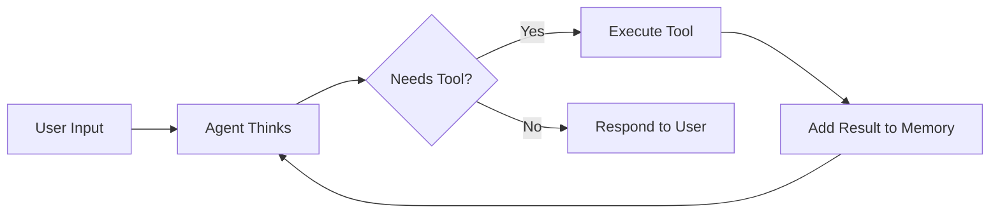

# Frequently Asked Questions (FAQ)

Common questions and answers about Forge.

## Table of Contents

- [General Questions](#general-questions)
- [Getting Started](#getting-started)
- [Architecture](#architecture)
- [Tools](#tools)
- [Memory](#memory)
- [Providers](#providers)
- [Performance](#performance)
- [Deployment](#deployment)
- [Troubleshooting](#troubleshooting)
- [Contributing](#contributing)

---

## General Questions

### What is Forge?

Forge is a lightweight Go framework for building AI agents. It provides the core components (agent loop, tools, memory, providers) while staying flexible and easy to use.

### Why use Forge instead of building from scratch?

Forge handles the complex parts:
- ✅ Agent loop with thinking and tool use
- ✅ Memory management with automatic pruning
- ✅ Error recovery and circuit breakers
- ✅ Tool parameter validation
- ✅ Provider abstraction

You focus on your application logic and custom tools.

### What makes Forge different from other frameworks?

**Forge is:**
- 🪶 **Lightweight:** Minimal dependencies, small footprint
- 🔧 **Flexible:** Interface-driven, not opinionated
- 🎯 **Focused:** Does agent loop well, nothing more
- 🧪 **Testable:** Easy to mock and test
- 📖 **Simple:** Clear code, good docs

**Forge is not:**
- ❌ A complete application framework
- ❌ Opinionated about your architecture
- ❌ Batteries-included with 100 tools

### What languages does Forge support?

Forge is written in Go and designed for Go applications. However, agents can:
- Use tools written in any language (via HTTP/gRPC)
- Generate code in any language
- Work with any data format

### Is Forge production-ready?

Version 0.1.0 provides stable core features. We recommend:
- ✅ Use for new projects
- ✅ Build prototypes and MVPs
- ⚠️ Test thoroughly for production
- ⚠️ Monitor closely in early deployment

---

## Getting Started

### What do I need to get started?

**Required:**
- Go 1.21 or later
- OpenAI API key (or compatible provider)

**Recommended:**
- Basic understanding of Go
- Familiarity with LLMs
- 15 minutes to complete quick start

### How long does it take to learn?

**Timeline:**
- **5 minutes:** Basic agent running
- **30 minutes:** Custom tool working
- **2 hours:** Production-ready agent
- **1 day:** Deep understanding

### Can I use Forge without OpenAI?

Yes! Forge supports OpenAI-compatible APIs:
- Anyscale
- Together AI
- LocalAI (self-hosted)
- Ollama (local models)

See [Provider Configuration](how-to/configure-provider.md).

### Do I need to know Go well?

Basic Go knowledge is sufficient:
- Struct and interface basics
- Error handling
- Context package (helpful)

Most users learn as they go.

---

## Architecture

### How does the agent loop work?



See [Agent Loop Architecture](architecture/agent-loop.md).

### Why always use the agent loop?

The agent loop enables:
- Multi-step reasoning
- Tool use
- Error recovery
- Consistent behavior

Even simple tasks benefit from this structure.

### Can agents use multiple tools?

Yes! Agents can:
- Use multiple tools in sequence
- Chain tool results
- Switch between tools based on results
- Use tools multiple times

### What's the maximum conversation length?

Limited by:
1. **Model context window** (e.g., GPT-4: 8K tokens)
2. **Memory configuration** (you control this)

Memory automatically prunes old messages to stay within limits.

---

## Tools

### How do I create a custom tool?

See [How to Create a Custom Tool](how-to/create-custom-tool.md).

Basic steps:
1. Implement `Tool` interface
2. Define parameters with JSON Schema
3. Implement `Execute()` logic
4. Test thoroughly
5. Register with agent

### What tools come built-in?

Three essential tools:
1. **task_completion:** Finish and return result
2. **ask_question:** Ask user for input
3. **converse:** Continue conversation

You add domain-specific tools.

### Can tools call other tools?

Tools themselves don't call other tools directly. Instead:
- Tool returns result
- Agent decides next action
- Agent may call another tool

This keeps tools simple and testable.

### How do I handle long-running tools?

Use context with timeout:

```go
func (t *LongTool) Execute(ctx context.Context, args map[string]interface{}) (string, error) {
    // Respect context cancellation
    if err := ctx.Err(); err != nil {
        return "", err
    }
    
    // Long operation
    result := doWork(ctx)
    return result, nil
}
```

### Can tools access external APIs?

Yes! Tools commonly:
- Call REST APIs
- Query databases
- Read/write files
- Execute commands
- Access cloud services

Just handle errors properly.

---

## Memory

### How much memory should I allocate?

**Rule of thumb:** 70-80% of model's context window

| Model | Context | Recommended Memory |
|-------|---------|-------------------|
| GPT-4 | 8K | 6,000 tokens |
| GPT-4-32K | 32K | 28,000 tokens |
| GPT-3.5 | 4K | 3,000 tokens |

### What happens when memory is full?

Automatic pruning:
1. System message is preserved
2. Oldest messages removed first
3. Recent context maintained

### Can I persist conversations?

Currently in-memory only. Coming in v0.3.0:
- Redis backend
- PostgreSQL backend
- SQLite backend

For now, implement custom Memory interface.

### How do I clear memory between users?

```go
// Between sessions
if newUser {
    memory.Clear()
}

// Preserve system message
systemMsg := memory.GetMessages()[0]
memory.Clear()
memory.Add(systemMsg)
```

---

## Providers

### Which providers are supported?

**Current (v0.1.0):**
- OpenAI (GPT-4, GPT-3.5)
- OpenAI-compatible APIs

**Planned (v0.2.0):**
- Anthropic (Claude 3)
- Local models (Ollama, llama.cpp)
- Azure OpenAI

### How do I switch providers?

Change provider initialization:

```go
// OpenAI
provider := openai.NewProvider("gpt-4", apiKey)

// Anyscale
provider := openai.NewProvider(
    "meta-llama/Llama-2-70b",
    apiKey,
    openai.WithBaseURL("https://api.endpoints.anyscale.com/v1"),
)
```

### Can I use multiple providers?

Yes, create multiple agents or implement custom provider that routes:

```go
type MultiProvider struct {
    primary   Provider
    fallback  Provider
}

func (m *MultiProvider) Complete(ctx context.Context, messages []Message) (*Response, error) {
    resp, err := m.primary.Complete(ctx, messages)
    if err != nil {
        return m.fallback.Complete(ctx, messages)
    }
    return resp, nil
}
```

### How do I reduce API costs?

1. **Use cheaper models** for simple tasks
2. **Limit context** size
3. **Set max tokens** for responses
4. **Reduce iterations** when possible
5. **Cache** repeated queries

See [Performance Optimization](how-to/optimize-performance.md).

---

## Performance

### How fast is Forge?

**Overhead:** < 10ms (negligible compared to LLM latency)

**Total latency depends on:**
- Model choice (GPT-3.5: ~1-2s, GPT-4: ~5-10s)
- Context size (more tokens = slower)
- Number of iterations

### How many requests can Forge handle?

**Single instance:** 100-1000 req/sec (CPU-bound)

**Scaling:**
- Horizontal: Run multiple instances
- Vertical: Increase CPU/memory
- Rate limiting: Control API usage

### How much memory does Forge use?

**Baseline:** ~10-50 MB per agent

**Scales with:**
- Conversation memory size
- Number of tools
- Number of concurrent requests

### Can I use Forge in serverless?

Yes! Works well in:
- AWS Lambda
- Google Cloud Functions
- Azure Functions

Cold start: ~100-500ms

---

## Deployment

### How do I deploy to production?

See [How to Deploy to Production](how-to/deploy-production.md).

Key steps:
1. Environment-based configuration
2. Secure secret management
3. Structured logging
4. Health checks
5. Monitoring and metrics

### What about Docker?

Example Dockerfile included in docs. Works great:
- Small Alpine-based image (~20MB)
- Multi-stage build
- Non-root user
- Health checks

### Does Forge work with Kubernetes?

Yes! Example manifests in docs:
- Deployment with replicas
- Service with load balancing
- Secret management
- Health/readiness probes
- Resource limits

### How do I monitor production agents?

**Metrics:**
- Request rate and latency
- Error rate
- Token usage
- Cost tracking

**Tools:**
- Prometheus + Grafana
- CloudWatch
- Datadog
- Custom dashboards

---

## Troubleshooting

### "Invalid API key" error

**Solutions:**
1. Check `OPENAI_API_KEY` is set
2. Verify key starts with `sk-`
3. Test key: `echo $OPENAI_API_KEY`
4. Ensure no extra spaces

### Agent not using my tool

**Check:**
1. Tool name is clear and descriptive
2. Description explains when to use it
3. Parameters are well-defined
4. Tool is registered with agent

### "Context length exceeded" error

**Solutions:**
1. Reduce memory limit
2. Shorten system prompt
3. Prune memory more aggressively
4. Use model with larger context

### Tool execution fails

**Debug:**
1. Check tool parameters are valid
2. Verify argument types
3. Test tool in isolation
4. Check logs for errors
5. Ensure tool handles context cancellation

### High API costs

**Optimize:**
1. Use GPT-3.5 instead of GPT-4
2. Reduce context size
3. Limit max tokens
4. Reduce iterations
5. Add response caching

### Memory leak

**Check:**
1. Clear memory between sessions
2. Set reasonable memory limits
3. Monitor memory usage
4. Look for unbounded data structures

---

## Contributing

### How can I contribute?

**Ways to contribute:**
1. Report bugs
2. Suggest features
3. Improve documentation
4. Submit PRs
5. Help other users

See [CONTRIBUTING.md](../CONTRIBUTING.md).

### What makes a good issue?

**Include:**
- Clear description
- Steps to reproduce (for bugs)
- Expected vs actual behavior
- Environment details
- Code samples (if relevant)

### What makes a good PR?

**Checklist:**
- [ ] Tests included
- [ ] Docs updated
- [ ] Follows code style
- [ ] Atomic commits
- [ ] Clear description

### How do I get help?

**Channels:**
1. Check this FAQ
2. Search existing issues
3. Read documentation
4. Open discussion
5. Ask in community

### Can I use Forge commercially?

Yes! MIT license allows:
- ✅ Commercial use
- ✅ Modification
- ✅ Distribution
- ✅ Private use

**Requirements:**
- Include license notice
- Include copyright notice

---

## More Questions?

- **Documentation:** [docs/README.md](README.md)
- **Discussions:** [GitHub Discussions](https://github.com/yourusername/forge/discussions)
- **Issues:** [GitHub Issues](https://github.com/yourusername/forge/issues)
- **Examples:** [examples/](../examples/)

Can't find an answer? Open a discussion!