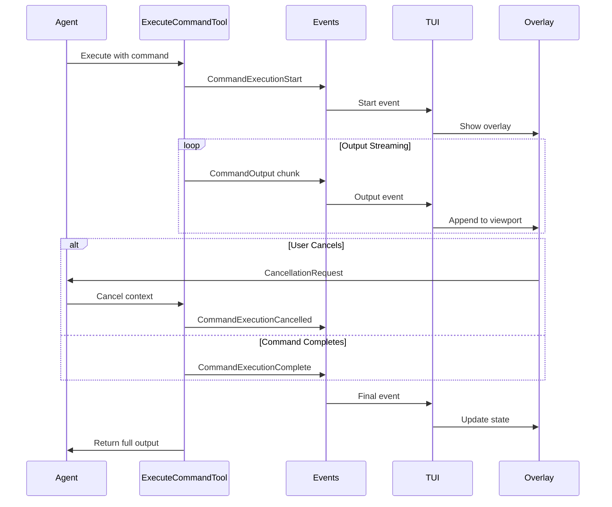

# 13. Streaming Command Execution with Interactive Overlay

**Status:** Proposed
**Date:** 2025-11-08
**Deciders:** Development Team
**Technical Story:** Implementation of real-time command output streaming with user-controllable cancellation for the TUI executor

---

## Context

The Forge TUI executor currently executes shell commands synchronously through the `execute_command` tool, collecting all output and returning it only after the command completes. This approach works for quick commands but provides poor user experience for long-running operations.

### Background

Modern development workflows often involve commands that take significant time to complete:
- Package installations (`npm install`, `pip install`, `go mod download`)
- Build processes (`npm run build`, `go build`, `cargo build`)
- Test suites (`npm test`, `go test ./...`)
- Database migrations and seeding operations
- File processing and code generation tasks

During these operations, users have no visibility into progress and cannot interrupt operations if needed. This creates a frustrating experience where the agent appears frozen or unresponsive.

### Problem Statement

The current synchronous command execution model lacks:
- Real-time feedback on command progress and output
- Visibility into what's happening during long-running operations
- Ability to cancel or interrupt commands once started
- Clear indication that the agent is actively processing vs. hung
- Standard error output visibility during execution (not just at completion)

### Goals

- Provide real-time streaming of command output (stdout/stderr) to the TUI
- Enable users to cancel running commands via keyboard interaction
- Maintain clean separation between normal conversation flow and command execution
- Use familiar UI patterns (overlay) for command output display
- Preserve all command output for the agent's context after completion
- Support both interactive and non-interactive command scenarios

### Non-Goals

- Command output history or replay functionality
- Multiple simultaneous command executions
- Command output filtering or search
- Execution pause/resume capabilities
- Integration with terminal multiplexers or external terminal emulators

---

## Decision Drivers

* **User Experience**: Users need visual feedback during long operations to understand system state
* **Responsiveness**: The UI should remain responsive during command execution
* **Control**: Users should be able to interrupt undesired or runaway commands
* **Consistency**: Command execution should follow established TUI patterns (similar to tool approval overlay)
* **Simplicity**: Implementation should leverage existing event system and channel architecture
* **Maintainability**: Solution should be straightforward to test and debug

---

## Considered Options

### Option 1: Synchronous Execution with Spinner

**Description:** Keep current synchronous execution but add a loading spinner or progress indicator in the conversation area.

**Pros:**
- Minimal code changes required
- Simple implementation
- No new event types needed
- Consistent with current architecture

**Cons:**
- No visibility into actual command output
- Cannot cancel running commands
- Poor experience for commands with meaningful progress output
- Doesn't solve the core problem of lack of feedback

### Option 2: Background Execution with Notifications

**Description:** Execute commands in background goroutines and notify user on completion via message events.

**Pros:**
- Agent can continue processing while command runs
- Non-blocking for agent loop
- Familiar notification pattern

**Cons:**
- No real-time output visibility
- Complex state management for multiple background commands
- Difficult to provide cancellation mechanism
- Output might arrive out of context in conversation
- Doesn't match user's request for streaming feedback

### Option 3: Streaming with Interactive Overlay

**Description:** Stream command output in real-time via events to a dedicated overlay UI component with cancellation controls.

**Pros:**
- Real-time visibility into command execution
- Dedicated UI space prevents conversation clutter
- Interactive controls (cancel, close) built into overlay
- Leverages existing overlay pattern from tool approval
- Clean separation of concerns
- Familiar terminal-like output display
- Agent receives complete output after execution

**Cons:**
- More complex implementation
- Requires new event types and channel for cancellation
- Tool execution becomes async with event streaming
- Additional testing scenarios needed

---

## Decision

**Chosen Option:** Option 3 - Streaming with Interactive Overlay

### Rationale

The streaming overlay approach best addresses user needs while maintaining architectural consistency:

1. **Real-time Feedback**: Users see command output as it happens, matching expectations from direct terminal use
2. **Interactive Control**: Overlay provides cancel button and keyboard shortcuts (Ctrl+C, Esc) for command termination
3. **Clean UI Separation**: Overlay keeps command output separate from conversation flow, preventing clutter
4. **Architectural Consistency**: Follows established patterns from tool approval overlay (ADR-0010) and event streaming
5. **Preserves Context**: Complete output is still captured and returned to agent after command completes
6. **Extensibility**: Foundation for future enhancements like output filtering or command templates

The implementation aligns with the existing event-driven architecture (ADR-0005) and TUI design principles (ADR-0009).

---

## Consequences

### Positive

- Significantly improved user experience during long-running commands
- Users can monitor command progress and identify issues quickly
- Ability to cancel runaway or mistaken commands prevents wasted time
- Familiar overlay UI pattern reduces learning curve
- Streaming architecture enables future enhancements (progress bars, etc.)
- Better debugging capabilities when commands fail
- Agent receives richer context from command execution flow

### Negative

- Increased complexity in execute_command tool implementation
- Additional goroutines and synchronization for output streaming
- New event types add to event handler complexity
- Cancellation channel requires careful lifecycle management
- Testing requires more scenarios (streaming, cancellation, edge cases)
- Slightly higher memory usage for buffering output chunks

### Neutral

- Command execution time unchanged (just visibility improved)
- Tool results still returned to agent in same format
- Overlay temporarily blocks user input (consistent with approval overlay)
- Single command execution at a time (matches current behavior)

---

## Implementation

### Event System Extensions

Add five new event types to `pkg/types/event.go`:

```go
EventTypeCommandExecutionStart     // Command begins execution
EventTypeCommandOutput              // Buffered stdout/stderr chunk
EventTypeCommandExecutionComplete   // Command finished successfully
EventTypeCommandExecutionFailed     // Command failed with error
EventTypeCommandExecutionCancelled  // User cancelled command
```

Each `CommandOutput` event includes:
- Output content (buffered chunk)
- Stream type (stdout/stderr)
- Timestamp
- Running total line count

### Cancellation Channel

Add to agent channels structure:

```go
type AgentChannels struct {
    Event    chan *AgentEvent
    Input    chan *UserInput
    Approval chan *ApprovalResponse
    Cancel   chan *CancellationRequest  // New
}
```

### Tool Execution Flow



### Output Buffering Strategy

- **Buffer Size**: 1KB or 100ms intervals (whichever comes first)
- **Chunk Format**: Preserve line boundaries when possible
- **Stream Handling**: Separate goroutines for stdout and stderr
- **Error Handling**: Continue buffering on read errors, report in final event

### Overlay Component

New file `pkg/executor/tui/command_overlay.go`:

```go
type CommandExecutionOverlay struct {
    command      string
    viewport     viewport.Model
    output       strings.Builder
    state        ExecutionState  // running/completed/failed/cancelled
    exitCode     int
    cancelFunc   func()
}
```

**Features:**
- Scrollable viewport for output (full terminal height - header/footer)
- Header showing command being executed
- Status indicator with appropriate emoji (🔄 running, ✓ success, ✗ failed, ⊗ cancelled)
- Footer with controls: `[Ctrl+C] Cancel` `[Esc] Close`
- Auto-scroll to bottom as new output arrives
- Colored output for stderr (red tint)

### Migration Path

Changes are backward compatible:
- Existing synchronous behavior maintained for non-TUI executors
- CLI executor continues to work unchanged
- TUI executor gains new overlay functionality
- Tools don't require modification to work with either mode

### Timeline

Implementation phases:
1. **Phase 1**: Event types and channel infrastructure (1-2 days)
2. **Phase 2**: Tool modifications for streaming (2-3 days)
3. **Phase 3**: Overlay component and UI integration (2-3 days)
4. **Phase 4**: Testing and refinement (1-2 days)

**Total Estimated**: 6-10 days

---

## Validation

### Success Metrics

- Command output appears in TUI within 100ms of being written by command
- Cancellation terminates command within 1 second
- No memory leaks from long-running commands or large output
- UI remains responsive during command execution
- All output chunks are received in correct order
- Final tool result matches accumulated output

### Monitoring

- Performance metrics for event emission rate during streaming
- Memory usage during commands with large output volumes
- User feedback on responsiveness and cancellation reliability
- Edge case handling (binary output, non-UTF8, control sequences)

### Testing Scenarios

1. Quick commands (< 1 second) - verify overlay shows and dismisses cleanly
2. Long-running commands (npm install) - verify streaming and auto-scroll
3. Commands with heavy output (find large directory) - verify buffering
4. Commands writing to stderr - verify error output appears distinctly
5. User cancellation - verify clean termination and cleanup
6. Failed commands - verify error state and exit code display
7. Multiple sequential commands - verify overlay resets between executions

---

## Related Decisions

- [ADR-0005](0005-channel-based-agent-communication.md) - Channel-based communication enables cancellation requests
- [ADR-0009](0009-tui-executor-design.md) - TUI design principles guide overlay implementation
- [ADR-0010](0010-tool-approval-mechanism.md) - Overlay pattern established for tool approval
- [ADR-0011](0011-coding-tools-architecture.md) - ExecuteCommandTool architecture

---

## References

- [Go os/exec Package](https://pkg.go.dev/os/exec) - Command execution and pipe handling
- [Bubble Tea Viewport](https://github.com/charmbracelet/bubbles/tree/master/viewport) - Scrollable output component
- [Context Cancellation Patterns](https://go.dev/blog/context) - Graceful command termination

---

## Notes

### Design Considerations

- Overlay design mirrors tool approval overlay for consistency
- Buffering strategy balances responsiveness with event overhead
- Cancellation uses context.Context for clean goroutine shutdown
- Output capture preserves all content for agent context despite streaming

### Alternative Approaches Considered

- **Line-based events**: Rejected due to high event volume for verbose commands
- **Polling model**: Rejected as less responsive than push-based streaming
- **Inline display**: Rejected to avoid conversation clutter
- **Split panes**: Rejected to maintain single-pane TUI design philosophy

### Future Enhancements

Potential improvements outside current scope:
- Output filtering/search within overlay
- Command history with re-run capability
- Progress bar extraction from known command patterns
- Output syntax highlighting for known formats (logs, JSON, etc.)
- Pause/resume functionality for very long commands

**Last Updated:** 2025-11-08