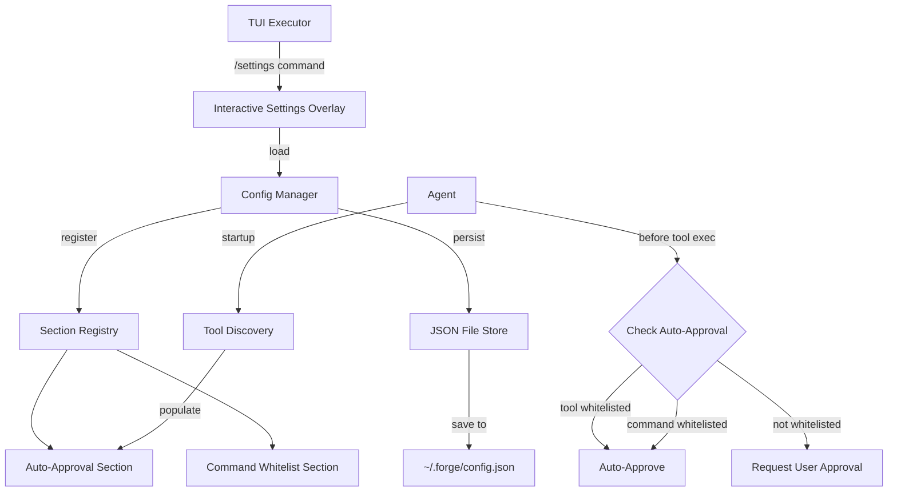

# 17. Auto-Approval and Interactive Settings System

**Status:** Accepted
**Date:** 2025-11-16
**Deciders:** Forge Core Team
**Technical Story:** Implementation of configurable auto-approval for trusted tools and commands with an interactive TUI settings editor

---

## Context

The Forge TUI coding agent requires user approval for potentially dangerous operations like file modifications and command execution (ADR-0010). While this provides safety, it creates friction for trusted, repetitive operations that users want to auto-approve. Additionally, users need a way to manage agent configuration without editing JSON files manually.

### Background

Current tool approval mechanism (ADR-0010) requires manual approval for every tool call. In practice, users develop trust patterns:
- Certain tools are always safe (e.g., `read_file`, `list_files`)
- Specific commands are frequently used and trusted (e.g., `npm install`, `git status`)
- Individual workflows have predictable, safe operations

Without auto-approval, users must manually approve dozens of operations in a single session, slowing down development flow and creating cognitive load.

The existing configuration is stored in JSON files without a user-friendly interface, requiring:
- Manual file editing with risk of syntax errors
- Understanding of configuration schema
- Restarting the application to apply changes
- No validation of configuration values

### Problem Statement

We need a system that:
1. Allows users to whitelist trusted tools for automatic approval
2. Supports pattern-based command whitelisting (e.g., all `npm` commands)
3. Provides an interactive, in-TUI settings editor
4. Validates configuration changes before applying them
5. Persists settings across sessions
6. Remains extensible for future configuration options

### Goals

- Reduce approval friction for trusted operations without sacrificing safety
- Provide intuitive TUI-based settings management accessible via `/settings` command
- Support dynamic tool discovery from the agent at startup
- Enable pattern matching for command whitelists (prefix and exact match)
- Implement section-based configuration architecture for extensibility
- Offer interactive editing with keyboard navigation and real-time validation
- Maintain backward compatibility with manual approval workflow

### Non-Goals

- ML-based automatic trust learning (future enhancement)
- Per-file or per-directory approval policies (future work)
- Role-based access control or multi-user settings (out of scope)
- Import/export of settings profiles (future enhancement)
- Approval history or audit logging (separate feature)

---

## Decision Drivers

* **User Experience**: Reduce repetitive approvals while maintaining control
* **Safety**: Users must explicitly configure auto-approvals; secure by default
* **Flexibility**: Support both tool-level and command-pattern whitelisting  
* **Discoverability**: Settings accessible via intuitive `/settings` command
* **Extensibility**: Architecture must support future configuration sections
* **Validation**: Prevent invalid configurations that could break the agent
* **Persistence**: Settings must survive application restarts

---

## Considered Options

### Option 1: Tool-Level Flags with Config File

**Description:** Add `RequiresApproval()` flag to each tool, configured via JSON file.

**Pros:**
- Simple boolean per tool
- Straightforward to implement
- Clear approval requirements

**Cons:**
- No pattern matching for commands
- Manual JSON editing required
- No validation until runtime
- Inflexible for partial trust scenarios
- Cannot whitelist specific command patterns

**Verdict:** ❌ Rejected - Too rigid, poor UX for configuration

### Option 2: Single Whitelist with Hardcoded Tools

**Description:** Maintain a hardcoded list of safe tools with optional command whitelist.

**Pros:**
- Fast implementation
- No configuration needed
- Predictable behavior

**Cons:**
- No user customization
- Cannot adapt to user-specific workflows
- Hardcoded assumptions about safety
- Requires code changes to modify whitelist

**Verdict:** ❌ Rejected - Violates user choice principle

### Option 3: Section-Based Configuration with Interactive TUI Editor

**Description:** Extensible section-based config system with dedicated TUI settings editor supporting keyboard navigation, toggles, and validation.

**Pros:**
- User-friendly interactive editing
- Extensible section architecture for future features
- Real-time validation prevents errors
- Dynamic tool discovery from agent
- Pattern matching for command whitelists
- Accessible via familiar `/settings` command
- Changes apply without restart
- Supports both tools and commands

**Cons:**
- More complex implementation
- Requires TUI overlay component
- Need to design keyboard navigation
- Additional testing scenarios

**Verdict:** ✅ Accepted - Best balance of UX, flexibility, and extensibility

---

## Decision

**Chosen Option:** Option 3 - Section-Based Configuration with Interactive TUI Editor

### Rationale

The section-based approach with interactive editing provides the best user experience while maintaining architectural flexibility:

1. **Extensibility**: Section interface allows adding new configuration types (future: theme settings, keybindings, API keys) without modifying core architecture

2. **User Experience**: Interactive TUI editor provides:
   - Immediate visual feedback on settings
   - Keyboard-driven navigation matching TUI patterns
   - Toggle controls for binary options
   - List editors for collections (command patterns)
   - Real-time validation before saving
   - Clear error messages for invalid inputs

3. **Safety**: Auto-approval is opt-in:
   - All tools require approval by default
   - Users must explicitly enable auto-approval per tool
   - Command whitelist must be manually configured
   - Changes require explicit save action

4. **Dynamic Discovery**: Tool list populated from agent at startup:
   - No hardcoded tool names
   - Automatically includes custom tools
   - Tools added/removed reflected in settings

5. **Pattern Matching**: Command whitelist supports:
   - Exact matches: `git status`
   - Prefix matches: `npm` matches all npm commands
   - Description metadata for user clarity

6. **Persistence**: Settings stored in `~/.forge/config.json`:
   - JSON format for interoperability
   - Human-readable structure
   - Atomic writes prevent corruption
   - Survives application restarts

---

## Consequences

### Positive

- **Reduced Friction**: Trusted operations auto-approve, speeding up workflows significantly
- **User Control**: Users explicitly choose what to auto-approve; nothing is automatic by default
- **Extensible Architecture**: Section-based design easily accommodates future settings (themes, keybindings, etc.)
- **Interactive UX**: TUI editor provides professional, intuitive configuration experience
- **Pattern Flexibility**: Command whitelist supports both exact and prefix matching
- **Dynamic Discovery**: Tool list automatically reflects agent's actual capabilities
- **Validation**: Real-time validation prevents configuration errors before they cause issues
- **Persistence**: Settings survive restarts, maintaining user preferences
- **No Restart Required**: Changes apply immediately without restarting the application
- **Accessible**: `/settings` command is discoverable and matches user expectations

### Negative

- **Initial Setup**: Users must configure auto-approvals manually (no defaults)
- **Complexity**: More moving parts than simple approval-always or approve-never
- **Learning Curve**: Users need to understand pattern matching syntax
- **Maintenance**: Configuration file must be managed (though automated)
- **Testing**: More scenarios to test (settings UI, validation, persistence, integration)
- **Potential for Misconfiguration**: Users could auto-approve dangerous patterns if careless

### Neutral

- **File Storage**: Settings in `~/.forge/config.json` (standard location, easy to find/backup)
- **JSON Format**: Human-readable but can be corrupted by manual editing
- **Section Model**: Adds abstraction layer but enables future extensibility
- **TUI Overlay**: Settings overlay temporarily blocks other interaction (consistent with approval overlay)

---

## Implementation

### Architecture Overview



### Package Structure

```
pkg/
├── config/                      # New: Configuration management
│   ├── config.go               # Global config singleton and helpers
│   ├── manager.go              # Section registry and orchestration
│   ├── section.go              # Section interface definition
│   ├── auto_approval.go        # Auto-approval section implementation
│   ├── whitelist.go            # Command whitelist section
│   ├── store.go                # File persistence layer
│   └── discovery.go            # Tool discovery from agent
│
pkg/executor/tui/
├── settings_interactive.go      # Interactive settings overlay
├── slash_commands.go           # Register /settings command
└── overlay.go                  # Overlay mode enum
```

### Core Interfaces

#### Section Interface

```go
// pkg/config/section.go
package config

type Section interface {
    ID() string
    Title() string
    Description() string
    Data() map[string]interface{}
    SetData(data map[string]interface{}) error
    Validate() error
    Reset()
}
```

#### Configuration Manager

```go
// pkg/config/manager.go
package config

type Manager struct {
    sections map[string]Section
    store    Store
    mu       sync.RWMutex
}

func (m *Manager) RegisterSection(section Section) error
func (m *Manager) GetSection(id string) (Section, bool)
func (m *Manager) GetSections() []Section
func (m *Manager) LoadAll() error
func (m *Manager) SaveAll() error
```

### Auto-Approval Section

```go
// pkg/config/auto_approval.go
package config

type AutoApprovalSection struct {
    tools map[string]bool  // tool_name -> auto_approve
    mu    sync.RWMutex
}

func (s *AutoApprovalSection) ID() string { return "auto_approval" }
func (s *AutoApprovalSection) Title() string { return "Auto-Approval Settings" }
func (s *AutoApprovalSection) Description() string {
    return "Configure which tools can execute without manual approval"
}

func (s *AutoApprovalSection) IsToolAutoApproved(toolName string) bool {
    s.mu.RLock()
    defer s.mu.RUnlock()
    return s.tools[toolName]
}

func (s *AutoApprovalSection) EnsureToolExists(toolName string) {
    s.mu.Lock()
    defer s.mu.Unlock()
    if _, exists := s.tools[toolName]; !exists {
        s.tools[toolName] = false  // Default: require approval
    }
}
```

### Command Whitelist Section

```go
// pkg/config/whitelist.go
package config

type CommandWhitelistSection struct {
    patterns []CommandPattern
    mu       sync.RWMutex
}

type CommandPattern struct {
    Pattern     string `json:"pattern"`
    Description string `json:"description"`
}

func (s *CommandWhitelistSection) IsCommandWhitelisted(command string) bool {
    s.mu.RLock()
    defer s.mu.RUnlock()
    
    for _, pattern := range s.patterns {
        // Exact match
        if pattern.Pattern == command {
            return true
        }
        
        // Prefix match (e.g., "npm" matches "npm install")
        if strings.HasPrefix(command, pattern.Pattern+" ") || 
           strings.HasPrefix(command, pattern.Pattern+"\t") {
            return true
        }
    }
    
    return false
}
```

### File Persistence

```go
// pkg/config/store.go
package config

type FileStore struct {
    path string
}

func (s *FileStore) Save(data map[string]map[string]interface{}) error {
    // Atomic write: write to temp file, then rename
    tmpPath := s.path + ".tmp"
    
    encoded, err := json.MarshalIndent(data, "", "  ")
    if err != nil {
        return err
    }
    
    if err := os.WriteFile(tmpPath, encoded, 0600); err != nil {
        return err
    }
    
    return os.Rename(tmpPath, s.path)
}

func (s *FileStore) Load() (map[string]map[string]interface{}, error) {
    // Read and parse JSON
    data, err := os.ReadFile(s.path)
    if err != nil {
        if os.IsNotExist(err) {
            return make(map[string]map[string]interface{}), nil
        }
        return nil, err
    }
    
    var result map[string]map[string]interface{}
    if err := json.Unmarshal(data, &result); err != nil {
        return nil, err
    }
    
    return result, nil
}
```

### Interactive Settings Overlay

The interactive settings overlay provides a full TUI interface for managing configuration. For detailed UI mockups and interaction flows, see [`docs/features/interactive-settings-ui-mockup.md`](../features/interactive-settings-ui-mockup.md).

**Key Features:**
- **Keyboard Navigation**: Full vim-style + arrow key support (↑↓jk for items, Tab/←→hl for sections)
- **Toggle Controls**: Space/Enter to toggle auto-approval checkboxes
- **List Editing**: Add (a), Edit (e), Delete (d) command whitelist patterns
- **Modal Dialogs**: Pattern add/edit with text input, radio buttons, validation
- **Real-time Feedback**: Visual indicators for modified items, unsaved changes
- **Color Scheme**: Forge palette (salmon pink, mint green, muted gray)

```go
// pkg/executor/tui/settings_interactive.go
package tui

type InteractiveSettingsOverlay struct {
    width   int
    height  int
    focused bool
    
    // Navigation
    selectedSection int
    selectedItem    int
    sections        []settingsSection
    
    // Edit state
    hasChanges bool
    editMode   bool
    scrollOffset int
    
    // Dialog state for add/edit
    activeDialog *inputDialog
}

type settingsSection struct {
    id          string
    title       string
    description string
    items       []settingsItem
}

type settingsItem struct {
    key         string
    displayName string
    value       interface{}
    itemType    itemType
    modified    bool
}

type itemType int

const (
    itemTypeToggle itemType = iota
    itemTypeText
    itemTypeList
)

// Input dialog for adding/editing command patterns
type inputDialog struct {
    title       string
    fields      []inputField
    selectedField int
    onConfirm   func(values map[string]string) error
    onCancel    func()
}

type inputField struct {
    label       string
    key         string
    value       string
    fieldType   fieldType
    options     []string  // For radio buttons
    maxLength   int
    validator   func(string) error
}

type fieldType int

const (
    fieldTypeText fieldType = iota
    fieldTypeRadio
)

func (s *InteractiveSettingsOverlay) Update(msg tea.Msg) (Overlay, tea.Cmd) {
    // Handle dialog input if active
    if s.activeDialog != nil {
        return s.handleDialogInput(msg)
    }
    
    switch msg := msg.(type) {
    case tea.KeyMsg:
        switch msg.String() {
        case "esc", "q":
            if s.hasChanges {
                // Show confirmation dialog
                return s, nil
            }
            return nil, nil
            
        case "ctrl+s":
            if s.hasChanges {
                s.saveSettings()
                s.hasChanges = false
            }
            return s, nil
            
        case "up", "k":
            s.navigateUp()
            return s, nil
            
        case "down", "j":
            s.navigateDown()
            return s, nil
            
        case " ", "enter":
            s.toggleCurrent()
            return s, nil
            
        case "tab", "right", "l":
            s.nextSection()
            return s, nil
            
        case "shift+tab", "left", "h":
            s.previousSection()
            return s, nil
            
        case "a":
            // Add new command pattern (when in whitelist section)
            if s.isInWhitelistSection() {
                s.showAddPatternDialog()
            }
            return s, nil
            
        case "e":
            // Edit selected pattern
            if s.isInWhitelistSection() && s.isPatternSelected() {
                s.showEditPatternDialog()
            }
            return s, nil
            
        case "d":
            // Delete selected pattern
            if s.isInWhitelistSection() && s.isPatternSelected() {
                s.showDeleteConfirmation()
            }
            return s, nil
        }
    }
    
    return s, nil
}

func (s *InteractiveSettingsOverlay) View() string {
    // Render settings with sections, items, and controls
    // Use Forge color palette (salmon pink, mint green, muted gray)
    // See docs/features/interactive-settings-ui-mockup.md for visual design
}
```

**Pattern Add/Edit Dialog:**

When user presses 'a' in Command Whitelist section, a modal dialog appears:

```
┌─ Add New Command Pattern ──────────────────────────────────┐
│                                                             │
│  Pattern (command or prefix):                              │
│  ▸ docker_                           ← [TEXT INPUT]        │
│                                                             │
│  Description:                                               │
│    Docker commands                   ← [TEXT INPUT]        │
│                                                             │
│  Pattern type:                                              │
│    ○ Prefix match    ● Exact match   ← [RADIO BUTTONS]    │
│                                                             │
│              [Enter to Add] [Esc to Cancel]                │
└─────────────────────────────────────────────────────────────┘
```

**Validation Rules:**
- Pattern field cannot be empty
- Duplicate patterns show warning but allow saving
- Description optional, max 100 characters
- Real-time character count and validation feedback
- Pattern types: Prefix match (default) or Exact match

**Delete Confirmation:**

When user presses 'd' on a pattern:

```
┌─ Confirm Delete ────────────────────────────────────────────┐
│                                                             │
│  ⚠️  Are you sure you want to delete this pattern?         │
│                                                             │
│  Pattern: git status                                       │
│  Description: Git status check                             │
│                                                             │
│  This command will require manual approval after deletion. │
│                                                             │
│           [y] Yes, delete    [n] No, cancel                │
└─────────────────────────────────────────────────────────────┘
```

### Agent Integration

```go
// pkg/agent/default.go - Modified approval flow

func (a *DefaultAgent) requestApproval(ctx context.Context, toolCall *tools.ToolCall) (bool, bool, error) {
    // Check auto-approval first
    if toolCall.ToolName == "execute_command" {
        if cmd, ok := argsMap["command"].(string); ok {
            if config.IsCommandWhitelisted(cmd) {
                return true, false, nil  // Auto-approve
            }
        }
    } else if config.IsToolAutoApproved(toolCall.ToolName) {
        return true, false, nil  // Auto-approve
    }
    
    // Fall through to manual approval if not whitelisted
    // ... existing approval flow ...
}
```

### Tool Discovery

```go
// pkg/config/discovery.go

func DiscoverToolsFromAgent(agent agent.Agent) error {
    if !IsInitialized() {
        return fmt.Errorf("config not initialized")
    }
    
    mgr := Global()
    section, exists := mgr.GetSection("auto_approval")
    if !exists {
        return fmt.Errorf("auto_approval section not registered")
    }
    
    autoApproval, ok := section.(*AutoApprovalSection)
    if !ok {
        return fmt.Errorf("invalid section type")
    }
    
    // Get tools from agent
    tools := agent.GetTools()
    
    // Ensure each tool exists in config
    for _, tool := range tools {
        if t, ok := tool.(tools.Tool); ok {
            autoApproval.EnsureToolExists(t.Name())
        }
    }
    
    // Save updated config
    return mgr.SaveAll()
}
```

### Slash Command Registration

```go
// pkg/executor/tui/slash_commands.go

func (e *Executor) registerCommands() {
    // ... existing commands ...
    
    e.commandRegistry["/settings"] = func(args []string) error {
        return e.handleSettingsCommand(args)
    }
}

func (e *Executor) handleSettingsCommand(args []string) error {
    // Create and show settings overlay
    overlay := NewInteractiveSettingsOverlay(e.width, e.height)
    e.setOverlay(overlay, OverlayModeSettings)
    return nil
}
```

### Configuration File Format

```json
{
  "auto_approval": {
    "read_file": true,
    "write_file": false,
    "list_files": true,
    "search_files": true,
    "apply_diff": false,
    "execute_command": false,
    "task_completion": true,
    "ask_question": true,
    "converse": true
  },
  "command_whitelist": {
    "patterns": [
      {
        "pattern": "npm",
        "description": "All npm commands"
      },
      {
        "pattern": "git status",
        "description": "Git status check"
      },
      {
        "pattern": "ls",
        "description": "List directory contents"
      }
    ]
  }
}
```

### Initialization Flow

```go
// cmd/forge/main.go

func run() error {
    // Initialize config early in startup
    if err := appconfig.Initialize(""); err != nil {
        return fmt.Errorf("failed to initialize config: %w", err)
    }
    
    // ... create agent ...
    
    // Discover tools and populate config
    if err := appconfig.DiscoverToolsFromAgent(agent); err != nil {
        log.Warn("Failed to discover tools", "error", err)
    }
    
    // ... start executor ...
}
```

---

## Validation

### Success Metrics

- **Friction Reduction**: Time from tool call to execution reduced by 80%+ for whitelisted operations
- **User Adoption**: 90%+ of users configure at least one auto-approval
- **Error Rate**: <1% of users encounter configuration errors
- **Discoverability**: Users find `/settings` command within first 5 interactions
- **Configuration Quality**: 95%+ of configurations are valid on first save
- **Performance**: Settings load/save operations complete in <100ms

### Monitoring

- Track auto-approval hit rate (% of tool calls auto-approved)
- Monitor configuration file parse errors
- Measure time spent in settings editor
- Log validation failures and their causes
- Track frequency of settings changes
- Monitor which tools are most commonly auto-approved

### Testing Strategy

#### Unit Tests

```go
// pkg/config/auto_approval_test.go
func TestAutoApprovalSection_IsToolAutoApproved(t *testing.T)
func TestAutoApprovalSection_EnsureToolExists(t *testing.T)
func TestAutoApprovalSection_Validate(t *testing.T)

// pkg/config/whitelist_test.go  
func TestCommandWhitelistSection_IsCommandWhitelisted(t *testing.T)
func TestCommandWhitelistSection_PatternMatching(t *testing.T)
func TestCommandWhitelistSection_Validate(t *testing.T)

// pkg/config/manager_test.go
func TestManager_RegisterSection(t *testing.T)
func TestManager_SaveAndLoad(t *testing.T)
func TestManager_ConcurrentAccess(t *testing.T)
```

#### Integration Tests

```go
// pkg/executor/tui/settings_test.go
func TestSettingsOverlay_Navigation(t *testing.T)
func TestSettingsOverlay_ToggleItems(t *testing.T)
func TestSettingsOverlay_SaveChanges(t *testing.T)
func TestSettingsOverlay_DiscardChanges(t *testing.T)
func TestSettingsOverlay_Validation(t *testing.T)

// pkg/agent/approval_test.go
func TestAgent_AutoApprovalIntegration(t *testing.T)
func TestAgent_CommandWhitelistIntegration(t *testing.T)
func TestAgent_FallbackToManualApproval(t *testing.T)
```

---

## Related Decisions

- [ADR-0010: Tool Approval Mechanism](0010-tool-approval-mechanism.md) - Original approval flow that this extends
- [ADR-0009: TUI Executor Design](0009-tui-executor-design.md) - TUI architecture and overlay pattern
- [ADR-0011: Coding Tools Architecture](0011-coding-tools-architecture.md) - Tools that benefit from auto-approval
- [ADR-0012: Enhanced TUI Executor](0012-enhanced-tui-executor.md) - Overlay component design patterns

---

## References

- Configuration management patterns in Go
- [Bubble Tea framework](https://github.com/charmbracelet/bubbletea) - TUI implementation
- [Lipgloss styling](https://github.com/charmbracelet/lipgloss) - Terminal UI styling
- User settings patterns from VS Code, Cursor, and other IDEs
- Pattern matching algorithms for command whitelisting

---

## Notes

### Design Principles

**Secure by Default**: All tools require approval unless explicitly whitelisted. Users must actively choose to auto-approve operations.

**Extensibility First**: Section-based architecture makes it trivial to add new configuration categories:
- Future sections could include: API keys, theme settings, keybindings, prompt templates, etc.
- Each section is isolated and can be developed/tested independently
- Sections can be conditionally loaded based on features enabled

**User Control**: Configuration is transparent and editable:
- Interactive TUI provides guided editing experience
- JSON file format allows manual editing for power users
- Changes can be applied immediately or discarded
- Validation prevents broken configurations

**Pattern Flexibility**: Command whitelist intentionally supports flexible matching:
- Exact: `"git status"` only matches that specific command
- Prefix: `"npm"` matches all npm commands (`npm install`, `npm run build`, etc.)
- Future: Could extend to regex patterns for advanced users

### Security Considerations

**Default Deny**: New tools added to the agent are automatically set to require approval (false in config). Users must explicitly enable auto-approval.

**Command Injection Prevention**: While we whitelist command patterns, we don't execute arbitrary code. The execute_command tool still sanitizes inputs and enforces workspace boundaries.

**Config File Permissions**: Stored at `~/.forge/config.json` with 0600 permissions (user read/write only).

**Validation**: All configuration changes are validated before saving:
- Tool names must exist in the agent's tool registry
- Command patterns must be non-empty strings
- Section data must conform to schema

### User Experience Considerations

**Discoverability**: `/settings` command is:
- Listed in help text
- Suggested when approval friction is high
- Easy to remember (matches user expectations)

**Keyboard Navigation**: All settings interactions use keyboard:
- Arrow keys / j/k for navigation
- Space / Enter for toggle
- Tab for section switching
- Ctrl+S for save
- Esc for cancel

**Visual Feedback**: Users always know:
- Which item is selected (highlighted)
- What values will be saved (modified indicator)
- If changes are pending (unsaved changes warning)
- Why validation failed (inline error messages)

### Future Enhancements

Potential improvements for future releases:

1. **Smart Suggestions**: Analyze approval patterns and suggest auto-approvals
2. **Temporary Whitelisting**: Auto-approve for current session only
3. **Approval History**: View and learn from past approval decisions
4. **Import/Export**: Share settings across machines or teams
5. **Per-Project Settings**: Override global settings for specific projects
6. **Approval Profiles**: Switch between "development" and "production" profiles
7. **Regex Patterns**: Advanced pattern matching for command whitelist
8. **Risk Scoring**: Show risk indicators for auto-approved operations

### Migration Path

For users upgrading from versions without auto-approval:

1. **Automatic**: Configuration system initializes with empty settings (all require approval)
2. **Discovery**: Tools are automatically discovered on first run
3. **User Choice**: Users configure auto-approvals via `/settings` at their convenience
4. **Backward Compatible**: Absence of config file means "approve everything manually"
5. **No Breaking Changes**: Existing approval flow continues to work unchanged

### Example Workflows

**Initial Setup (New User)**:
1. User starts Forge for first time
2. Config initialized with empty auto-approvals
3. User encounters frequent approvals for `read_file`
4. Opens `/settings`, navigates to "read_file", toggles to auto-approve
5. Saves settings (Ctrl+S)
6. Future `read_file` operations auto-approve

**Command Whitelisting**:
1. User frequently runs `npm install` and `npm test`
2. Opens `/settings`, navigates to Command Whitelist section
3. Adds pattern: `npm` (matches all npm commands)
4. Adds pattern: `git status` (exact match only)
5. Saves settings
6. Future npm and git status commands auto-approve

**Reviewing Settings**:
1. User types `/settings` in TUI
2. Overlay shows current configuration
3. User can navigate, review, modify
4. Esc closes without changes
5. Ctrl+S saves any modifications

---

## Implementation Timeline

### Phase 1: Core Configuration (Completed)
- ✅ Design section-based architecture
- ✅ Implement config package with Manager, Store, Sections
- ✅ Create auto-approval and whitelist sections
- ✅ Add file persistence layer
- ✅ Implement tool discovery mechanism

### Phase 2: Agent Integration (Completed)
- ✅ Modify agent approval flow to check config
- ✅ Add config initialization to startup
- ✅ Implement auto-approval checking
- ✅ Add command whitelist validation

### Phase 3: Interactive TUI (In Progress)
- 🔄 Build interactive settings overlay
- 🔄 Implement keyboard navigation
- 🔄 Add toggle and list editing controls
- 🔄 Implement save/cancel functionality
- 🔄 Add real-time validation

### Phase 4: Testing & Documentation (Pending)
- ⏳ Write comprehensive unit tests
- ⏳ Add integration tests
- ⏳ Update user documentation
- ⏳ Create tutorial for settings configuration

---

**Last Updated:** 2025-11-16
**Status:** Phase 3 in progress - Interactive TUI implementation underway
