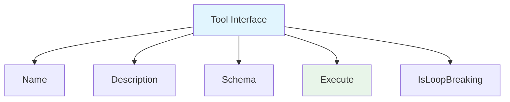
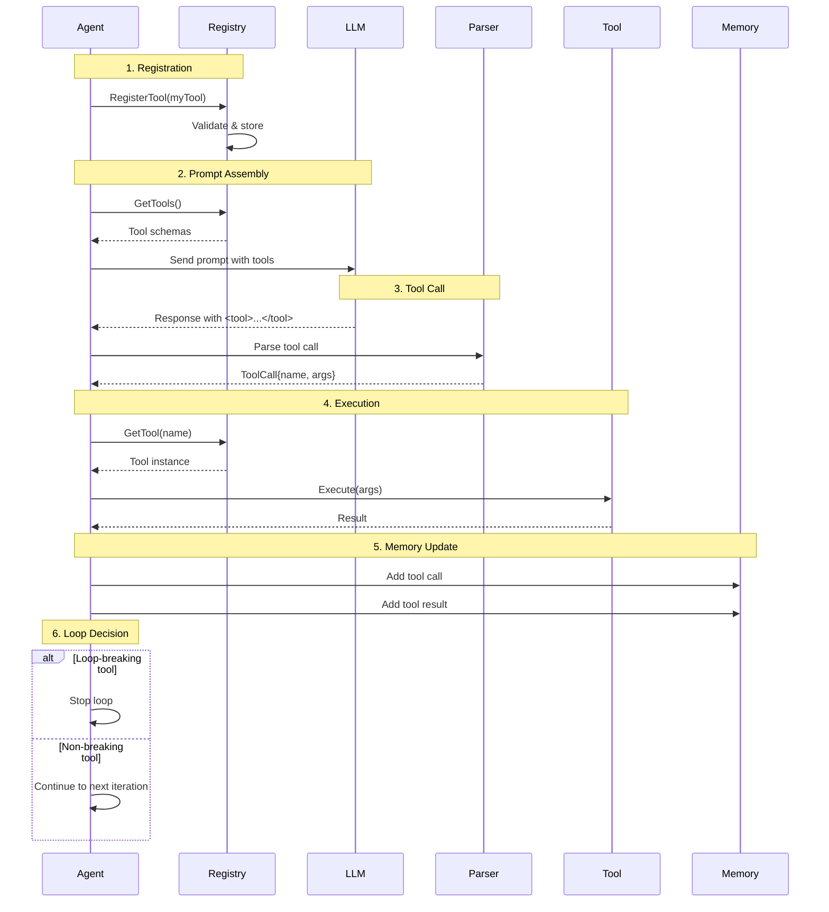
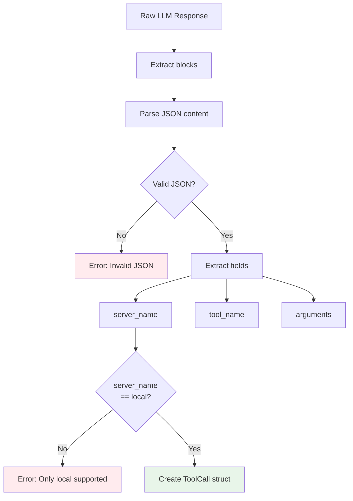

# Tool System Architecture

This document describes the architecture and implementation of Forge's tool system, which enables agents to perform actions and interact with external systems.

## Overview

The tool system allows agents to extend their capabilities beyond text generation by:
- Executing code (calculations, data processing)
- Accessing external APIs (web search, databases)
- Interacting with systems (file I/O, command execution)
- Performing custom business logic

## Core Concepts

### What is a Tool?

A tool is a function that:
1. Has a **name** (unique identifier)
2. Has a **description** (tells LLM what it does)
3. Has a **schema** (JSON schema for parameters)
4. Can be **executed** with arguments
5. Declares if it's **loop-breaking** (stops agent loop)



## Tool Interface

All tools implement this interface from [`pkg/agent/tools/tool.go`](../../pkg/agent/tools/tool.go):

```go
type Tool interface {
    // Name returns the unique identifier
    Name() string
    
    // Description tells the LLM what this tool does
    Description() string
    
    // Schema returns JSON schema for parameters
    Schema() map[string]interface{}
    
    // Execute runs the tool with given arguments
    Execute(ctx context.Context, arguments json.RawMessage) (string, error)
    
    // IsLoopBreaking indicates if agent should stop after using this
    IsLoopBreaking() bool
}
```

## Tool Categories

### 1. Loop-Breaking Tools

These tools stop the agent loop when executed:

**task_completion** - Signals successful task completion
```go
type TaskCompletionTool struct{}

func (t *TaskCompletionTool) IsLoopBreaking() bool {
    return true  // Stops the loop
}
```

**ask_question** - Requests user input
```go
type AskQuestionTool struct{}

func (t *AskQuestionTool) IsLoopBreaking() bool {
    return true  // Waits for user response
}
```

**converse** - Natural conversation
```go
type ConverseTool struct{}

func (t *ConverseTool) IsLoopBreaking() bool {
    return true  // Turn complete
}
```

### 2. Non-Breaking Tools

These tools allow the agent to continue:

```go
type CalculatorTool struct{}

func (t *CalculatorTool) IsLoopBreaking() bool {
    return false  // Agent continues after using this
}
```

The agent can:
- Use the tool
- Get the result
- Use another tool
- Or use a loop-breaking tool to finish

## Tool Lifecycle



## Tool Registration

### Built-in Tools

Three tools are always available and cannot be overridden:

```go
func NewDefaultAgent(provider llm.Provider, opts ...Option) *DefaultAgent {
    ag := &DefaultAgent{
        tools: make(map[string]tools.Tool),
        // ...
    }
    
    // Register built-in tools
    ag.tools["task_completion"] = &tools.TaskCompletionTool{}
    ag.tools["ask_question"] = &tools.AskQuestionTool{}
    ag.tools["converse"] = &tools.ConverseTool{}
    
    return ag
}
```

### Custom Tools

Users can register additional tools:

```go
calculator := &CalculatorTool{}
err := agent.RegisterTool(calculator)
if err != nil {
    // Handle error (duplicate name, invalid schema, etc.)
}
```

Registration validates:
- Tool name is unique
- Schema is valid JSON schema
- Tool implements interface correctly

## Tool Call Format

### LLM Output Format

Tools are called using XML format:

```xml
<tool>
{
  "server_name": "local",
  "tool_name": "calculator",
  "arguments": {
    "operation": "multiply",
    "a": 15,
    "b": 23
  }
}
</tool>
```

### Parsing Process

The parser in [`pkg/agent/tools/parser.go`](../../pkg/agent/tools/parser.go):



## JSON Schema

Each tool defines parameters using JSON Schema:

```go
func (t *CalculatorTool) Schema() map[string]interface{} {
    return map[string]interface{}{
        "type": "object",
        "properties": map[string]interface{}{
            "operation": map[string]interface{}{
                "type":        "string",
                "description": "The operation to perform",
                "enum":        []string{"add", "subtract", "multiply", "divide"},
            },
            "a": map[string]interface{}{
                "type":        "number",
                "description": "First number",
            },
            "b": map[string]interface{}{
                "type":        "number",
                "description": "Second number",
            },
        },
        "required": []string{"operation", "a", "b"},
    }
}
```

This schema:
- Defines parameter types
- Provides descriptions (LLM sees these)
- Specifies required parameters
- Constrains values (enum, format, etc.)

## Tool Execution

### Argument Validation

Before execution, arguments are validated against the schema:

```go
func (a *DefaultAgent) executeTool(ctx context.Context, toolCall ToolCall) (string, error) {
    // Get tool
    tool, exists := a.tools[toolCall.ToolName]
    if !exists {
        return "", fmt.Errorf("tool not found: %s", toolCall.ToolName)
    }
    
    // Validate arguments against schema
    // (Validation happens in tool's Execute method)
    
    // Execute
    result, err := tool.Execute(ctx, toolCall.Arguments)
    if err != nil {
        return "", fmt.Errorf("tool execution failed: %w", err)
    }
    
    return result, nil
}
```

### Error Handling

Tools should return descriptive errors:

```go
func (t *CalculatorTool) Execute(ctx context.Context, args json.RawMessage) (string, error) {
    var params struct {
        Operation string  `json:"operation"`
        A         float64 `json:"a"`
        B         float64 `json:"b"`
    }
    
    // Parse arguments
    if err := json.Unmarshal(args, &params); err != nil {
        return "", fmt.Errorf("invalid arguments: %w", err)
    }
    
    // Validate operation
    validOps := map[string]bool{
        "add": true, "subtract": true, 
        "multiply": true, "divide": true,
    }
    if !validOps[params.Operation] {
        return "", fmt.Errorf("unknown operation: %s", params.Operation)
    }
    
    // Validate division by zero
    if params.Operation == "divide" && params.B == 0 {
        return "", fmt.Errorf("cannot divide by zero")
    }
    
    // Perform calculation
    var result float64
    switch params.Operation {
    case "add":
        result = params.A + params.B
    // ... other operations
    }
    
    return fmt.Sprintf("%.2f", result), nil
}
```

## Tool Results

### Adding to Memory

Tool results are added to conversation history:

```go
// Tool call
memory.AddMessage(Message{
    Role: RoleAssistant,
    Content: "<tool>{...}</tool>",
})

// Tool result  
memory.AddMessage(Message{
    Role: RoleTool,
    Content: "Result: 345.00",
    ToolCallID: toolCall.ID,
})
```

This enables:
- Multi-step reasoning
- Context for future iterations
- Debugging and observability

### Result Format

Tools should return useful, descriptive results:

```go
// Good: Informative result
return "Search found 3 results: [Article 1], [Article 2], [Article 3]", nil

// Bad: Not useful for agent
return "Success", nil

// Good: Error with context
return "", fmt.Errorf("API rate limit exceeded, retry in 60s")

// Bad: Vague error
return "", fmt.Errorf("failed")
```

## Best Practices

### Tool Design

1. **Single Responsibility:**
   ```go
   // Good: Focused tool
   type AddTool struct{}
   
   // Bad: Do-everything tool
   type MathTool struct{} // add, subtract, multiply, divide, sqrt, pow, ...
   ```

2. **Clear Descriptions:**
   ```go
   func (t *SearchTool) Description() string {
       return "Searches the web for information. Use when you need current information or facts not in your training data. Returns top 5 results with titles and snippets."
   }
   ```

3. **Descriptive Parameters:**
   ```go
   "query": map[string]interface{}{
       "type": "string",
       "description": "The search query. Be specific and use keywords.",
   }
   ```

4. **Validation:**
   ```go
   func (t *MyTool) Execute(ctx context.Context, args json.RawMessage) (string, error) {
       // Always validate inputs
       if len(query) == 0 {
           return "", fmt.Errorf("query cannot be empty")
       }
       
       if maxResults < 1 || maxResults > 10 {
           return "", fmt.Errorf("maxResults must be between 1 and 10")
       }
       
       // ... execute
   }
   ```

5. **Context Usage:**
   ```go
   func (t *APITool) Execute(ctx context.Context, args json.RawMessage) (string, error) {
       // Respect context cancellation
       select {
       case <-ctx.Done():
           return "", ctx.Err()
       default:
       }
       
       // Use context for HTTP requests
       req, _ := http.NewRequestWithContext(ctx, "GET", url, nil)
       resp, err := client.Do(req)
       // ...
   }
   ```

### Tool Naming

Use clear, descriptive names:

```go
// Good
"calculator"
"web_search"
"send_email"
"read_file"

// Bad
"tool1"
"helper"
"do_thing"
```

### Loop-Breaking Decision

Make tools loop-breaking when:
- ✅ They complete the user's request
- ✅ They require user input
- ✅ They represent a conversational turn

Keep tools non-breaking when:
- ✅ They provide intermediate data
- ✅ They're part of a multi-step process
- ✅ Agent might need to use other tools after

## Performance Considerations

### Synchronous Execution

Currently, tools execute synchronously:
- One tool at a time
- Blocks until complete
- Simple, predictable

Future: Parallel tool execution for independent tools.

### Timeout Handling

Use context timeouts for long-running tools:

```go
func (t *SlowTool) Execute(ctx context.Context, args json.RawMessage) (string, error) {
    // Create timeout context
    ctx, cancel := context.WithTimeout(ctx, 30*time.Second)
    defer cancel()
    
    // Execute with timeout
    result := make(chan string, 1)
    go func() {
        result <- doSlowWork()
    }()
    
    select {
    case r := <-result:
        return r, nil
    case <-ctx.Done():
        return "", fmt.Errorf("tool execution timeout")
    }
}
```

### Resource Management

Clean up resources properly:

```go
func (t *FileTool) Execute(ctx context.Context, args json.RawMessage) (string, error) {
    file, err := os.Open(filename)
    if err != nil {
        return "", err
    }
    defer file.Close()  // Always close
    
    // ... work with file
    
    return result, nil
}
```

## Security Considerations

### Input Validation

Always validate tool inputs:

```go
func (t *CommandTool) Execute(ctx context.Context, args json.RawMessage) (string, error) {
    var params struct {
        Command string `json:"command"`
    }
    json.Unmarshal(args, &params)
    
    // Validate against whitelist
    allowed := map[string]bool{
        "ls": true,
        "pwd": true,
        // ... safe commands only
    }
    
    if !allowed[params.Command] {
        return "", fmt.Errorf("command not allowed: %s", params.Command)
    }
    
    // Execute safely
}
```

### Sanitization

Sanitize inputs to prevent injection:

```go
import "regexp"

func sanitizeInput(input string) string {
    // Remove dangerous characters
    safe := regexp.MustCompile(`[^a-zA-Z0-9\s\-_.]`)
    return safe.ReplaceAllString(input, "")
}
```

### Rate Limiting

Implement rate limiting for expensive tools:

```go
type RateLimitedTool struct {
    limiter *rate.Limiter
}

func (t *RateLimitedTool) Execute(ctx context.Context, args json.RawMessage) (string, error) {
    // Wait for rate limit
    if err := t.limiter.Wait(ctx); err != nil {
        return "", fmt.Errorf("rate limit: %w", err)
    }
    
    // Execute
    return t.doWork(args)
}
```

## Testing Tools

### Unit Tests

Test tool execution with various inputs:

```go
func TestCalculatorTool(t *testing.T) {
    tool := &CalculatorTool{}
    
    tests := []struct {
        name    string
        args    string
        want    string
        wantErr bool
    }{
        {
            name: "add",
            args: `{"operation":"add","a":5,"b":3}`,
            want: "8.00",
        },
        {
            name: "divide by zero",
            args: `{"operation":"divide","a":5,"b":0}`,
            wantErr: true,
        },
    }
    
    for _, tt := range tests {
        t.Run(tt.name, func(t *testing.T) {
            got, err := tool.Execute(context.Background(), []byte(tt.args))
            if (err != nil) != tt.wantErr {
                t.Errorf("Execute() error = %v, wantErr %v", err, tt.wantErr)
            }
            if got != tt.want {
                t.Errorf("Execute() = %v, want %v", got, tt.want)
            }
        })
    }
}
```

## See Also

- [Agent Loop Architecture](agent-loop.md) - How tools integrate with the agent loop
- [Architecture Overview](overview.md) - System architecture
- [Building Custom Tools](../guides/building-custom-tools.md) - Tool development guide
- [API Reference: Tools](../reference/api/tools.md) - Complete tools API