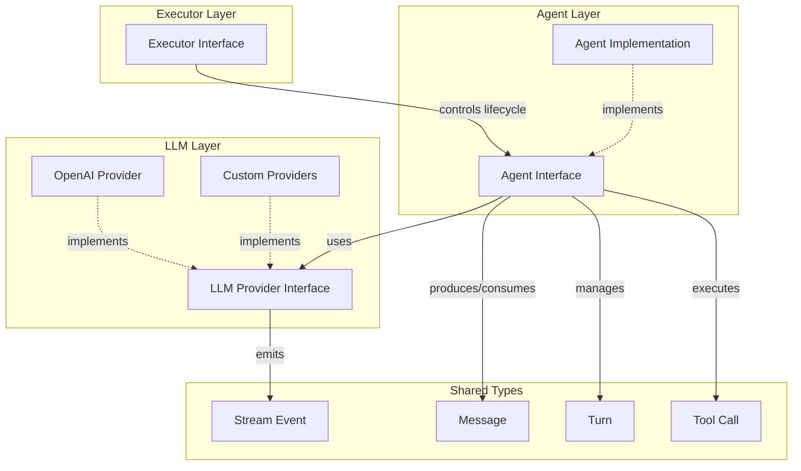
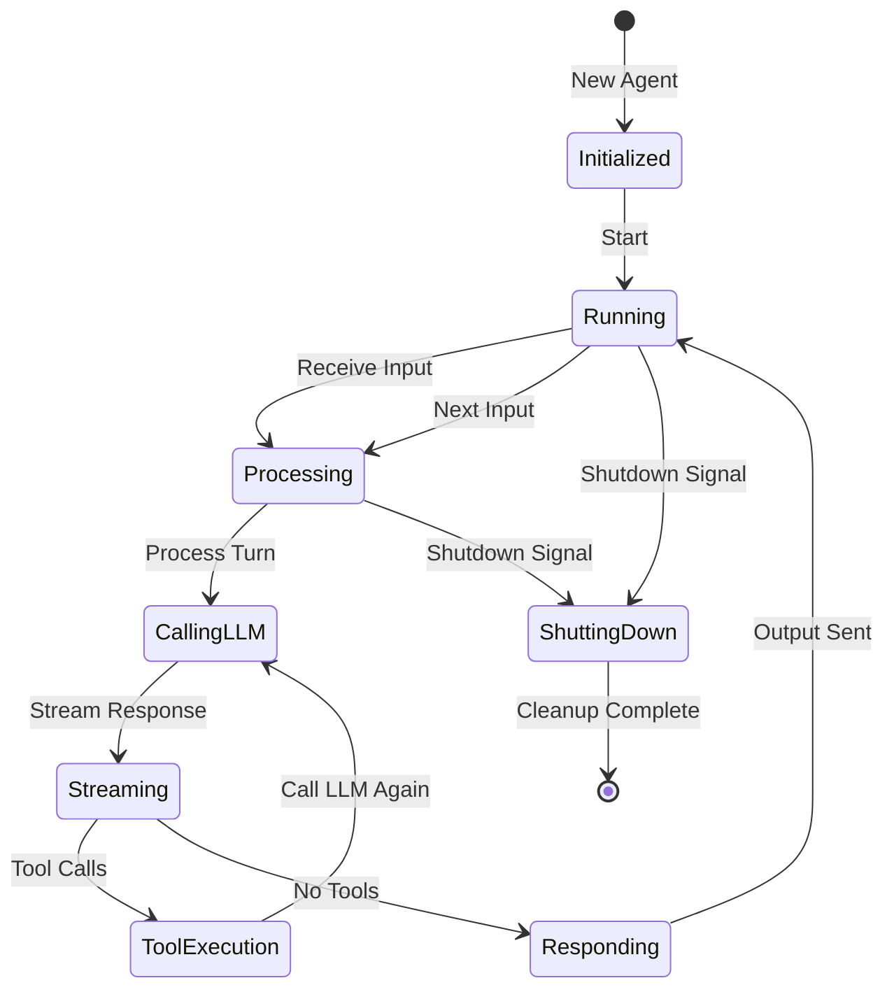

# Agent Interface Design

## Overview

The Forge agent framework uses an async event-driven architecture where agents run continuously, processing multiple conversation turns until completion. Agents are decoupled from specific LLM providers and can swap providers at runtime.

## Core Principles

1. **Async Event-Driven**: Agents process events asynchronously using Go channels and goroutines
2. **Streaming Support**: Native support for streaming LLM responses
3. **Provider Agnostic**: Agents work with any LLM provider implementing the Provider interface
4. **Executor-Controlled Lifecycle**: Executors manage agent start/shutdown via well-defined interfaces
5. **Multi-Turn Conversations**: Agents handle continuous multi-turn interactions until natural completion

## Architecture Diagram



## Key Interfaces

### Agent Interface

The agent is the core orchestrator that:
- Receives input from the executor
- Manages conversation state
- Calls LLM providers
- Handles tool execution
- Produces output back to executor
- Runs until natural completion or shutdown signal

### Executor Interface

The executor provides the runtime environment:
- Starts and stops agents
- Provides input channels
- Consumes output channels
- Handles I/O specific to environment (CLI, HTTP, etc.)

### LLM Provider Interface

The provider abstracts LLM interactions:
- Sends prompts to LLM
- Streams responses back
- Supports different models
- Handles provider-specific configuration

## Core Types

### Message
Represents a single message in a conversation
```go
type Message struct {
    Role    MessageRole
    Content string
    ToolCalls []ToolCall
    Metadata map[string]interface{}
}

type MessageRole string
const (
    RoleSystem    MessageRole = "system"
    RoleUser      MessageRole = "user"
    RoleAssistant MessageRole = "assistant"
    RoleTool      MessageRole = "tool"
)
```

### Turn
Represents a single conversation turn (user input -> agent response)
```go
type Turn struct {
    ID        string
    Input     Message
    Output    Message
    StartTime time.Time
    EndTime   time.Time
    Metadata  map[string]interface{}
}
```

### StreamEvent
Represents a chunk of streaming response
```go
type StreamEvent struct {
    Type    StreamEventType
    Content string
    Done    bool
    Error   error
}

type StreamEventType string
const (
    StreamEventTypeContent StreamEventType = "content"
    StreamEventTypeToolCall StreamEventType = "tool_call"
    StreamEventTypeError StreamEventType = "error"
)
```

### ToolCall
Represents a function/tool call request
```go
type ToolCall struct {
    ID       string
    Name     string
    Arguments map[string]interface{}
}
```

## Agent Lifecycle



## Communication Pattern

### Input/Output Channels

Agents communicate via Go channels:

```go
type AgentChannels struct {
    Input      chan Message      // Executor -> Agent
    Output     chan Message      // Agent -> Executor
    Error      chan error        // Agent -> Executor
    Shutdown   chan struct{}     // Executor -> Agent
    Done       chan struct{}     // Agent -> Executor
}
```

### Event Flow

1. Executor creates agent with channels
2. Executor calls `agent.Start()`
3. Agent begins listening on input channel
4. For each input message:
   - Agent processes the message
   - Agent calls LLM provider
   - Agent streams response chunks
   - Agent executes any tool calls
   - Agent sends final output
5. Agent continues until:
   - Shutdown signal received
   - Natural completion (agent decides to stop)
6. Agent cleanup and close done channel

## Interface Definitions

### Agent Interface
```go
type Agent interface {
    // Start begins the agent's event loop
    Start(ctx context.Context) error
    
    // Shutdown gracefully stops the agent
    Shutdown(ctx context.Context) error
    
    // GetChannels returns the communication channels
    GetChannels() *AgentChannels
}
```

### Executor Interface
```go
type Executor interface {
    // Run starts the executor with the given agent
    Run(ctx context.Context, agent Agent) error
    
    // Stop gracefully stops the executor
    Stop(ctx context.Context) error
}
```

### LLM Provider Interface
```go
type Provider interface {
    // GenerateStream sends a prompt and streams responses
    GenerateStream(ctx context.Context, messages []Message) (<-chan StreamEvent, error)
    
    // Generate sends a prompt and returns complete response
    Generate(ctx context.Context, messages []Message) (*Message, error)
    
    // GetModelInfo returns information about the model
    GetModelInfo() ModelInfo
}

type ModelInfo struct {
    Name           string
    MaxTokens      int
    SupportsTools  bool
    SupportsStream bool
}
```

## Implementation Strategy

### Phase 1: Core Types and Interfaces (Current)
- Define all core types in `pkg/types`
- Define Agent interface in `pkg/agent`
- Define Executor interface in `pkg/executor`  
- Define Provider interface in `pkg/llm`

### Phase 2: Basic Implementation (Next)
- Implement basic agent with simple conversation flow
- Implement simple CLI executor
- Implement mock LLM provider for testing

### Phase 3: Advanced Features (Future)
- Tool calling support
- State persistence
- Memory management
- Advanced executors (HTTP API)
- Real LLM providers (OpenAI, Anthropic)

## Error Handling

Agents use structured errors:
```go
type AgentError struct {
    Code    ErrorCode
    Message string
    Cause   error
}

type ErrorCode string
const (
    ErrorCodeLLMFailure     ErrorCode = "llm_failure"
    ErrorCodeToolFailure    ErrorCode = "tool_failure"
    ErrorCodeShutdown       ErrorCode = "shutdown"
    ErrorCodeInvalidInput   ErrorCode = "invalid_input"
)
```

## Configuration

Agents are configured via:
```go
type AgentConfig struct {
    Provider    Provider
    Tools       []Tool
    SystemPrompt string
    MaxTurns    int
    Timeout     time.Duration
    EnableStream bool
}
```

## Next Steps

1. Implement all types in `pkg/types`
2. Update Agent interface in `pkg/agent`
3. Update Executor interface in `pkg/executor`
4. Update Provider interface in `pkg/llm`
5. Add comprehensive godoc comments
6. Create unit tests for type definitions