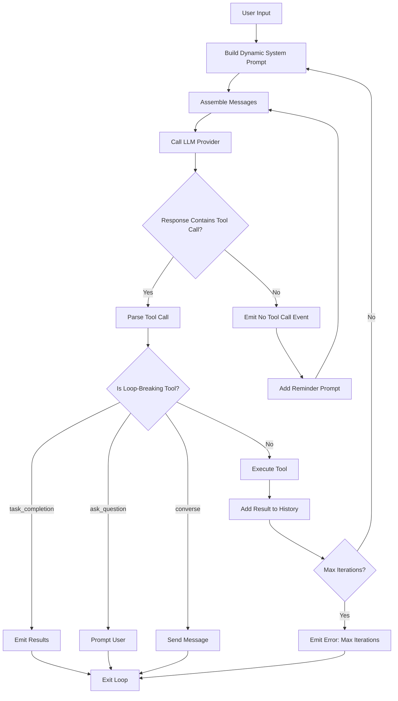
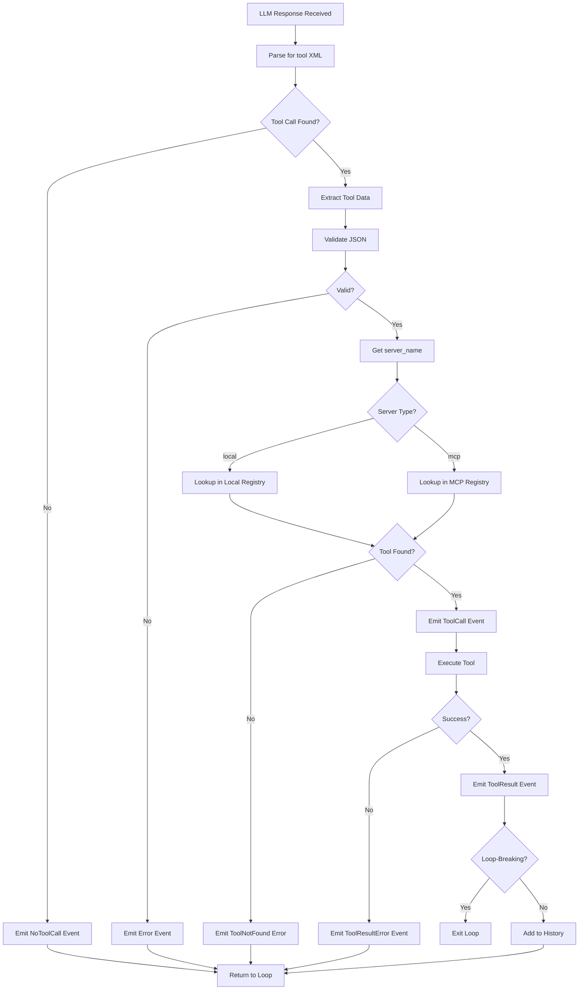
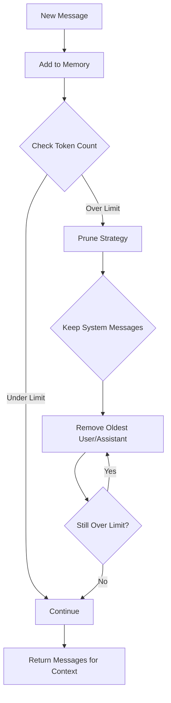
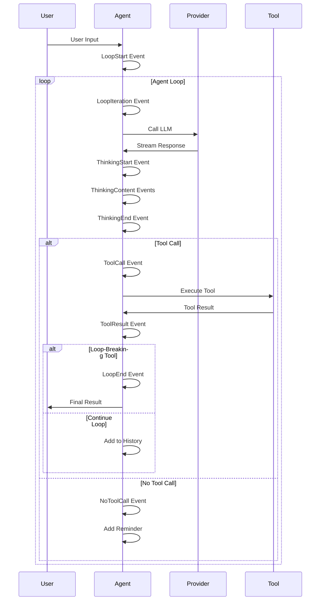
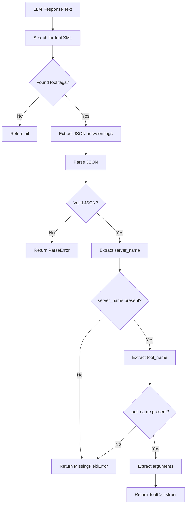
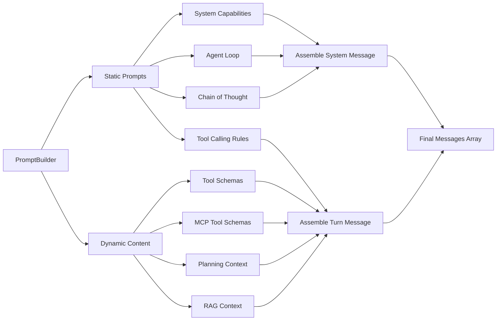

# Agent Loop Flow Diagram

## High-Level Agent Loop Flow

## Detailed Message Assembly

```mermaid
graph LR
    A[Start Message Assembly] --> B[System Message]
    B --> C[Add User Instructions]
    C --> D[Add Agent Loop Prompt]
    D --> E[Add System Capabilities]
    E --> F[Add Chain of Thought]
    
    F --> G[Conversation History]
    G --> H[Previous User Messages]
    H --> I[Previous Assistant Messages]
    I --> J[Previous Tool Results]
    
    J --> K[Current Turn Message]
    K --> L[Add Tool Schemas]
    L --> M[Add Tool Calling Rules]
    M --> N[Add Planning Context]
    N --> O[Add RAG Context]
    O --> P[Add User Input]
    
    P --> Q[Final Message Array]
```

## Tool Execution Flow

## Memory Management Flow

## Event Emission Timeline

## Tool Call Parsing

## Prompt Building Process

## Key Decision Points

### When to Exit Loop?

1. **task_completion** tool called → Agent finished task
2. **ask_question** tool called → Agent needs user input
3. **converse** tool called → Agent wants to chat
4. **Max iterations** reached → Safety limit
5. **User cancellation** → User stopped the agent
6. **Critical error** → Unrecoverable failure

### When to Continue Loop?

1. **Regular tool** executed successfully
2. **No tool call** but under max iterations
3. **Recoverable error** with retry logic

### When to Emit NoToolCall?

1. LLM response has no `<tool>` tags
2. Response is pure conversation/thinking
3. Malformed tool call (parsing failed)