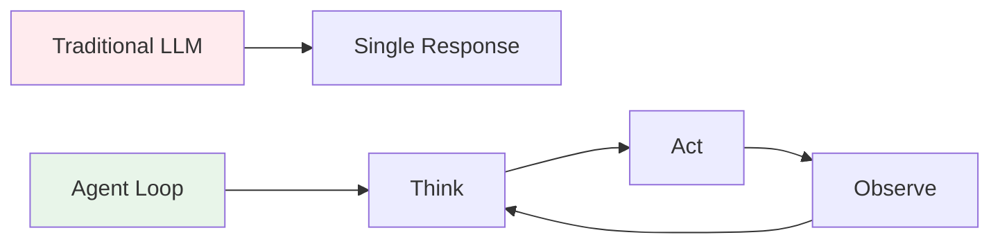
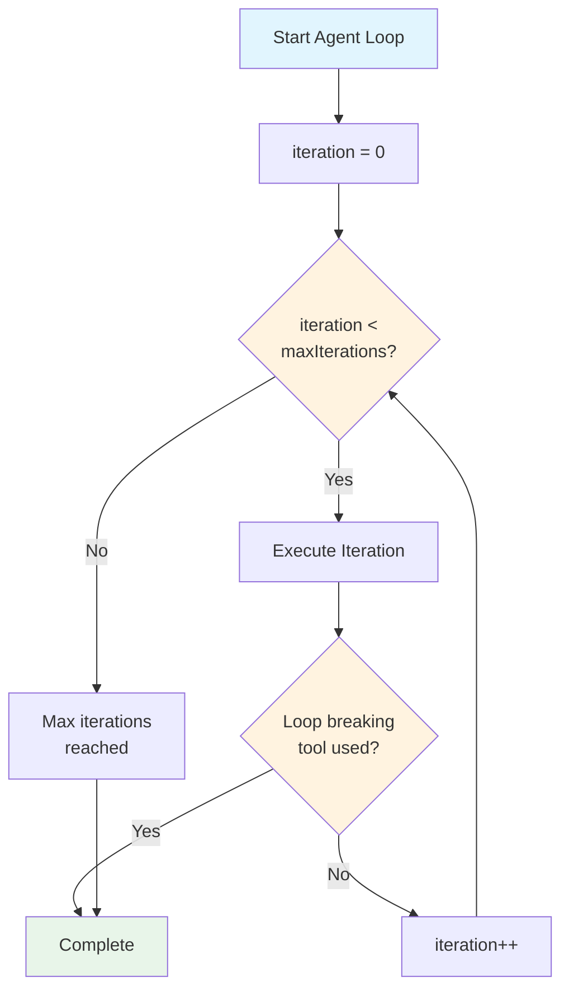
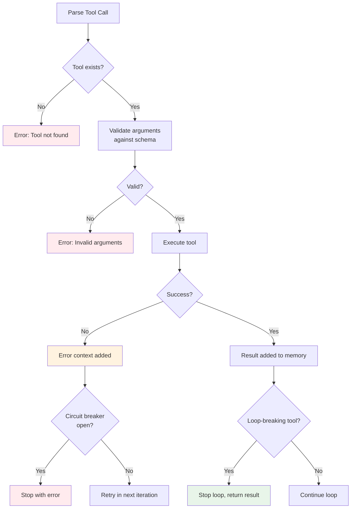
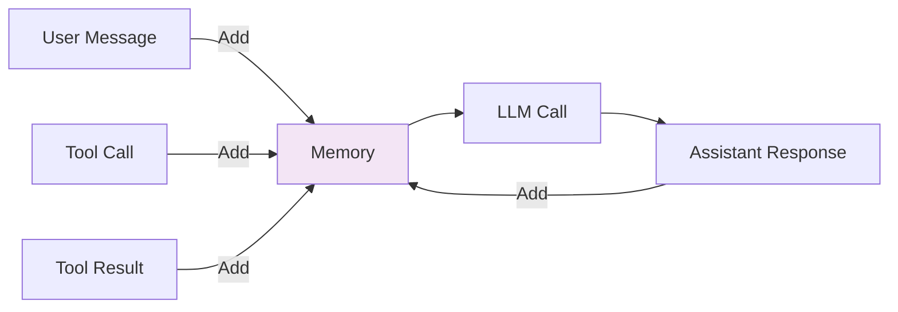
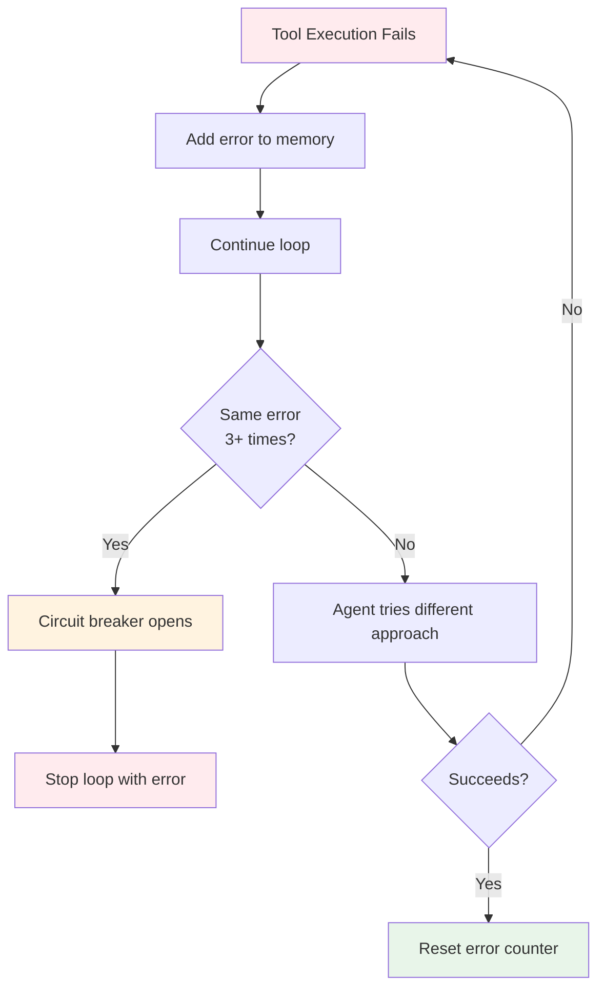

# Agent Loop Architecture

This document provides a detailed technical explanation of Forge's agent loop system - the core mechanism that enables iterative reasoning and tool execution.

## Overview

The agent loop is a continuous cycle of reasoning, action, and learning that allows agents to:
- Break down complex tasks into steps
- Use tools to gather information or perform actions
- Learn from tool results
- Iterate until the task is complete

## Core Concept

Traditional LLM interactions are stateless request-response cycles. The agent loop transforms this into a stateful, iterative process:



## Implementation

### Loop Entry Point

The agent loop begins in [`DefaultAgent.ProcessMessage()`](../../pkg/agent/default.go):

```go
func (a *DefaultAgent) ProcessMessage(ctx context.Context, message string) error {
    // Add user message to memory
    a.memory.AddMessage(types.Message{
        Role:    types.RoleUser,
        Content: message,
    })
    
    // Run the agent loop
    a.runAgentLoop(ctx)
    
    return nil
}
```

### Loop Execution

The main loop is in [`runAgentLoop()`](../../pkg/agent/default.go):



### Single Iteration

Each iteration follows this sequence:

```mermaid
sequenceDiagram
    participant Loop as Agent Loop
    participant Prompt as Prompt Builder
    participant Memory as Memory System
    participant Provider as LLM Provider
    participant Parser as Content Parser
    participant Tools as Tool System
    
    Loop->>Prompt: Build system prompt with tools
    Loop->>Memory: Get conversation history
    Loop->>Provider: Send messages
    Provider-->>Loop: Stream response
    Loop->>Parser: Parse thinking & tool calls
    
    alt Tool call found
        Loop->>Tools: Parse tool call
        Tools->>Tools: Validate arguments
        Tools->>Tools: Execute tool
        Tools-->>Loop: Return result
        Loop->>Memory: Add result to history
        
        alt Loop-breaking tool
            Loop->>Loop: Stop iteration
        else Non-breaking tool
            Loop->>Loop: Continue to next iteration
        end
    else No tool call
        Loop->>Loop: Output response
    end
```

## Key Components

### 1. Prompt Assembly

Before each LLM call, the system prompt is dynamically assembled:

```go
systemPrompt := prompts.BuildSystemPrompt(
    customInstructions,
    tools,
    iteration,
    maxIterations,
)
```

The system prompt includes:
- Custom instructions (personality, behavior)
- Tool schemas (what tools are available)
- Iteration warnings (approaching limit)
- Format requirements (thinking tags, tool XML)

### 2. Tool Call Detection

Responses are parsed for tool calls using XML format:

```xml
<tool>
{
  "server_name": "local",
  "tool_name": "calculator",
  "arguments": {
    "operation": "multiply",
    "a": 15,
    "b": 23
  }
}
</tool>
```

The parser extracts:
- Tool name
- Arguments (JSON)
- Context (what the agent was thinking)

### 3. Tool Execution

Tools are executed with validation:



### 4. Loop Termination

The loop stops when:

1. **Loop-Breaking Tool Used:**
   ```go
   if tool.IsLoopBreaking() {
       return true, result
   }
   ```

2. **Max Iterations Reached:**
   ```go
   if iteration >= maxIterations {
       return false, "Max iterations reached"
   }
   ```

3. **Error with Open Circuit Breaker:**
   ```go
   if circuitBreakerOpen {
       return false, errorMessage
   }
   ```

## Built-in Loop-Breaking Tools

### task_completion

Signals successful task completion:

```go
type TaskCompletionTool struct{}

func (t *TaskCompletionTool) Execute(ctx context.Context, args json.RawMessage) (string, error) {
    var params struct {
        Result string `json:"result"`
    }
    json.Unmarshal(args, &params)
    return params.Result, nil
}

func (t *TaskCompletionTool) IsLoopBreaking() bool {
    return true // Stops the loop
}
```

### ask_question

Requests user input:

```go
func (t *AskQuestionTool) IsLoopBreaking() bool {
    return true // Waits for user response
}
```

### converse

Natural conversation:

```go
func (t *ConverseTool) IsLoopBreaking() bool {
    return true // Conversational turn complete
}
```

## Memory Integration

The loop maintains conversation context through memory:



Each iteration adds messages to memory:
- User messages
- Assistant responses (with thinking)
- Tool calls
- Tool results

Memory is automatically pruned when token limits are reached, preserving:
- System prompt
- Recent conversation context
- Current tool interaction

## Error Recovery

The agent loop includes self-healing error recovery:



The circuit breaker pattern:
1. Tracks consecutive failures
2. Opens after threshold (default: 3)
3. Prevents infinite retry loops
4. Returns clear error to user

## Performance Characteristics

### Iteration Cost

Each iteration incurs:
- 1 LLM API call
- Token cost: system prompt + history + response
- Latency: network + LLM processing time

Example with 10 iterations:
```
Total Calls: 10
Total Tokens: 10 × (system + history + response)
Total Time: 10 × (network + processing)
```

### Optimization Strategies

1. **Lower MaxIterations** for simple tasks:
   ```go
   agent.WithMaxIterations(5)  // Faster, cheaper
   ```

2. **Smaller models** for tool-heavy workflows:
   ```go
   openai.WithModel("gpt-4o-mini")  // Faster, 60% cheaper
   ```

3. **Effective tool design** to minimize iterations:
   - Clear descriptions
   - Useful return values
   - Proper error messages

4. **Memory pruning** to control token usage:
   - Automatic pruning at token limits
   - Preserves recent context
   - Reduces cost per iteration

## Event Emission

The loop emits events for observability:

```go
// Start of iteration
emit(ThinkingEvent{
    Content: "[Agent is analyzing...]",
})

// Tool execution
emit(ToolCallEvent{
    ToolName: "calculator",
    Arguments: {...},
})

// Tool result
emit(ToolResultEvent{
    Result: "345.00",
})

// Final response
emit(MessageEvent{
    Content: "The result is 345",
})

// End of turn
emit(TurnCompleteEvent{})
```

These events enable:
- Real-time UI updates
- Debugging and logging
- Performance monitoring
- User feedback

## Design Decisions

### Why Iteration Limits?

Without limits, infinite loops are possible:
```
Agent: Use tool X
Tool X: Returns incomplete result
Agent: Use tool X again
Tool X: Returns incomplete result
... forever
```

MaxIterations provides:
- Cost control
- Predictable behavior
- Clear failure modes

### Why Loop-Breaking Tools?

Without explicit termination signals:
- Agent might not know when it's done
- Could waste iterations "double-checking"
- Unclear when to return control to user

Loop-breaking tools provide:
- Clear completion signals
- Control over conversation flow
- Explicit user interaction points

### Why Add Tool Results to Memory?

Tool results become context for future iterations:
```
Iteration 1: calculator(5, 3) → "8"
Iteration 2: Agent remembers 8, can use in next calculation
```

This enables:
- Multi-step reasoning
- Building on previous results
- Complex problem solving

## Best Practices

### For Framework Users

1. **Set appropriate limits:**
   ```go
   // Simple tasks
   agent.WithMaxIterations(5)
   
   // Complex workflows
   agent.WithMaxIterations(20)
   ```

2. **Monitor iterations in production:**
   ```go
   // Track via events
   agent.On(TurnCompleteEvent, func(e Event) {
       metrics.RecordIterations(e.IterationCount)
   })
   ```

3. **Design tools for efficiency:**
   ```go
   // Good: Returns useful, complete information
   func (t *SearchTool) Execute(...) (string, error) {
       return "Found 3 results: ...", nil
   }
   
   // Bad: Requires multiple calls
   func (t *SearchTool) Execute(...) (string, error) {
       return "Search complete", nil  // No data!
   }
   ```

### For Framework Developers

1. **Keep loop logic simple:**
   - Single responsibility: orchestrate
   - Delegate to specialized components
   - Maintain clear state

2. **Emit comprehensive events:**
   - Every significant state change
   - Include relevant context
   - Enable debugging

3. **Handle errors gracefully:**
   - Add context to errors
   - Enable recovery when possible
   - Fail fast when not

## See Also

- [Architecture Overview](overview.md) - System architecture
- [Tool System Architecture](tool-system.md) - Tool design
- [Memory System Architecture](memory-system.md) - Memory management
- [Error Handling Guide](../guides/error-handling.md) - Error recovery patterns
- [Building Custom Tools](../guides/building-custom-tools.md) - Tool development guide