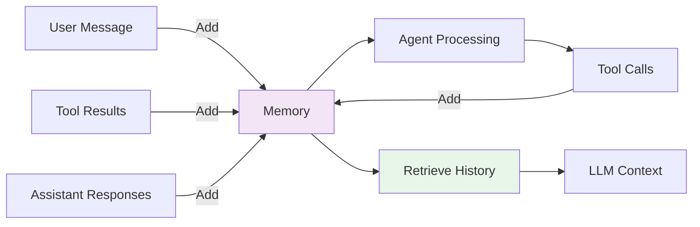
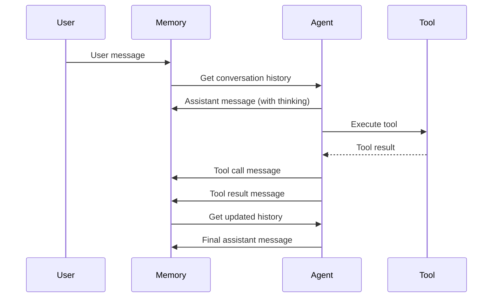
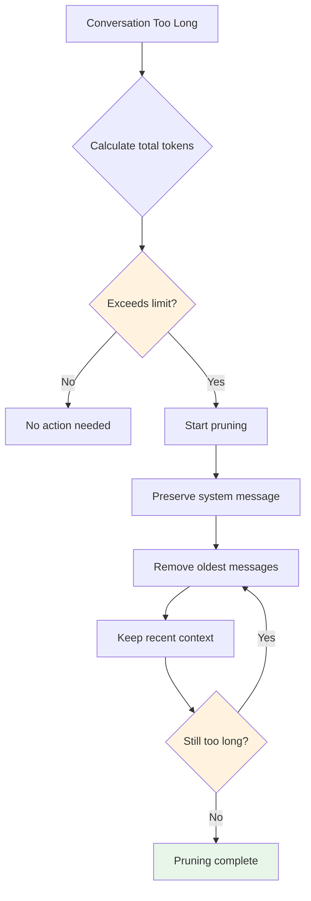
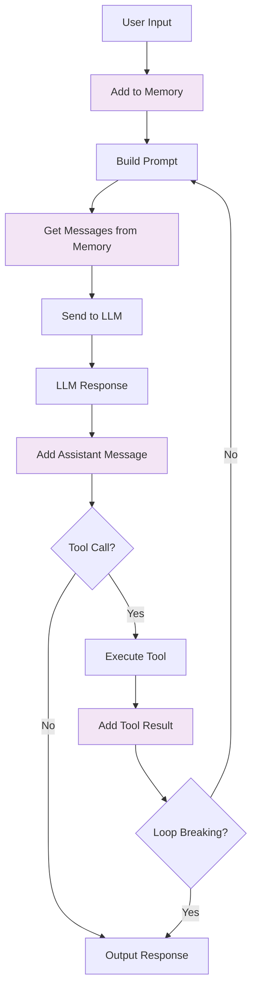

# Memory System Architecture

This document describes the architecture and implementation of Forge's memory system, which manages conversation history and context for agents.

## Overview

The memory system enables agents to:
- Maintain conversation context across turns
- Remember previous interactions
- Reference earlier messages and tool results
- Manage token limits through pruning

## Core Concept



## Memory Interface

From [`pkg/agent/memory/memory.go`](../../pkg/agent/memory/memory.go):

```go
type Memory interface {
    // AddMessage adds a message to memory
    AddMessage(message types.Message)
    
    // GetMessages returns all messages
    GetMessages() []types.Message
    
    // GetRecent returns the N most recent messages
    GetRecent(n int) []types.Message
    
    // GetByRole returns messages filtered by role
    GetByRole(role types.Role) []types.Message
    
    // Prune removes old messages to stay under token limit
    Prune(maxTokens int)
    
    // Clear removes all messages
    Clear()
}
```

## ConversationMemory Implementation

The default implementation in [`pkg/agent/memory/conversation.go`](../../pkg/agent/memory/conversation.go):

```go
type ConversationMemory struct {
    messages []types.Message
    mu       sync.RWMutex  // Thread-safe access
}
```

### Key Features

1. **Thread-Safe**: Uses RWMutex for concurrent access
2. **In-Memory**: Fast access, no persistence
3. **Automatic Pruning**: Manages token limits
4. **Role Filtering**: Query by message role

## Message Types

Messages have different roles:

```go
const (
    RoleSystem    Role = "system"     // System instructions
    RoleUser      Role = "user"       // User input
    RoleAssistant Role = "assistant"  // Agent responses
    RoleTool      Role = "tool"       // Tool results
)
```

### Message Flow



## Memory Operations

### Adding Messages

```go
func (m *ConversationMemory) AddMessage(message types.Message) {
    m.mu.Lock()
    defer m.mu.Unlock()
    
    // Set timestamp if not provided
    if message.Timestamp.IsZero() {
        message.Timestamp = time.Now()
    }
    
    m.messages = append(m.messages, message)
}
```

Thread-safe append operation that:
- Locks for writes
- Adds timestamp automatically
- Appends to message slice

### Retrieving Messages

```go
func (m *ConversationMemory) GetMessages() []types.Message {
    m.mu.RLock()
    defer m.mu.RUnlock()
    
    // Return a copy to prevent external modification
    messages := make([]types.Message, len(m.messages))
    copy(messages, m.messages)
    return messages
}
```

Returns a copy to prevent external modifications.

### Recent Messages

```go
func (m *ConversationMemory) GetRecent(n int) []types.Message {
    m.mu.RLock()
    defer m.mu.RUnlock()
    
    if n >= len(m.messages) {
        return m.GetMessages()
    }
    
    start := len(m.messages) - n
    messages := make([]types.Message, n)
    copy(messages, m.messages[start:])
    return messages
}
```

Useful for showing last N messages in UI.

### Filter by Role

```go
func (m *ConversationMemory) GetByRole(role types.Role) []types.Message {
    m.mu.RLock()
    defer m.mu.RUnlock()
    
    var filtered []types.Message
    for _, msg := range m.messages {
        if msg.Role == role {
            filtered = append(filtered, msg)
        }
    }
    return filtered
}
```

Examples:
- Get all user messages
- Get all tool results
- Get all assistant responses

## Token Management

### Why Prune?

LLMs have context windows (token limits):
- GPT-4o: 128K tokens
- GPT-4o-mini: 128K tokens
- Each message consumes tokens
- Long conversations exceed limits

### Pruning Strategy



### Prune Implementation

```go
func (m *ConversationMemory) Prune(maxTokens int) {
    m.mu.Lock()
    defer m.mu.Unlock()
    
    totalTokens := m.calculateTokens()
    if totalTokens <= maxTokens {
        return  // No pruning needed
    }
    
    // Always keep system message (first message)
    systemMsg := m.messages[0]
    messages := m.messages[1:]
    
    // Remove oldest messages until under limit
    for totalTokens > maxTokens && len(messages) > 0 {
        // Remove oldest message
        messages = messages[1:]
        totalTokens = m.calculateTokensFor(append([]types.Message{systemMsg}, messages...))
    }
    
    // Update messages
    m.messages = append([]types.Message{systemMsg}, messages...)
}
```

### Token Estimation

Simple estimation (GPT tokenization is complex):

```go
func (m *ConversationMemory) calculateTokens() int {
    total := 0
    for _, msg := range m.messages {
        // Rough estimate: ~4 characters per token
        total += len(msg.Content) / 4
    }
    return total
}
```

For production, use proper tokenization libraries:
- `tiktoken` for OpenAI models
- Provider-specific tokenizers

## Conversation Example

### Multi-Turn Conversation

```go
// Turn 1
memory.AddMessage(Message{
    Role: RoleUser,
    Content: "What is 5 + 3?",
})

memory.AddMessage(Message{
    Role: RoleAssistant,
    Content: "[I need to calculate this...]\n<tool>...</tool>",
})

memory.AddMessage(Message{
    Role: RoleTool,
    Content: "8",
})

memory.AddMessage(Message{
    Role: RoleAssistant,
    Content: "5 + 3 = 8",
})

// Turn 2
memory.AddMessage(Message{
    Role: RoleUser,
    Content: "Now multiply that by 2",
})

// Agent can reference "that" = 8 from memory

memory.AddMessage(Message{
    Role: RoleAssistant,
    Content: "[Multiply 8 by 2...]\n<tool>...</tool>",
})
```

The agent maintains context across turns.

## Memory in Agent Loop

### Integration Points



### Before Each LLM Call

```go
func (a *DefaultAgent) executeIteration(ctx context.Context) {
    // 1. Build system prompt
    systemPrompt := prompts.BuildSystemPrompt(...)
    
    // 2. Get conversation history from memory
    history := a.memory.GetMessages()
    
    // 3. Assemble messages
    messages := []types.Message{
        {Role: types.RoleSystem, Content: systemPrompt},
    }
    messages = append(messages, history...)
    
    // 4. Call LLM
    response := a.provider.Complete(ctx, messages)
    
    // 5. Add response to memory
    a.memory.AddMessage(types.Message{
        Role: types.RoleAssistant,
        Content: response.Content,
    })
}
```

## Advanced Features

### Tagging Messages

Add metadata to messages:

```go
type Message struct {
    Role      Role
    Content   string
    Timestamp time.Time
    Metadata  map[string]interface{}  // Custom metadata
}

// Example: Tag important messages
message.Metadata = map[string]interface{}{
    "important": true,
    "category": "calculation",
}
```

### Filtering with Metadata

```go
func (m *ConversationMemory) GetImportant() []types.Message {
    m.mu.RLock()
    defer m.mu.RUnlock()
    
    var important []types.Message
    for _, msg := range m.messages {
        if val, ok := msg.Metadata["important"].(bool); ok && val {
            important = append(important, msg)
        }
    }
    return important
}
```

### Message Search

```go
func (m *ConversationMemory) Search(query string) []types.Message {
    m.mu.RLock()
    defer m.mu.RUnlock()
    
    var results []types.Message
    for _, msg := range m.messages {
        if strings.Contains(strings.ToLower(msg.Content), strings.ToLower(query)) {
            results = append(results, msg)
        }
    }
    return results
}
```

## Persistence

### Current: In-Memory Only

ConversationMemory stores messages in a slice:
- ✅ Fast
- ✅ Simple
- ❌ Lost on restart
- ❌ No sharing between instances

### Future: Persistent Memory

Implement Memory interface with database backend:

```go
type DatabaseMemory struct {
    db *sql.DB
}

func (m *DatabaseMemory) AddMessage(message types.Message) {
    // INSERT INTO messages ...
}

func (m *DatabaseMemory) GetMessages() []types.Message {
    // SELECT * FROM messages ...
}
```

Enables:
- Conversation persistence
- Multi-instance agents
- Long-term memory
- Analytics and search

## Performance Considerations

### Memory Usage

Each message consumes memory:
```
Message size ≈ len(content) + overhead
Total memory ≈ num_messages × average_message_size
```

For long conversations:
- Use pruning
- Implement persistence with pagination
- Consider message compression

### Lock Contention

RWMutex allows concurrent reads:
```go
// Multiple readers can proceed simultaneously
messages := memory.GetMessages()  // RLock
recent := memory.GetRecent(10)    // RLock

// Writers block all access
memory.AddMessage(msg)  // Lock
```

For high concurrency:
- Minimize write operations
- Batch additions where possible
- Consider lock-free data structures

### Pruning Cost

Pruning is O(n) where n = number of messages:
```go
// Pruning involves:
// 1. Calculating tokens for all messages
// 2. Removing messages from slice
// 3. Recalculating tokens
```

Optimization:
- Track token count incrementally
- Prune proactively before hitting limits
- Use more efficient token counting

## Best Practices

### 1. Regular Pruning

```go
// After each turn
if totalTokens > maxTokens {
    memory.Prune(maxTokens)
}
```

### 2. Preserve Important Context

```go
// Don't prune system message
// Keep recent tool results
// Preserve user questions
```

### 3. Use Appropriate Limits

```go
// Short conversations
memory.Prune(4000)  // ~1000 words

// Normal conversations  
memory.Prune(16000)  // ~4000 words

// Long conversations
memory.Prune(32000)  // ~8000 words
```

### 4. Monitor Memory Usage

```go
// Log memory stats
log.Printf("Messages: %d, Tokens: %d", 
    len(memory.GetMessages()),
    memory.calculateTokens())
```

## Testing Memory

```go
func TestConversationMemory(t *testing.T) {
    memory := NewConversationMemory()
    
    // Test adding messages
    memory.AddMessage(types.Message{
        Role: types.RoleUser,
        Content: "Hello",
    })
    
    messages := memory.GetMessages()
    if len(messages) != 1 {
        t.Errorf("Expected 1 message, got %d", len(messages))
    }
    
    // Test pruning
    for i := 0; i < 100; i++ {
        memory.AddMessage(types.Message{
            Role: types.RoleUser,
            Content: "Message " + strconv.Itoa(i),
        })
    }
    
    memory.Prune(1000)  // Prune to 1000 tokens
    
    if len(memory.GetMessages()) >= 100 {
        t.Error("Pruning didn't reduce message count")
    }
}
```

## See Also

- [Agent Loop Architecture](agent-loop.md) - How memory integrates with agent loop
- [Architecture Overview](overview.md) - System architecture
- [Memory Management Guide](../guides/memory-management.md) - Using memory effectively
- [API Reference: Types](../reference/api/types.md) - Message types and structures