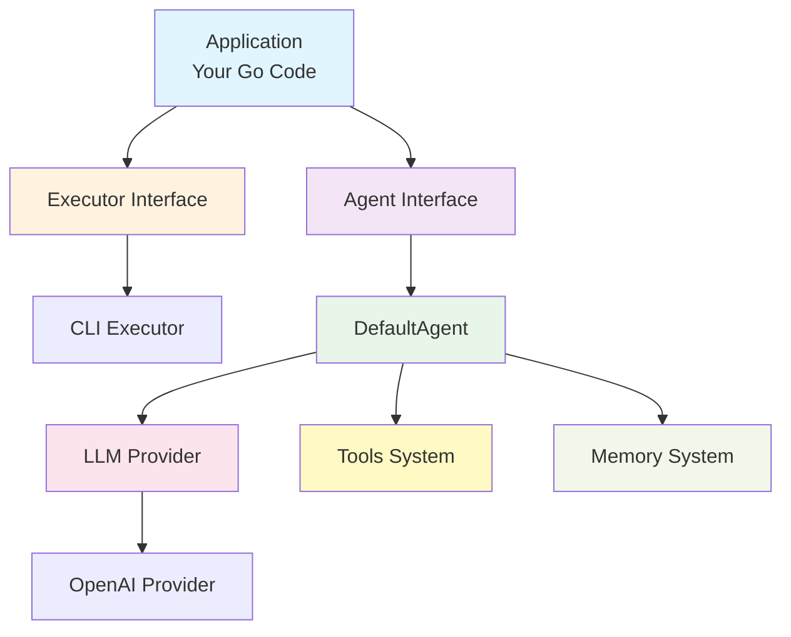
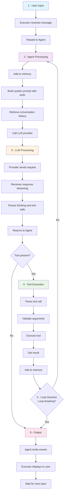
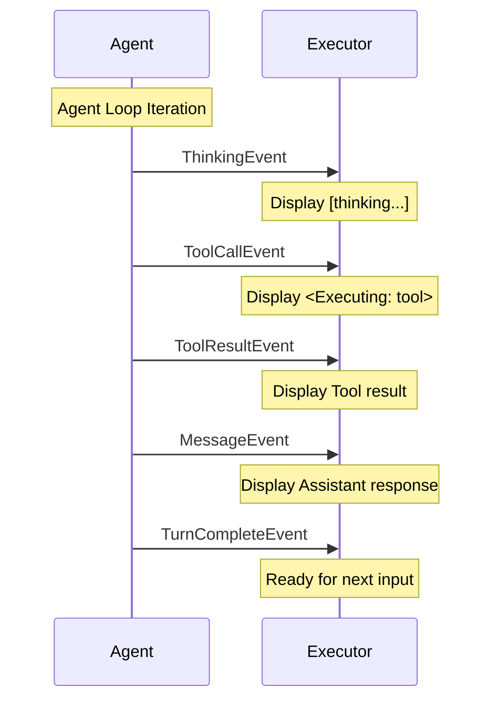

# Forge Architecture Overview

This document provides a comprehensive overview of Forge's architecture, design principles, and component organization.

## Philosophy

Forge is built on three core principles:

1. **Interface-Driven Design** - All major components are interfaces for maximum flexibility
2. **Pluggable Architecture** - Easy to swap implementations without changing application code
3. **Library-First** - Designed as an importable Go module, not a standalone application

## High-Level Architecture



## Core Components

### 1. Agent System (`pkg/agent`)

The agent is the central orchestrator that:
- Manages the conversation loop
- Coordinates tool execution
- Maintains conversation memory
- Handles errors and retries

**Key Files:**
- `agent.go` - Agent interface definition
- `default.go` - DefaultAgent implementation with agent loop
- `tools/` - Tool system
- `prompts/` - Prompt assembly
- `memory/` - Conversation memory
- `core/` - Stream processing

**Interface:**
```go
type Agent interface {
    ProcessMessage(ctx context.Context, message string) error
    RegisterTool(tool tools.Tool) error
    GetTools() map[string]tools.Tool
}
```

### 2. LLM Provider System (`pkg/llm`)

Abstracts LLM services behind a common interface:
- Sends requests to LLM APIs
- Handles streaming responses
- Manages API configurations

**Key Files:**
- `provider.go` - Provider interface
- `types.go` - Request/response types
- `openai/` - OpenAI implementation
- `parser/` - Content parsing (thinking, tool calls)

**Interface:**
```go
type Provider interface {
    Complete(ctx context.Context, messages []types.Message) (*types.CompletionResponse, error)
    Stream(ctx context.Context, messages []types.Message) (<-chan types.StreamChunk, error)
}
```

### 3. Tool System (`pkg/agent/tools`)

Enables agents to perform actions:
- Define capabilities the agent can use
- JSON schema-based parameter validation
- Loop-breaking vs non-breaking tools
- Custom tool registration

**Built-in Tools:**
- `task_completion` - Complete a task and return result
- `ask_question` - Request clarification from user
- `converse` - Casual conversation

**Interface:**
```go
type Tool interface {
    Name() string
    Description() string
    Schema() map[string]interface{}
    Execute(ctx context.Context, arguments json.RawMessage) (string, error)
    IsLoopBreaking() bool
}
```

### 4. Executor System (`pkg/executor`)

Handles how agents interact with the environment:
- Different execution contexts (CLI, API, custom)
- Input/output management
- Event handling and display

**Key Files:**
- `executor.go` - Executor interface
- `cli/` - CLI executor implementation

**Interface:**
```go
type Executor interface {
    Run(ctx context.Context) error
}
```

### 5. Memory System (`pkg/agent/memory`)

Manages conversation history:
- Thread-safe message storage
- Token-based pruning
- Role-based filtering
- System message preservation

**Interface:**
```go
type Memory interface {
    AddMessage(message types.Message)
    GetMessages() []types.Message
    GetRecent(n int) []types.Message
    Prune(maxTokens int)
    Clear()
}
```

### 6. Prompt System (`pkg/agent/prompts`)

Assembles prompts dynamically:
- System prompt with tool schemas
- Custom instruction injection
- Iteration warnings
- Context management

**Key Functions:**
- `BuildSystemPrompt()` - Create system prompt with tools
- `FormatToolSchema()` - Format tools for LLM
- `BuildMessages()` - Assemble complete message list

### 7. Types Package (`pkg/types`)

Shared types across the framework:
- Message types (user, assistant, system, tool)
- Events (thinking, tool calls, errors)
- Configuration options
- Channel utilities

## Package Organization

```
forge/
├── pkg/                    # Public API
│   ├── agent/              # Agent core
│   │   ├── agent.go        # Agent interface
│   │   ├── default.go      # DefaultAgent implementation
│   │   ├── tools/          # Tool system
│   │   ├── prompts/        # Prompt assembly
│   │   ├── memory/         # Conversation memory
│   │   └── core/           # Stream processing
│   ├── llm/                # LLM providers
│   │   ├── provider.go     # Provider interface
│   │   ├── types.go        # LLM types
│   │   ├── openai/         # OpenAI implementation
│   │   └── parser/         # Content parsers
│   ├── executor/           # Execution environments
│   │   ├── executor.go     # Executor interface
│   │   └── cli/            # CLI executor
│   └── types/              # Shared types
│       ├── channels.go     # Channel utilities
│       ├── config.go       # Configuration
│       ├── event.go        # Event types
│       ├── message.go      # Message types
│       └── types.go        # Core types
└── internal/               # Private implementation
    ├── core/               # Internal core logic
    └── utils/              # Internal utilities
```

## Design Patterns

### 1. Interface-Based Design

All major components are interfaces:

```go
// Users depend on interfaces, not implementations
type Agent interface { ... }
type Provider interface { ... }
type Executor interface { ... }
type Tool interface { ... }
```

Benefits:
- Easy to test (mock interfaces)
- Swappable implementations
- Clear contracts
- Dependency inversion

### 2. Event-Driven Architecture

Components communicate via events:

```go
// Events emitted during agent operation
type Event interface {
    Type() EventType
    Timestamp() time.Time
}

// Examples:
- ThinkingEvent
- ToolCallEvent  
- MessageEvent
- ErrorEvent
```

Benefits:
- Real-time updates
- Decoupled components
- Observable behavior
- Easy debugging

### 3. Builder Pattern

Configuration via functional options:

```go
agent.NewDefaultAgent(
    provider,
    agent.WithCustomInstructions("..."),
    agent.WithMaxIterations(10),
)

openai.NewProvider(
    apiKey,
    openai.WithModel("gpt-4o"),
    openai.WithTemperature(0.7),
)
```

Benefits:
- Clean API
- Optional parameters
- Backward compatibility
- Self-documenting

### 4. Chain of Responsibility

Error recovery with circuit breaker:

```go
Try operation
  ↓ Fails
Add error context
  ↓
Try again
  ↓ Fails again
Check circuit breaker
  ↓ Open
Return error to user
```

Benefits:
- Automatic retry logic
- Prevents infinite loops
- Graceful degradation

## Data Flow

### Message Processing Flow



### Event Flow



## Extension Points

### 1. Custom LLM Providers

Implement the Provider interface:

```go
type MyProvider struct {
    // Your config
}

func (p *MyProvider) Complete(ctx context.Context, messages []types.Message) (*types.CompletionResponse, error) {
    // Your implementation
}

func (p *MyProvider) Stream(ctx context.Context, messages []types.Message) (<-chan types.StreamChunk, error) {
    // Your implementation
}
```

### 2. Custom Tools

Implement the Tool interface:

```go
type MyTool struct{}

func (t *MyTool) Name() string { return "my_tool" }
func (t *MyTool) Description() string { return "..." }
func (t *MyTool) Schema() map[string]interface{} { return ... }
func (t *MyTool) Execute(ctx context.Context, args json.RawMessage) (string, error) { ... }
func (t *MyTool) IsLoopBreaking() bool { return false }
```

### 3. Custom Executors

Implement the Executor interface:

```go
type MyExecutor struct {
    agent agent.Agent
}

func (e *MyExecutor) Run(ctx context.Context) error {
    // Your execution logic
}
```

### 4. Custom Memory

Implement the Memory interface for persistence:

```go
type DatabaseMemory struct {
    db *sql.DB
}

func (m *DatabaseMemory) AddMessage(msg types.Message) {
    // Store in database
}

func (m *DatabaseMemory) GetMessages() []types.Message {
    // Retrieve from database
}
```

## Current Features

- ✅ Agent loop with iterative reasoning
- ✅ Tool system with built-in tools
- ✅ Custom tool registration
- ✅ OpenAI provider implementation
- ✅ CLI executor
- ✅ Chain-of-thought reasoning
- ✅ Conversation memory management
- ✅ Event-driven architecture
- ✅ Streaming support
- ✅ Self-healing error recovery
- ✅ Circuit breaker pattern
- ✅ Token-based memory pruning

## Planned Features

- [ ] Additional LLM providers (Anthropic, Google, etc.)
- [ ] HTTP API executor
- [ ] Persistent memory backends
- [ ] Multi-agent coordination
- [ ] Parallel tool execution
- [ ] Tool result streaming
- [ ] Advanced memory management
- [ ] Agent collaboration and handoffs

## Performance Characteristics

### Memory Usage
- Minimal: Conversation history only
- Automatic pruning prevents unbounded growth
- Tool results included in history

### Latency
- One LLM call per iteration
- Iterations run sequentially
- Tool execution is synchronous

### Cost
- Scales with iterations (each = 1 LLM call)
- MaxIterations controls maximum cost
- Memory pruning reduces token usage

## See Also

- [Agent Loop Architecture](agent-loop.md) - Detailed loop implementation
- [Tool System Architecture](tool-system.md) - Tool system design
- [Memory System Architecture](memory-system.md) - Memory management
- [Design Decisions](design-decisions.md) - Key architectural choices
- [API Reference](../reference/) - Complete API documentation