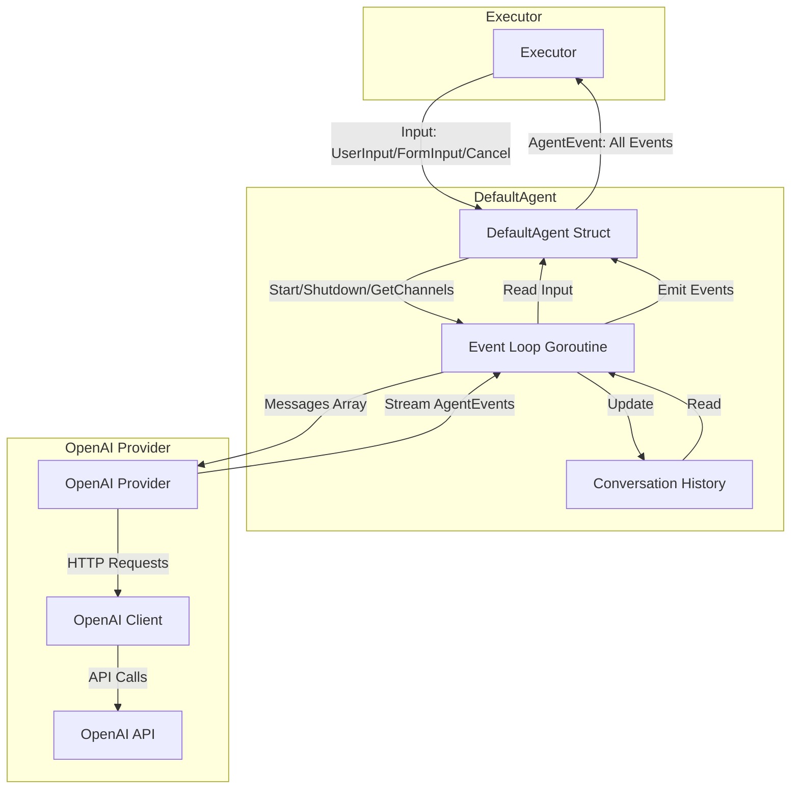
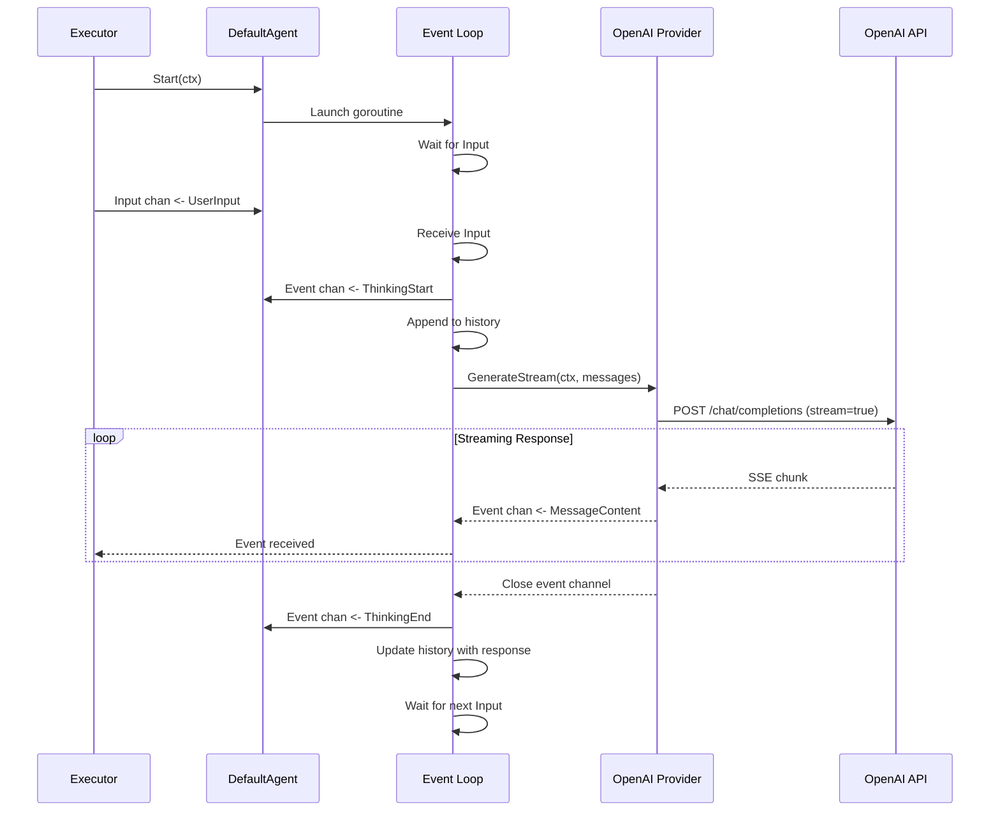

# DefaultAgent and OpenAI Provider Architecture

## Overview

This document describes the architecture for the DefaultAgent implementation and OpenAI Provider integration.

## Component Diagram



## Data Flow: Single Turn



## DefaultAgent Structure

```go
type DefaultAgent struct {
    provider  llm.Provider        // LLM provider (e.g., OpenAI)
    config    *types.AgentConfig  // Agent configuration
    channels  *types.AgentChannels // Communication channels
    history   []*types.Message    // Conversation history
    mu        sync.RWMutex        // Protects history
    cancel    context.CancelFunc  // Cancels event loop
}
```

## OpenAI Provider Structure

```go
type Provider struct {
    client    *openai.Client      // OpenAI Go client
    apiKey    string              // API key
    model     string              // Model name (e.g., gpt-4)
    modelInfo *types.ModelInfo    // Cached model info
}
```

## Event Loop Algorithm

```
1. Start event loop goroutine
2. Initialize context with cancellation
3. Loop until shutdown:
   a. Select on multiple channels:
      - Input channel: Process user input
      - Shutdown channel: Exit loop
      - Context.Done(): Exit loop
   
   b. On Input received:
      - Check Input type (Cancel/UserInput/FormInput)
      - If Cancel: abort current request, continue
      - Emit ThinkingStart event
      - Append user message to history
      - Call provider.GenerateStream(ctx, history)
      - Stream events from provider to Event channel
      - Append assistant response to history
      - Emit ThinkingEnd event
      - Continue loop (multi-turn)
   
   c. On Shutdown/Context.Done:
      - Emit StatusShutdown event
      - Close Event and Done channels
      - Exit loop

4. Return from goroutine
```

## OpenAI Provider Implementation

### GenerateStream Method

```
1. Convert []*types.Message to OpenAI ChatCompletionMessage format
2. Create ChatCompletionRequest with stream=true
3. Call client.CreateChatCompletionStream(ctx, request)
4. Create event channel
5. Launch goroutine to read SSE stream:
   a. Emit EventTypeMessageStart
   b. For each delta from stream:
      - Emit EventTypeMessageContent with delta text
   c. On stream end:
      - Emit EventTypeMessageEnd
   d. On error:
      - Emit EventTypeError
   e. Close event channel
6. Return event channel
```

### Generate Method

```
1. Call GenerateStream(ctx, messages)
2. Accumulate all MessageContent events
3. Return complete Message or error
```

## Key Design Decisions

### 1. Multi-turn Processing
- Event loop continues running after each response
- Maintains conversation history across turns
- Enables natural back-and-forth dialogue

### 2. Streaming First
- All LLM calls use streaming by default
- Generate() wraps GenerateStream() for convenience
- Enables real-time user feedback

### 3. Cancellation Support
- Input.Cancel type allows aborting in-flight requests
- Context cancellation propagates to OpenAI API calls
- Graceful shutdown ensures cleanup

### 4. Event-Driven Architecture
- All communication via channels
- Non-blocking with buffered channels
- Easy to extend with new event types

### 5. Thread Safety
- Conversation history protected by mutex
- Each agent has own goroutine
- Channel-based synchronization

## Error Handling

1. **Network Errors**: Emit EventTypeError, continue event loop
2. **API Errors**: Convert to AgentError, emit EventTypeError
3. **Context Cancellation**: Clean shutdown, emit StatusShutdown
4. **Invalid Input**: Emit EventTypeError with validation details

## Testing Strategy

### OpenAI Provider Tests
- Mock HTTP responses using httptest
- Test streaming chunk parsing
- Test error handling (rate limits, invalid API key, etc.)
- Test Message conversion to/from OpenAI format

### DefaultAgent Tests
- Mock Provider implementation
- Test event loop lifecycle (start/shutdown)
- Test multi-turn conversation flow
- Test cancellation handling
- Test concurrent safety of history access

## Example Usage

```go
// Create OpenAI provider
apiKey := os.Getenv("OPENAI_API_KEY")
provider := openai.NewProvider(apiKey, "gpt-4")

// Create default agent
config := types.NewAgentConfig().
    WithSystemPrompt("You are a helpful assistant").
    Build()

agent := agent.NewDefaultAgent(provider, config)

// Start agent
ctx := context.Background()
if err := agent.Start(ctx); err != nil {
    log.Fatal(err)
}

// Get channels
channels := agent.GetChannels()

// Send user input
channels.Input <- types.NewUserInput("Hello!")

// Read events
for event := range channels.Event {
    switch event.Type {
    case types.EventTypeMessageContent:
        fmt.Print(event.Content)
    case types.EventTypeError:
        log.Printf("Error: %v", event.Error)
    }
}

// Shutdown
agent.Shutdown(context.Background())
```

## Dependencies

- `github.com/openai/openai-go`: Official OpenAI Go SDK
- Standard library: `context`, `sync`, `net/http`
- Internal: `pkg/types`, `pkg/llm`

## Performance Considerations

1. **Buffered Channels**: Size 100 to prevent blocking
2. **Memory**: Conversation history grows with turns (implement max history length)
3. **Goroutines**: One per agent, proper lifecycle management
4. **API Rate Limits**: Consider adding rate limiting to provider