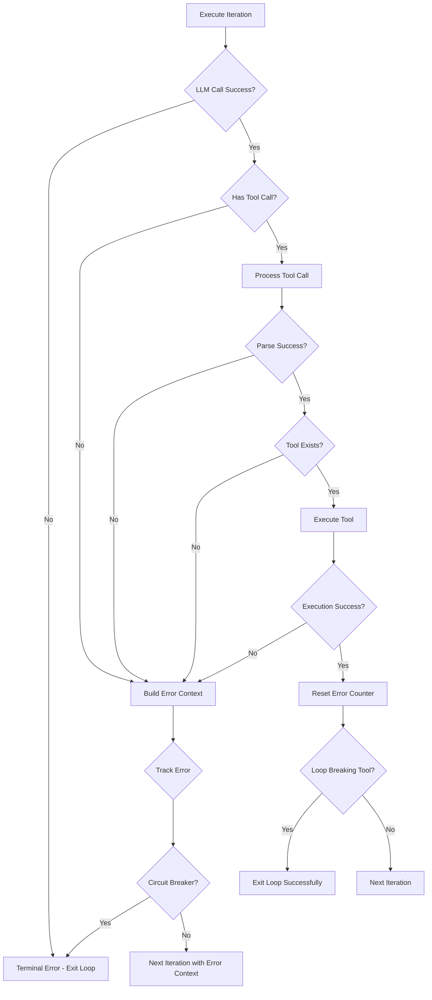

# Error Recovery

Forge implements a self-healing error recovery system that allows agents to handle and recover from errors during execution without terminating the agent loop.

## Overview

When an error occurs during tool execution, instead of terminating the agent loop, the error is fed back to the agent as ephemeral context. The agent can then:

1. Understand what went wrong
2. Adjust its approach
3. Try again with a different strategy

This creates a more resilient agent that can handle unexpected situations gracefully.

## Error Categories

### Terminal Errors

These errors will terminate the agent loop:

- **LLM/API Errors**: Failures when calling the LLM provider
- **Context Cancellation**: When the context is cancelled (timeout, user interrupt)
- **Circuit Breaker Trigger**: When 5 identical consecutive errors occur

### Recoverable Errors

These errors trigger the recovery mechanism:

- **No Tool Call**: Agent response contains no tool calls
- **Invalid Tool Call**: Malformed tool call JSON or missing required fields
- **Unknown Tool**: Tool name not registered with the agent
- **Tool Execution Failure**: Tool exists but execution failed

## Circuit Breaker Pattern

To prevent infinite error loops, Forge implements a circuit breaker that tracks the last 5 errors:

```go
type DefaultAgent struct {
    // ...
    lastErrors [5]string // Ring buffer of error messages
    errorIndex int       // Current position in ring buffer
}
```

### Trigger Conditions

The circuit breaker triggers when:
1. All 5 slots in the ring buffer are filled
2. All 5 error messages are identical (same hash)

When triggered, the agent loop terminates with an error indicating repeated failures.

### Reset Behavior

The error counter resets to zero when:
- A tool call executes successfully
- A different error occurs (breaking the pattern)

## Error Recovery Flow



## Error Messages

### Structure

Error context messages follow this format:

```
The previous iteration failed with the following error:

[Detailed error message]

Please analyze what went wrong and try a different approach.
[Specific recovery instructions based on error type]
```

### Error-Specific Instructions

**No Tool Call**:
```
Please analyze what went wrong and try a different approach. You must provide a tool call in your response.
```

**Invalid JSON**:
```
Please analyze what went wrong and try a different approach. Ensure your tool call JSON is properly formatted.
```

**Unknown Tool**:
```
Please analyze what went wrong and try a different approach. Use one of the available tools: [tool1, tool2, ...]
```

**Execution Failure**:
```
Please analyze what went wrong and try a different approach. The error was: [specific error message]
```

## Ephemeral Error Context

Error messages are **not** stored in the agent's permanent conversation history. Instead, they are:

1. Generated from the current error
2. Passed to [`BuildMessages()`](pkg/agent/prompts/builder.go:77) as the `errorContext` parameter
3. Included as a temporary user message in the next LLM call
4. Discarded after the iteration completes

This prevents error messages from polluting the conversation history while still providing the agent with context to recover.

## Implementation Details

### Key Functions

- **[`runAgentLoop()`](pkg/agent/default.go:231)**: Main loop with error context variable
- **[`executeIteration()`](pkg/agent/default.go:250)**: Single iteration execution
- **[`processToolCall()`](pkg/agent/default.go:527)**: Tool call parsing and validation
- **[`executeTool()`](pkg/agent/default.go:578)**: Tool lookup and execution
- **[`trackError()`](pkg/agent/default.go:406)**: Error tracking for circuit breaker
- **[`resetErrorTracking()`](pkg/agent/default.go:427)**: Reset error counter

### Code Example

```go
func (a *DefaultAgent) runAgentLoop(ctx context.Context) error {
    var errorContext string
    
    for {
        shouldContinue, nextError, err := a.executeIteration(ctx, errorContext)
        if err != nil {
            return err
        }
        if !shouldContinue {
            return nil
        }
        
        errorContext = nextError
    }
}
```

## Testing

Comprehensive tests are provided in [`pkg/agent/error_recovery_test.go`](pkg/agent/error_recovery_test.go):

- **TestErrorTracking/TracksSingleError**: Verifies single error tracking
- **TestErrorTracking/TracksMultipleDifferentErrors**: Verifies different errors don't trigger circuit breaker
- **TestErrorTracking/TriggersCircuitBreakerOn5IdenticalErrors**: Verifies circuit breaker activation
- **TestErrorTracking/ResetsAfterSuccessfulIteration**: Verifies error counter reset
- **TestErrorTracking/CircuitBreakerRequiresAllFiveSlotsFilled**: Verifies all slots must be filled

Run tests with:
```bash
go test ./pkg/agent -run TestErrorTracking -v
```

## Best Practices

### For Agent Developers

1. **Provide Clear Error Messages**: Tool execution errors should be descriptive to help the agent understand what went wrong
2. **Use Appropriate Tool Return Types**: Return structured errors that the agent can parse
3. **Test Error Scenarios**: Include error cases in your tool tests

### For Agent Users

1. **Monitor Error Events**: Subscribe to error events to track recovery attempts
2. **Set Appropriate Timeouts**: Use context timeouts to prevent indefinite retries
3. **Review Error Patterns**: Repeated errors may indicate issues with tools or instructions

## Example Scenario

```
User: "Calculate 100 divided by 0"

Iteration 1:
- Agent calls calculator tool with division by zero
- Tool returns error: "division by zero"
- Error fed back to agent

Iteration 2:
- Agent receives error context
- Agent calls ask_question tool to inform user
- Agent: "I cannot divide by zero. Would you like a different calculation?"
```

This demonstrates how the agent can gracefully handle tool errors and provide helpful feedback to the user.

## Related Documentation

- [Agent Loop Design](agent-loop-design.md)
- [Agent Architecture](architecture.md)
- [Tool System](../pkg/agent/tools/README.md)