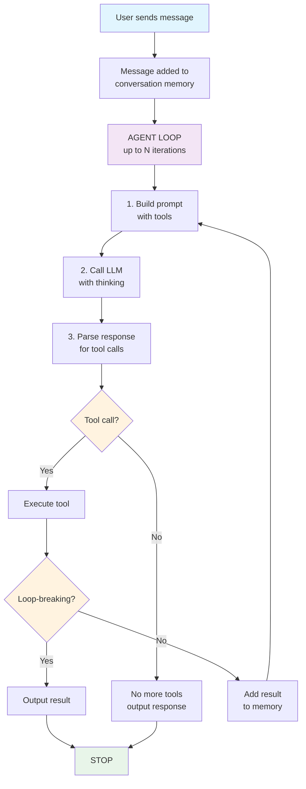

# Understanding the Agent Loop

The agent loop is the core mechanism that makes Forge agents intelligent and capable. This guide explains how it works.

## What is the Agent Loop?

The agent loop is a continuous reasoning and action cycle where the agent:
1. Receives a task or message
2. **Thinks** about what to do
3. **Uses tools** to accomplish tasks
4. **Repeats** until the task is complete

Unlike simple LLM interactions (single question → single answer), the agent loop enables multi-step problem solving.

## Simple vs Agent Loop

### Traditional LLM Interaction

```
User: "What is 15 * 23?"
LLM: "345"
```

One call, one response. The LLM must know the answer or make it up.

### Agent Loop

```
User: "What is 15 * 23?"

Iteration 1:
  Agent: [I need to calculate this...]
  Action: Use calculator tool(15, 23)
  Result: 345.00

Iteration 2:
  Agent: [I have the result...]
  Action: Use task_completion tool
  Response: "15 × 23 = 345"
  STOP (loop-breaking tool used)
```

The agent can use tools, verify results, and break down complex tasks.

## How the Loop Works

### The Cycle



### Step-by-Step Example

Let's trace a complex request: "Calculate (100 + 50) / 3"

**Iteration 1:**
```
Thinking: [I need to break this into steps: first add 100 and 50...]
Tool Call: calculator(operation=add, a=100, b=50)
Tool Result: "150.00"
Loop Breaking: No
→ Continue to iteration 2
```

**Iteration 2:**
```
Thinking: [Now I need to divide 150 by 3...]
Tool Call: calculator(operation=divide, a=150, b=3)
Tool Result: "50.00"
Loop Breaking: No
→ Continue to iteration 3
```

**Iteration 3:**
```
Thinking: [I have the final result...]
Tool Call: task_completion(result="The result of (100 + 50) / 3 is 50")
Loop Breaking: Yes
→ STOP, return result to user
```

## Chain-of-Thought Reasoning

Every agent response includes thinking blocks shown in `[brackets]`:

```
[The agent is analyzing the problem...]
[I should use the calculator tool...]
[The calculation is complete...]
```

This is **chain-of-thought prompting** - the agent "thinks out loud" which:
- Makes reasoning transparent
- Improves accuracy
- Helps debug issues
- Shows the agent's decision-making process

## Built-in Loop-Breaking Tools

These three tools are always available and stop the agent loop:

### 1. task_completion

Signals the task is done and provides the final result.

```go
tool: task_completion
arguments: {
  "result": "Your final answer or output"
}
```

**When to use:** Task is complete, user has their answer.

### 2. ask_question

Request clarification or additional information from the user.

```go
tool: ask_question
arguments: {
  "question": "What specific format would you like?",
  "suggestions": ["JSON", "CSV", "Plain text"]
}
```

**When to use:** Need more information to proceed.

### 3. converse

Engage in casual conversation or provide information.

```go
tool: converse
arguments: {
  "message": "I can help with that! Here's how..."
}
```

**When to use:** Conversational response, no specific task.

## Non-Loop-Breaking Tools

Custom tools (like calculator) don't stop the loop:

```go
func (t *CalculatorTool) IsLoopBreaking() bool {
    return false  // Agent continues after using this
}
```

The agent can:
1. Use the tool
2. Get the result
3. Use another tool
4. Or call a loop-breaking tool to finish

## Iteration Limits

To prevent infinite loops, agents have a maximum iteration count:

```go
ag := agent.NewDefaultAgent(
    provider,
    agent.WithMaxIterations(10),  // Default is 10
)
```

If the agent hits this limit, it will automatically stop.

**When to increase:**
- Complex multi-step tasks
- Tasks requiring many tool calls

**When to decrease:**
- Simple tasks
- Cost control
- Faster responses

## Memory Management

The agent maintains conversation history in memory:

```go
// Each iteration adds to memory:
User: "Hello"
Assistant: "Hi! How can I help?"
User: "What is 5 + 5?"
Tool Call: calculator(5, 5)
Tool Result: "10.00"
Assistant: "5 + 5 = 10"
```

This enables:
- Multi-turn conversations
- Context awareness
- Reference to previous answers

Memory is automatically pruned when it gets too large (preserves recent context).

## Event Streaming

The agent emits events during the loop:

```go
// Events you can listen for:
- ThinkingEvent      // Agent is reasoning
- ToolCallEvent      // Tool is being called
- ToolResultEvent    // Tool returned result
- MessageEvent       // Agent is responding
- ErrorEvent         // Something went wrong
- TurnCompleteEvent  // Loop finished
```

The CLI executor uses these to show real-time updates.

## Error Recovery

Forge includes automatic error recovery with a circuit breaker pattern:

```go
Attempt 1: Tool call fails
→ Agent receives error message
→ Agent tries different approach

Attempt 2: Tool call fails again
→ Agent receives error message
→ Agent tries alternate solution

Attempt 3: Repeated failures
→ Circuit breaker activates
→ Agent returns error to user
```

This prevents:
- Infinite retry loops
- Wasted API calls
- Confusing behavior

## Best Practices

### 1. Clear Instructions

```go
agent.WithCustomInstructions(`
You are a helpful assistant.
Always show your reasoning.
Use tools to verify information.
Break complex tasks into steps.
`)
```

### 2. Appropriate Iteration Limits

```go
// Simple Q&A: lower limit
agent.WithMaxIterations(5)

// Complex tasks: higher limit
agent.WithMaxIterations(20)
```

### 3. Tool Design

Make tools:
- **Focused**: One clear purpose
- **Documented**: Clear descriptions
- **Validated**: Check inputs
- **Informative**: Return useful results

```go
func (t *MyTool) Description() string {
    return "Clear, specific description of what this tool does and when to use it"
}
```

### 4. Monitor Thinking

Pay attention to thinking blocks:
- Spot reasoning errors
- Understand tool selection
- Debug unexpected behavior

## Common Patterns

### Sequential Tool Use

```
User: "Process data.csv and create a report"

Step 1: read_file("data.csv")
Step 2: analyze_data(content)
Step 3: generate_report(analysis)
Step 4: task_completion(report)
```

### Conditional Logic

```
User: "Check if user exists, if not create them"

Step 1: check_user(username)
Step 2a: If exists → task_completion("User found")
Step 2b: If not → create_user(username)
Step 3: task_completion("User created")
```

### Verification

```
User: "Calculate and verify the result"

Step 1: calculator(100, 50, "add")
Step 2: calculator(150, 3, "divide")  
Step 3: calculator(50, 3, "multiply")  // Verify
Step 4: Compare results
Step 5: task_completion("Verified: 50")
```

## Debugging the Loop

### Enable Detailed Logging

```go
// Set environment variable
export FORGE_DEBUG=true

// Or in code
os.Setenv("FORGE_DEBUG", "true")
```

### Watch Iterations

Count iterations in thinking blocks:
```
[Iteration 1: Starting task...]
[Iteration 2: Processing result...]
[Iteration 3: Almost done...]
```

### Check Tool Results

Each tool execution shows:
```
<Executing: tool_name(args)>
Tool result: "result string"
```

If results are unexpected, check your tool's Execute() method.

## Performance Considerations

### Cost

Each iteration = 1 LLM API call
- More iterations = higher cost
- Set appropriate limits
- Use cheaper models for simple tasks (gpt-4o-mini)

### Latency

- Each iteration adds latency
- Parallel tool execution (future feature)
- Optimize tool response times

### Token Usage

- Conversation history grows
- Memory auto-prunes old messages
- System prompt + tools consume tokens

## Next Steps

Now that you understand the agent loop:

- **[Building Custom Tools](../guides/building-custom-tools.md)** - Create your own tools
- **[Memory Management](../guides/memory-management.md)** - Control conversation history
- **[Error Handling](../guides/error-handling.md)** - Robust error recovery
- **[Architecture Overview](../architecture/overview.md)** - System design details

## See Also

- [Agent Loop Architecture](../architecture/agent-loop.md) - Technical implementation details
- [Tool System Architecture](../architecture/tool-system.md) - How tools work internally
- [API Reference: Agent](../reference/api/agent.md) - Complete API documentation