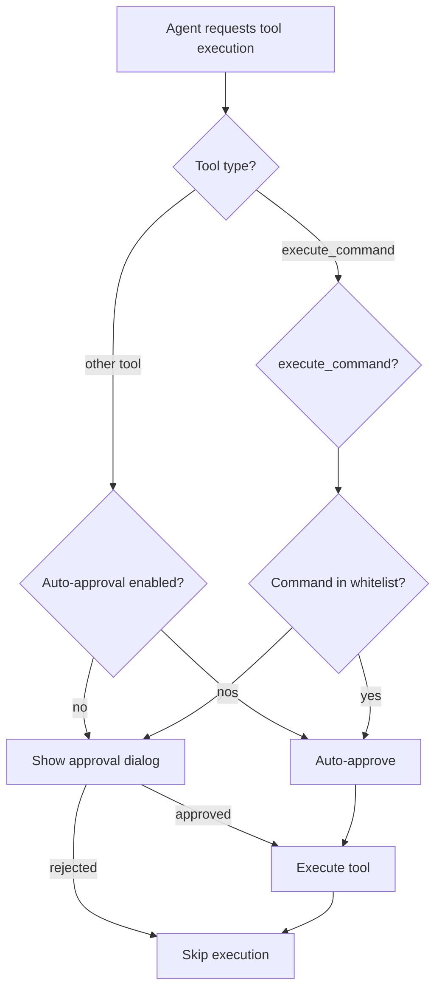

# Auto-Approval and Settings Page Implementation Plan

## Overview

This document outlines the implementation plan for two new features:
1. **Auto-Approval System**: Allow users to configure which tools are auto-approved
2. **Settings Page**: A TUI interface accessible via `/settings` for managing configuration

## Requirements

### Auto-Approval System
- Per-tool auto-approval toggles (all tools except execute_command)
- Command whitelist for execute_command tool with pattern matching
- Configuration stored in `~/.forge/config.json`
- Default: All tools require manual approval (must opt-in to auto-approve)
- Pattern matching: "npm" matches all npm commands, "npm install" matches "npm install" with any args

### Settings Page
- Accessible via `/settings` slash command in TUI
- Manage auto-approval settings for all tools
- Edit command whitelist with add/remove functionality
- Save/cancel changes
- Visual feedback for unsaved changes

## UX Mockups

### Settings Page Layout

```
┌─────────────────────────────────────────────────────────────────────────┐
│ ⚙️  Settings                                                             │
│                                                                          │
│ Navigation: [Tab] to switch sections  [Esc] to exit  [Ctrl+S] to save   │
├─────────────────────────────────────────────────────────────────────────┤
│                                                                          │
│ ┌─ Auto-Approval Settings ─────────────────────────────────────────┐   │
│ │                                                                    │   │
│ │ Configure which tools are automatically approved without prompts  │   │
│ │                                                                    │   │
│ │ [ ] read_file           - Read file contents                      │   │
│ │ [ ] write_to_file       - Write or create files                   │   │
│ │ [ ] apply_diff          - Apply code changes                      │   │
│ │ [ ] list_files          - List directory contents                 │   │
│ │ [ ] search_files        - Search for patterns in files            │   │
│ │ [ ] insert_content      - Insert lines into files                 │   │
│ │ [ ] ask_followup_question - Ask clarifying questions              │   │
│ │                                                                    │   │
│ │ Note: execute_command always requires approval or whitelist       │   │
│ └────────────────────────────────────────────────────────────────────┘   │
│                                                                          │
│ ┌─ Command Whitelist (for execute_command) ────────────────────────┐   │
│ │                                                                    │   │
│ │ Commands matching these patterns will auto-approve                │   │
│ │                                                                    │   │
│ │ ✓ npm                    - All npm commands                       │   │
│ │ ✓ git status             - Git status and variations              │   │
│ │ ✓ ls                     - List directory                         │   │
│ │ ✓ cat                    - Display file contents                  │   │
│ │                                                                    │   │
│ │ [+] Add new pattern      [x] Remove selected                      │   │
│ └────────────────────────────────────────────────────────────────────┘   │
│                                                                          │
│                                                                          │
│ [Save Changes]  [Cancel]                              * Unsaved changes │
└─────────────────────────────────────────────────────────────────────────┘
```

### Add Command Pattern Dialog

```
┌──────────────────────────────────────────┐
│ Add Command Pattern                      │
├──────────────────────────────────────────┤
│                                          │
│ Enter command pattern:                   │
│ ┌──────────────────────────────────────┐ │
│ │ npm test                             │ │
│ └──────────────────────────────────────┘ │
│                                          │
│ Pattern matching examples:               │
│ • "npm" → matches all npm commands       │
│ • "npm install" → npm install <anything> │
│ • "git status" → git status <anything>   │
│                                          │
│     [Add]           [Cancel]             │
└──────────────────────────────────────────┘
```

### Confirmation Dialog (on save)

```
┌──────────────────────────────────────────┐
│ Save Settings?                           │
├──────────────────────────────────────────┤
│                                          │
│ Changes to auto-approval settings:       │
│  • read_file: enabled                    │
│  • list_files: enabled                   │
│                                          │
│ Command whitelist changes:               │
│  + Added: npm test                       │
│  - Removed: git push                     │
│                                          │
│ These changes take effect immediately.   │
│                                          │
│     [Save]          [Cancel]             │
└──────────────────────────────────────────┘
```

## Architecture

### Component Overview

```mermaid
graph TB
    subgraph TUI Layer
        SlashCmd[/settings command]
        SettingsUI[Settings UI Component]
    end
    
    subgraph Config Layer
        ConfigMgr[Config Manager]
        ConfigFile[~/.forge/config.json]
    end
    
    subgraph Agent Layer
        ApprovalFlow[Approval Flow]
        ToolExec[Tool Execution]
    end
    
    subgraph Tools
        ExecuteCmd[execute_command]
        OtherTools[Other Tools]
    end
    
    SlashCmd --> SettingsUI
    SettingsUI --> ConfigMgr
    ConfigMgr --> ConfigFile
    ApprovalFlow --> ConfigMgr
    ApprovalFlow --> ToolExec
    ToolExec --> ExecuteCmd
    ToolExec --> OtherTools
    ExecuteCmd --> ConfigMgr
```

### Approval Flow with Auto-Approval



### Configuration Structure

```go
// Configuration stored in ~/.forge/config.json
{
  "auto_approval": {
    "read_file": false,
    "write_to_file": false,
    "apply_diff": false,
    "list_files": false,
    "search_files": false,
    "insert_content": false,
    "ask_followup_question": false
  },
  "command_whitelist": [
    {
      "pattern": "npm",
      "description": "All npm commands"
    },
    {
      "pattern": "git status",
      "description": "Git status and variations"
    },
    {
      "pattern": "ls",
      "description": "List directory"
    }
  ]
}
```

## Implementation Details

### 1. Configuration Package (`pkg/config`)

**File: `pkg/config/config.go`**
- `Config` struct with auto-approval and whitelist settings
- `LoadConfig()` - Load from ~/.forge/config.json
- `SaveConfig()` - Save to ~/.forge/config.json
- `IsToolAutoApproved(toolName string) bool`
- `IsCommandWhitelisted(command string) bool` - Pattern matching logic
- Default configuration initialization

**File: `pkg/config/pattern.go`**
- Pattern matching logic for commands
- "npm" matches any command starting with "npm"
- "npm install" matches "npm install" followed by anything

### 2. Agent Integration

**File: `pkg/agent/default.go`**
- Modify `requestApproval()` to check auto-approval settings
- Check `config.IsToolAutoApproved()` before showing approval dialog
- For execute_command, check `config.IsCommandWhitelisted()`
- Auto-approve if settings allow, otherwise show dialog

### 3. Execute Command Tool

**File: `pkg/tools/coding/execute_command.go`**
- Access config to check whitelist in `GeneratePreview()`
- Add metadata to preview indicating if whitelisted

### 4. Settings UI

**File: `pkg/executor/tui/settings.go`**
- `SettingsView` component
- Sections: Auto-Approval, Command Whitelist
- Keyboard navigation (Tab, Arrow keys, Space to toggle, Enter to edit)
- Dirty state tracking for unsaved changes

**File: `pkg/executor/tui/settings_controls.go`**
- Checkbox list for tool auto-approval
- List component for command whitelist
- Add/Remove command pattern dialogs
- Save/Cancel buttons

**File: `pkg/executor/tui/slash_commands.go`**
- Register `/settings` command
- Handler to show settings overlay

### 5. Overlay Integration

**File: `pkg/executor/tui/overlay.go`**
- Add `OverlayModeSettings` enum value
- Handle settings overlay rendering
- Manage settings overlay state

## Pattern Matching Logic

Command whitelist patterns work as prefix matching with these rules:

1. **Single word patterns** (e.g., "npm"):
   - Matches: "npm", "npm install", "npm run build", etc.
   - Logic: `strings.HasPrefix(command, pattern)`

2. **Multi-word patterns** (e.g., "npm install"):
   - Matches: "npm install", "npm install express", "npm install --save", etc.
   - Logic: `strings.HasPrefix(command, pattern) || strings.HasPrefix(command, pattern + " ")`

3. **Exact match option** (future enhancement):
   - Pattern: "=ls" (with = prefix)
   - Matches only: "ls"

## Testing Strategy

### Unit Tests
- Config loading/saving
- Pattern matching logic
- Auto-approval decision logic
- Command whitelist validation

### Integration Tests
- Settings UI state management
- Config changes persistence
- Approval flow with auto-approval
- Command execution with whitelist

### Manual Testing
- Settings page navigation
- Add/remove whitelist entries
- Toggle auto-approvals
- Verify auto-approval behavior
- Test pattern matching edge cases

## Migration Path

1. Add config package with backward compatibility
2. Modify agent to use config (defaults to requiring approval)
3. Add settings UI components
4. Register /settings command
5. Update documentation

## Future Enhancements

- Workspace-specific overrides (`.forge/settings.json`)
- Import/export settings
- Preset configurations (conservative, balanced, permissive)
- Command history-based suggestions
- Auto-approval learning (suggest based on usage)
- Approval statistics/analytics