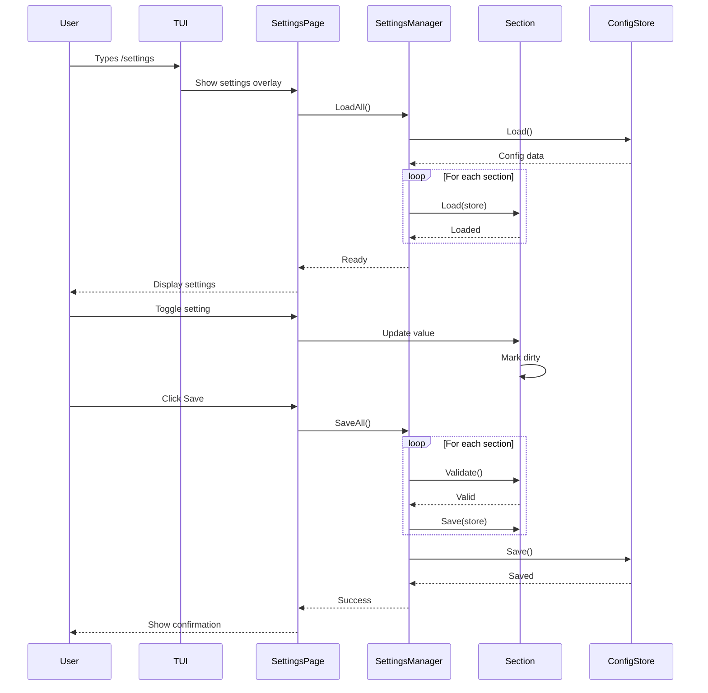

# Settings System Architecture

## Design Principles

The settings system is designed to be **extensible and decoupled**, allowing new settings sections to be added without modifying the core settings infrastructure.

### Key Principles

1. **Section-based architecture**: Settings are organized into logical sections (e.g., Auto-Approval, Command Whitelist, UI Preferences)
2. **Plugin-like extensibility**: New sections can be registered without modifying existing code
3. **Separation of concerns**: UI rendering, data persistence, and business logic are decoupled
4. **Reusable components**: Common UI elements (toggles, lists, inputs) are abstracted
5. **Type-safe**: Each section manages its own strongly-typed configuration

## Architecture Overview

```mermaid
graph TB
    subgraph Settings Framework
        SettingsManager[Settings Manager]
        SectionRegistry[Section Registry]
        ConfigStore[Config Store]
    end
    
    subgraph Section Interface
        SectionInterface[SettingsSection Interface]
        Render[Render Method]
        Load[Load Method]
        Save[Save Method]
        Validate[Validate Method]
    end
    
    subgraph Concrete Sections
        AutoApproval[Auto-Approval Section]
        CmdWhitelist[Command Whitelist Section]
        Future[Future Sections...]
    end
    
    subgraph UI Components
        ToggleComp[Toggle Component]
        ListComp[List Component]
        InputComp[Input Component]
        ButtonComp[Button Component]
    end
    
    subgraph TUI
        SettingsPage[Settings Page View]
        SlashCmd[/settings Command]
    end
    
    SlashCmd --> SettingsPage
    SettingsPage --> SettingsManager
    SettingsManager --> SectionRegistry
    SectionRegistry --> AutoApproval
    SectionRegistry --> CmdWhitelist
    SectionRegistry --> Future
    
    AutoApproval -.implements.-> SectionInterface
    CmdWhitelist -.implements.-> SectionInterface
    Future -.implements.-> SectionInterface
    
    AutoApproval --> ToggleComp
    CmdWhitelist --> ListComp
    CmdWhitelist --> InputComp
    
    SettingsManager --> ConfigStore
    ConfigStore --> FileSystem[(~/.forge/config.json)]
```

## Core Abstractions

### SettingsSection Interface

```go
// SettingsSection represents a configurable section in the settings page
type SettingsSection interface {
    // ID returns a unique identifier for this section
    ID() string
    
    // Title returns the display title for this section
    Title() string
    
    // Description returns a brief description of this section
    Description() string
    
    // Load loads the section's configuration from the store
    Load(store ConfigStore) error
    
    // Save saves the section's configuration to the store
    Save(store ConfigStore) error
    
    // Validate validates the current configuration
    Validate() error
    
    // Render renders the section UI and returns UI components
    Render(width, height int) tea.Model
    
    // IsDirty returns true if the section has unsaved changes
    IsDirty() bool
    
    // Reset discards unsaved changes
    Reset()
}
```

### Settings Manager

```go
// SettingsManager coordinates all settings sections
type SettingsManager struct {
    sections map[string]SettingsSection
    store    ConfigStore
    order    []string // Section display order
}

// RegisterSection adds a new settings section
func (m *SettingsManager) RegisterSection(section SettingsSection) {
    m.sections[section.ID()] = section
    m.order = append(m.order, section.ID())
}

// LoadAll loads all sections from storage
func (m *SettingsManager) LoadAll() error

// SaveAll saves all sections to storage
func (m *SettingsManager) SaveAll() error

// GetSection retrieves a section by ID
func (m *SettingsManager) GetSection(id string) (SettingsSection, bool)

// IsDirty returns true if any section has unsaved changes
func (m *SettingsManager) IsDirty() bool
```

### Config Store Interface

```go
// ConfigStore provides persistence for settings
type ConfigStore interface {
    // Get retrieves a value from the store
    Get(key string) (interface{}, error)
    
    // Set stores a value in the store
    Set(key string, value interface{}) error
    
    // GetSection retrieves an entire section's data
    GetSection(sectionID string) (map[string]interface{}, error)
    
    // SetSection stores an entire section's data
    SetSection(sectionID string, data map[string]interface{}) error
    
    // Load loads the configuration from disk
    Load() error
    
    // Save saves the configuration to disk
    Save() error
}
```

## Component System

### Base UI Components

```go
// Toggle - Checkbox/toggle component
type Toggle struct {
    Label    string
    Checked  bool
    Enabled  bool
    OnChange func(bool)
}

// ListEditor - Editable list with add/remove
type ListEditor struct {
    Title       string
    Items       []ListItem
    Selected    int
    OnAdd       func() string
    OnRemove    func(int)
    OnEdit      func(int) string
}

// TextInput - Single line text input
type TextInput struct {
    Label       string
    Value       string
    Placeholder string
    Validator   func(string) error
    OnChange    func(string)
}

// Button - Clickable button
type Button struct {
    Label    string
    Primary  bool
    Enabled  bool
    OnClick  func()
}
```

## Example: Auto-Approval Section

```go
// AutoApprovalSection implements SettingsSection
type AutoApprovalSection struct {
    tools      map[string]*Toggle
    dirty      bool
    
    // Runtime state
    focused    int
    components []tea.Model
}

func NewAutoApprovalSection() *AutoApprovalSection {
    return &AutoApprovalSection{
        tools: map[string]*Toggle{
            "read_file": {
                Label: "read_file - Read file contents",
                Checked: false,
                OnChange: func(checked bool) {
                    s.dirty = true
                },
            },
            "write_to_file": {
                Label: "write_to_file - Write or create files",
                Checked: false,
                OnChange: func(checked bool) {
                    s.dirty = true
                },
            },
            // ... more tools
        },
    }
}

func (s *AutoApprovalSection) ID() string {
    return "auto_approval"
}

func (s *AutoApprovalSection) Title() string {
    return "Auto-Approval Settings"
}

func (s *AutoApprovalSection) Load(store ConfigStore) error {
    data, err := store.GetSection(s.ID())
    if err != nil {
        return err
    }
    
    for toolName, toggle := range s.tools {
        if val, ok := data[toolName].(bool); ok {
            toggle.Checked = val
        }
    }
    
    s.dirty = false
    return nil
}

func (s *AutoApprovalSection) Save(store ConfigStore) error {
    data := make(map[string]interface{})
    for toolName, toggle := range s.tools {
        data[toolName] = toggle.Checked
    }
    
    if err := store.SetSection(s.ID(), data); err != nil {
        return err
    }
    
    s.dirty = false
    return nil
}

func (s *AutoApprovalSection) Render(width, height int) tea.Model {
    // Build UI using reusable components
    // Return a tea.Model that can be integrated into settings page
}
```

## Settings Page Flow



## File Structure

```
pkg/
├── config/
│   ├── config.go           # Main config types and manager
│   ├── store.go            # ConfigStore interface and JSON implementation
│   ├── section.go          # SettingsSection interface
│   ├── auto_approval.go    # Auto-approval section implementation
│   ├── whitelist.go        # Command whitelist section implementation
│   └── config_test.go
│
└── executor/tui/
    ├── settings/
    │   ├── manager.go      # SettingsManager
    │   ├── page.go         # Settings page view
    │   ├── components.go   # Reusable UI components
    │   └── settings_test.go
    │
    └── slash_commands.go   # /settings command registration
```

## Configuration File Structure

```json
{
  "version": "1.0",
  "sections": {
    "auto_approval": {
      "read_file": false,
      "write_to_file": false,
      "apply_diff": false,
      "list_files": false,
      "search_files": false,
      "insert_content": false,
      "ask_followup_question": false
    },
    "command_whitelist": {
      "patterns": [
        {
          "pattern": "npm",
          "description": "All npm commands"
        },
        {
          "pattern": "git status",
          "description": "Git status and variations"
        }
      ]
    },
    "ui_preferences": {
      "theme": "default",
      "show_line_numbers": true
    }
  }
}
```

## Adding New Settings Sections

To add a new settings section (e.g., UI Preferences):

1. **Create section implementation**:
```go
type UIPreferencesSection struct {
    theme          string
    lineNumbers    bool
    dirty          bool
}

func (s *UIPreferencesSection) ID() string {
    return "ui_preferences"
}

// Implement other SettingsSection methods...
```

2. **Register in settings manager**:
```go
func initializeSettings() *SettingsManager {
    manager := NewSettingsManager(store)
    
    // Register sections
    manager.RegisterSection(NewAutoApprovalSection())
    manager.RegisterSection(NewCommandWhitelistSection())
    manager.RegisterSection(NewUIPreferencesSection()) // New section
    
    return manager
}
```

3. **No changes needed to**:
   - Settings page UI (auto-renders all sections)
   - Config persistence (handles any section)
   - /settings command

## Benefits of This Architecture

1. **Extensibility**: Add new settings without modifying core code
2. **Testability**: Each section can be tested independently
3. **Maintainability**: Clear separation of concerns
4. **Reusability**: UI components can be used across sections
5. **Type Safety**: Each section manages its own types
6. **Future-proof**: Easy to add workspace overrides, import/export, etc.

## Future Enhancements

- Workspace-specific overrides
- Settings import/export
- Settings search/filter
- Settings validation rules
- Settings migration system
- Settings change events/hooks