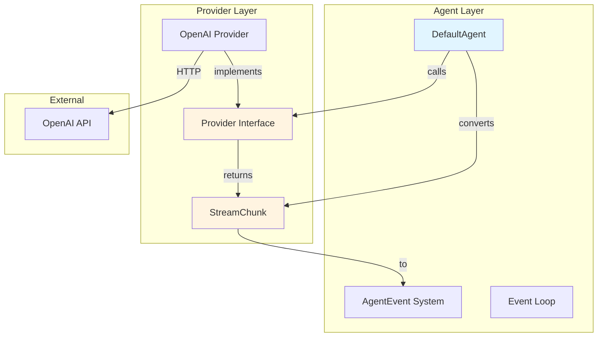
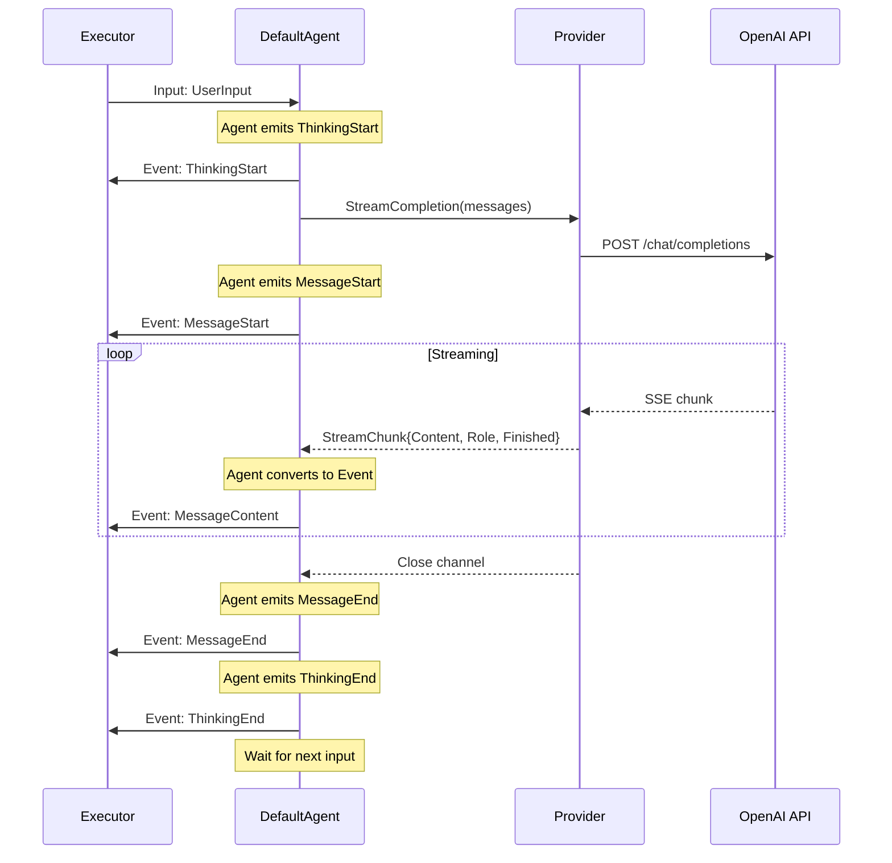

# Refactored Architecture: Provider Interface & DefaultAgent

## Overview

This document describes the refactored architecture with clean separation between LLM Provider and Agent layers.

## Key Architectural Principle

**Provider Layer**: LLM-focused, returns simple response chunks
**Agent Layer**: Orchestration-focused, converts chunks to AgentEvents

## Layer Diagram



## Refactored Types

### StreamChunk (pkg/llm/types.go)

```go
// StreamChunk represents a single chunk from an LLM streaming response.
// This is a provider-layer type focused purely on LLM output.
type StreamChunk struct {
    // Content is the text delta from the LLM
    Content string
    
    // Role is the message role (only set on first chunk)
    Role string
    
    // Finished indicates if this is the final chunk
    Finished bool
    
    // Error contains any error that occurred during streaming
    Error error
}

// IsError returns true if this chunk contains an error
func (c *StreamChunk) IsError() bool {
    return c.Error != nil
}

// IsLast returns true if this is the final chunk
func (c *StreamChunk) IsLast() bool {
    return c.Finished
}
```

### Refactored Provider Interface (pkg/llm/provider.go)

```go
// Provider defines the interface for LLM integrations.
// Providers handle API communication and return simple StreamChunks.
// The Agent layer is responsible for converting these to AgentEvents.
type Provider interface {
    // StreamCompletion sends messages to the LLM and streams back response chunks.
    //
    // The returned channel emits StreamChunk instances:
    // - First chunk has Role set (e.g., "assistant")
    // - Subsequent chunks contain Content deltas
    // - Final chunk has Finished=true
    // - Error chunk has Error set
    //
    // The channel is closed when streaming completes or an error occurs.
    // Callers should read until channel is closed.
    //
    // Returns error only if streaming cannot be initiated.
    StreamCompletion(ctx context.Context, messages []*types.Message) (<-chan *StreamChunk, error)
    
    // Complete sends messages to the LLM and returns the full response.
    // This is a convenience wrapper around StreamCompletion for non-streaming use.
    Complete(ctx context.Context, messages []*types.Message) (*types.Message, error)
    
    // GetModelInfo returns information about the LLM model.
    GetModelInfo() *types.ModelInfo
}
```

## Data Flow: Single Turn with Refactored Interface



## DefaultAgent Implementation

### Structure

```go
type DefaultAgent struct {
    provider  Provider              // LLM provider (decoupled from events)
    config    *types.AgentConfig    // Agent configuration
    channels  *types.AgentChannels  // Communication channels
    history   []*types.Message      // Conversation history
    mu        sync.RWMutex          // Protects history
    cancel    context.CancelFunc    // Cancels event loop
    wg        sync.WaitGroup        // Tracks goroutines
}
```

### Event Loop with Chunk Conversion

```go
func (a *DefaultAgent) eventLoop(ctx context.Context) {
    defer a.wg.Done()
    defer a.channels.Close()
    
    for {
        select {
        case input := <-a.channels.Input:
            a.processInput(ctx, input)
            
        case <-a.channels.Shutdown:
            a.emitEvent(&types.AgentEvent{Type: types.EventTypeStatusShutdown})
            return
            
        case <-ctx.Done():
            a.emitEvent(&types.AgentEvent{Type: types.EventTypeStatusShutdown})
            return
        }
    }
}

func (a *DefaultAgent) processInput(ctx context.Context, input *types.Input) {
    // Handle cancellation
    if input.Type == types.InputTypeCancel {
        // Cancel in-flight request (via context)
        return
    }
    
    // Emit thinking start (agent responsibility)
    a.emitEvent(&types.AgentEvent{
        Type: types.EventTypeThinkingStart,
    })
    
    // Add user message to history
    a.appendToHistory(&types.Message{
        Role:    types.RoleUser,
        Content: input.Content,
    })
    
    // Call provider (returns StreamChunks)
    stream, err := a.provider.StreamCompletion(ctx, a.getHistory())
    if err != nil {
        a.emitEvent(&types.AgentEvent{
            Type:  types.EventTypeError,
            Error: err,
        })
        return
    }
    
    // Emit message start (agent responsibility)
    a.emitEvent(&types.AgentEvent{
        Type: types.EventTypeMessageStart,
    })
    
    // Convert StreamChunks to AgentEvents (agent responsibility)
    var fullContent string
    for chunk := range stream {
        if chunk.IsError() {
            a.emitEvent(&types.AgentEvent{
                Type:  types.EventTypeError,
                Error: chunk.Error,
            })
            break
        }
        
        // Convert chunk content to message event
        a.emitEvent(&types.AgentEvent{
            Type:    types.EventTypeMessageContent,
            Content: chunk.Content,
        })
        
        fullContent += chunk.Content
        
        if chunk.IsLast() {
            break
        }
    }
    
    // Emit message end (agent responsibility)
    a.emitEvent(&types.AgentEvent{
        Type: types.EventTypeMessageEnd,
    })
    
    // Add assistant response to history
    a.appendToHistory(&types.Message{
        Role:    types.RoleAssistant,
        Content: fullContent,
    })
    
    // Emit thinking end (agent responsibility)
    a.emitEvent(&types.AgentEvent{
        Type: types.EventTypeThinkingEnd,
    })
}
```

## OpenAI Provider Implementation

### Structure

```go
type Provider struct {
    client    *openai.Client
    apiKey    string
    model     string
    modelInfo *types.ModelInfo
}

func NewProvider(apiKey, model string) *Provider {
    return &Provider{
        client: openai.NewClient(apiKey),
        apiKey: apiKey,
        model:  model,
        modelInfo: &types.ModelInfo{
            Provider: "openai",
            Model:    model,
        },
    }
}
```

### StreamCompletion Implementation

```go
func (p *Provider) StreamCompletion(ctx context.Context, messages []*types.Message) (<-chan *llm.StreamChunk, error) {
    // Convert to OpenAI format
    openaiMessages := convertToOpenAIMessages(messages)
    
    // Create streaming request
    req := openai.ChatCompletionRequest{
        Model:    p.model,
        Messages: openaiMessages,
        Stream:   true,
    }
    
    // Start stream
    stream, err := p.client.CreateChatCompletionStream(ctx, req)
    if err != nil {
        return nil, err
    }
    
    // Create output channel
    chunks := make(chan *llm.StreamChunk, 10)
    
    // Stream in goroutine
    go func() {
        defer close(chunks)
        defer stream.Close()
        
        firstChunk := true
        
        for {
            response, err := stream.Recv()
            if err == io.EOF {
                // Send final chunk
                chunks <- &llm.StreamChunk{Finished: true}
                return
            }
            
            if err != nil {
                chunks <- &llm.StreamChunk{Error: err}
                return
            }
            
            // Extract delta
            if len(response.Choices) > 0 {
                delta := response.Choices[0].Delta
                
                chunk := &llm.StreamChunk{
                    Content: delta.Content,
                }
                
                // Set role on first chunk
                if firstChunk && delta.Role != "" {
                    chunk.Role = delta.Role
                    firstChunk = false
                }
                
                chunks <- chunk
            }
        }
    }()
    
    return chunks, nil
}
```

### Complete Implementation

```go
func (p *Provider) Complete(ctx context.Context, messages []*types.Message) (*types.Message, error) {
    stream, err := p.StreamCompletion(ctx, messages)
    if err != nil {
        return nil, err
    }
    
    var content string
    var role string
    
    for chunk := range stream {
        if chunk.IsError() {
            return nil, chunk.Error
        }
        
        if chunk.Role != "" {
            role = chunk.Role
        }
        
        content += chunk.Content
    }
    
    return &types.Message{
        Role:    role,
        Content: content,
    }, nil
}
```

## Benefits of Refactored Design

### 1. Clean Separation of Concerns ✅
- Provider knows nothing about AgentEvents
- Provider focused purely on LLM communication
- Agent handles all event orchestration

### 2. Provider Reusability ✅
```go
// Can use provider directly without agent
provider := openai.NewProvider(apiKey, "gpt-4")
stream, _ := provider.StreamCompletion(ctx, messages)
for chunk := range stream {
    fmt.Print(chunk.Content) // Simple CLI usage
}
```

### 3. Easier Testing ✅
```go
// Mock provider only needs to return StreamChunks
type MockProvider struct{}

func (m *MockProvider) StreamCompletion(ctx, msgs) (<-chan *StreamChunk, error) {
    ch := make(chan *StreamChunk, 3)
    go func() {
        ch <- &StreamChunk{Role: "assistant"}
        ch <- &StreamChunk{Content: "Hello"}
        ch <- &StreamChunk{Content: " world", Finished: true}
        close(ch)
    }()
    return ch, nil
}
```

### 4. Easier to Add New Providers ✅
New providers only need to:
1. Implement 3 methods
2. Return simple StreamChunks
3. No knowledge of agent internals

### 5. Matches Industry Patterns ✅
Aligns with OpenAI, Anthropic, Google client patterns

## Migration Impact

### Files to Modify
1. `pkg/llm/types.go` - Create StreamChunk type
2. `pkg/llm/provider.go` - Refactor interface
3. `pkg/llm/provider_test.go` - Update tests
4. `pkg/types/*_test.go` - Update any affected tests

### Files to Create
1. `pkg/llm/openai/openai.go` - OpenAI provider
2. `pkg/llm/openai/openai_test.go` - Provider tests
3. `pkg/agent/default.go` - DefaultAgent
4. `pkg/agent/default_test.go` - Agent tests
5. `examples/openai-agent/main.go` - Example

### Breaking Changes
- Provider interface signature changed
- Any code using old `GenerateStream()` must update
- Since no external consumers yet, low impact

## Testing Strategy

### Provider Layer Tests
- Mock HTTP responses from OpenAI
- Test StreamChunk emission sequence
- Test error handling (API errors, network errors)
- Test context cancellation

### Agent Layer Tests
- Mock Provider returning test StreamChunks
- Verify AgentEvent emission sequence
- Test multi-turn conversations
- Test cancellation handling
- Test concurrent access to history

## Performance Considerations

### Memory
- StreamChunks are lightweight (string + 2 bools)
- Buffered channels prevent blocking
- Conversation history grows with turns (consider max length)

### Goroutines
- One goroutine per agent
- One goroutine per provider stream
- Proper cleanup via defer and WaitGroup

### Latency
- Streaming starts immediately
- Agent forwards chunks with minimal overhead
- No buffering/batching delays