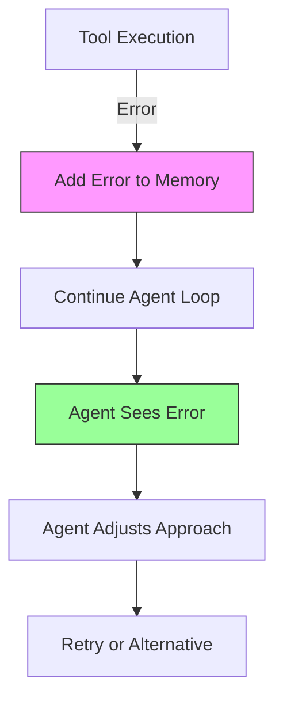
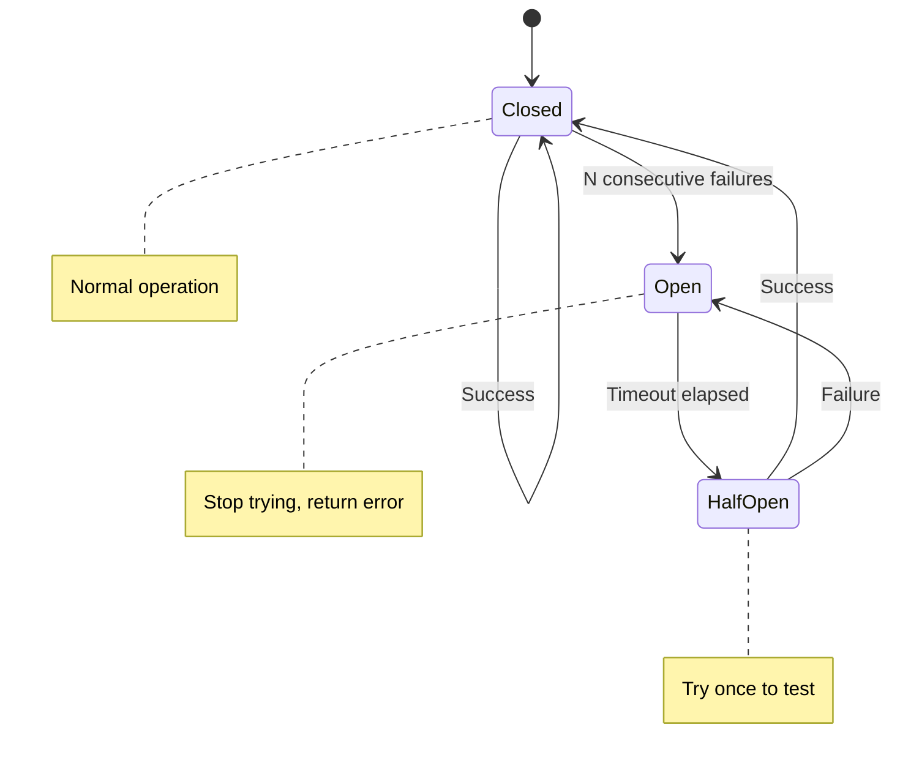

# Error Handling Reference

Complete guide to error handling in Forge agents.

## Table of Contents

- [Error Types](#error-types)
- [Error Recovery](#error-recovery)
- [Circuit Breaker](#circuit-breaker)
- [Timeout Handling](#timeout-handling)
- [Retry Strategies](#retry-strategies)
- [Error Logging](#error-logging)
- [Best Practices](#best-practices)

---

## Error Types

### Provider Errors

Errors from LLM provider API calls.

```go
type ProviderError struct {
    StatusCode int
    Message    string
    Retryable  bool
}
```

**Common Causes:**
- Invalid API key
- Rate limiting
- Network issues
- Model unavailable
- Malformed request

**Example:**

```go
response, err := provider.Complete(ctx, messages)
if err != nil {
    var providerErr *provider.ProviderError
    if errors.As(err, &providerErr) {
        if providerErr.StatusCode == 429 {
            // Rate limited - wait and retry
            time.Sleep(time.Second)
            response, err = provider.Complete(ctx, messages)
        }
    }
}
```

**HTTP Status Codes:**

| Code | Meaning | Retryable | Action |
|------|---------|-----------|--------|
| 400 | Bad Request | No | Fix request format |
| 401 | Unauthorized | No | Check API key |
| 429 | Rate Limited | Yes | Wait and retry |
| 500 | Server Error | Yes | Retry with backoff |
| 503 | Service Unavailable | Yes | Retry with backoff |

---

### Tool Errors

Errors during tool execution.

```go
type ToolError struct {
    ToolName string
    Cause    error
}
```

**Common Causes:**
- Invalid arguments
- Missing dependencies
- External service failures
- Timeout
- Permission issues

**Example:**

```go
result, err := tool.Execute(ctx, args)
if err != nil {
    var toolErr *tool.ToolError
    if errors.As(err, &toolErr) {
        fmt.Printf("Tool %s failed: %v\n", toolErr.ToolName, toolErr.Cause)
        // Tool error is added to conversation for agent to see
    }
}
```

**Agent Sees Error:**
```
Tool: calculator
Error: division by zero

Agent: [I see the error - can't divide by zero. Let me fix that...]
```

---

### Memory Errors

Errors in memory operations.

```go
type MemoryError struct {
    Operation string
    Cause     error
}
```

**Common Causes:**
- Memory full
- Corruption
- Concurrent access issues
- Serialization failures

**Example:**

```go
err := memory.Add(message)
if err != nil {
    var memErr *memory.MemoryError
    if errors.As(err, &memErr) {
        if memErr.Operation == "prune" {
            // Pruning failed - may need manual clear
            memory.Clear()
        }
    }
}
```

---

### Context Errors

Errors from context cancellation or timeout.

```go
// Context timeout
ctx, cancel := context.WithTimeout(context.Background(), 30*time.Second)
defer cancel()

err := agent.Run(ctx, executor)
if err != nil {
    switch {
    case errors.Is(err, context.DeadlineExceeded):
        fmt.Println("Agent timed out")
    case errors.Is(err, context.Canceled):
        fmt.Println("Agent was canceled")
    }
}
```

**Types:**
- `context.DeadlineExceeded`: Timeout reached
- `context.Canceled`: Manually canceled

---

## Error Recovery

### Automatic Recovery

Forge agents automatically recover from many errors:



**Example Flow:**

```
User: Calculate 10 / 0

Agent: [I'll use the calculator]
Tool: calculator
Error: division by zero

Agent: [I see division by zero error. Let me explain instead]
Agent: Division by zero is undefined in mathematics...
```

**Automatic Recovery Features:**
1. ✅ Error added to conversation
2. ✅ Agent continues (doesn't crash)
3. ✅ Agent sees error context
4. ✅ Can try alternative approaches
5. ✅ Can ask user for clarification

---

### Manual Recovery

You can implement custom recovery:

```go
func RunWithRecovery(agent core.Agent, executor core.Executor) error {
    ctx := context.Background()
    
    for attempt := 0; attempt < 3; attempt++ {
        err := agent.Run(ctx, executor)
        
        if err == nil {
            return nil // Success
        }
        
        // Check if recoverable
        if isRecoverable(err) {
            log.Printf("Attempt %d failed, retrying: %v", attempt+1, err)
            time.Sleep(time.Second * time.Duration(attempt+1))
            continue
        }
        
        return err // Unrecoverable
    }
    
    return fmt.Errorf("failed after 3 attempts")
}

func isRecoverable(err error) bool {
    var providerErr *provider.ProviderError
    if errors.As(err, &providerErr) {
        return providerErr.Retryable
    }
    return false
}
```

---

## Circuit Breaker

Prevents infinite retry loops on persistent failures.

### How It Works



### Configuration

```go
agent, err := core.NewAgent(
    provider,
    memory,
    tools,
    core.WithCircuitBreaker(3, 30*time.Second),
    //                     ^  ^
    //                     |  recovery timeout
    //                     max failures
)
```

**Parameters:**
- `maxFailures`: Consecutive failures before opening (default: 3)
- `timeout`: How long to wait before trying again (default: 30s)

**States:**

1. **Closed** (Normal)
   - Requests go through
   - Failures are counted

2. **Open** (Broken)
   - Requests fail immediately
   - No API calls made
   - Waits for timeout

3. **Half-Open** (Testing)
   - Allow one test request
   - If succeeds → Closed
   - If fails → Open

**Example:**

```go
// First 3 failures
Attempt 1: Provider error
Attempt 2: Provider error  
Attempt 3: Provider error
→ Circuit breaker opens

// Immediate failures without calling API
Attempt 4: Circuit breaker open error (immediate)
Attempt 5: Circuit breaker open error (immediate)

// After 30 seconds
Attempt 6: Tries again (half-open)
→ If success: circuit closes
→ If failure: circuit re-opens
```

---

## Timeout Handling

### Context Timeouts

Set maximum execution time:

```go
// Overall timeout
ctx, cancel := context.WithTimeout(context.Background(), 5*time.Minute)
defer cancel()

err := agent.Run(ctx, executor)
if errors.Is(err, context.DeadlineExceeded) {
    fmt.Println("Agent did not complete within 5 minutes")
}
```

### Provider Timeouts

Set timeout for individual API calls:

```go
provider := openai.NewProvider(
    "gpt-4",
    apiKey,
    openai.WithTimeout(30*time.Second),
)
```

**Recommendation:**
- Overall context: 5-10 minutes
- Provider timeout: 30-60 seconds
- Tool timeout: Varies by tool

### Nested Timeouts

```go
// Overall timeout: 10 minutes
ctx, cancel := context.WithTimeout(context.Background(), 10*time.Minute)
defer cancel()

// Provider timeout: 30 seconds per call
provider := openai.NewProvider(
    "gpt-4",
    apiKey,
    openai.WithTimeout(30*time.Second),
)

// Tool with custom timeout
func (t *LongRunningTool) Execute(ctx context.Context, args map[string]interface{}) (string, error) {
    // This tool's timeout: 2 minutes
    toolCtx, cancel := context.WithTimeout(ctx, 2*time.Minute)
    defer cancel()
    
    return t.doWork(toolCtx, args)
}
```

---

## Retry Strategies

### Exponential Backoff

Recommended for transient failures:

```go
func executeWithBackoff(fn func() error, maxRetries int) error {
    for attempt := 0; attempt < maxRetries; attempt++ {
        err := fn()
        if err == nil {
            return nil
        }
        
        if !isRetryable(err) {
            return err
        }
        
        // Exponential backoff: 1s, 2s, 4s, 8s...
        waitTime := time.Second * time.Duration(1<<uint(attempt))
        time.Sleep(waitTime)
    }
    
    return fmt.Errorf("failed after %d retries", maxRetries)
}

// Usage
err := executeWithBackoff(func() error {
    _, err := provider.Complete(ctx, messages)
    return err
}, 5)
```

### Jittered Backoff

Prevents thundering herd:

```go
import "math/rand"

func jitteredBackoff(attempt int) time.Duration {
    base := time.Second * time.Duration(1<<uint(attempt))
    jitter := time.Duration(rand.Int63n(int64(base / 2)))
    return base + jitter
}

// Usage
waitTime := jitteredBackoff(attempt)
time.Sleep(waitTime)
```

### Retry with Circuit Breaker

Combine retries with circuit breaker:

```go
type Retrier struct {
    maxRetries      int
    circuitBreaker  *CircuitBreaker
}

func (r *Retrier) Execute(fn func() error) error {
    for attempt := 0; attempt < r.maxRetries; attempt++ {
        // Check circuit breaker
        if !r.circuitBreaker.Allow() {
            return fmt.Errorf("circuit breaker open")
        }
        
        err := fn()
        
        if err == nil {
            r.circuitBreaker.RecordSuccess()
            return nil
        }
        
        r.circuitBreaker.RecordFailure()
        
        if !isRetryable(err) {
            return err
        }
        
        time.Sleep(jitteredBackoff(attempt))
    }
    
    return fmt.Errorf("failed after %d retries", r.maxRetries)
}
```

---

## Error Logging

### Structured Logging

Use structured logging for better debugging:

```go
import "log/slog"

logger := slog.New(slog.NewJSONHandler(os.Stdout, nil))

// Log errors with context
logger.Error("agent execution failed",
    "error", err,
    "iteration", iteration,
    "tool", toolName,
    "duration", duration,
)
```

### Error Tracking

Track errors for analysis:

```go
type ErrorTracker struct {
    errors []ErrorEvent
    mu     sync.Mutex
}

type ErrorEvent struct {
    Timestamp time.Time
    Type      string
    Message   string
    Context   map[string]interface{}
}

func (t *ErrorTracker) Track(err error, context map[string]interface{}) {
    t.mu.Lock()
    defer t.mu.Unlock()
    
    event := ErrorEvent{
        Timestamp: time.Now(),
        Type:      fmt.Sprintf("%T", err),
        Message:   err.Error(),
        Context:   context,
    }
    
    t.errors = append(t.errors, event)
}

// Usage
tracker := &ErrorTracker{}

if err := agent.Run(ctx, executor); err != nil {
    tracker.Track(err, map[string]interface{}{
        "user_id": userID,
        "session_id": sessionID,
    })
}
```

### Error Metrics

Track error rates and types:

```go
type ErrorMetrics struct {
    totalErrors     int64
    providerErrors  int64
    toolErrors      int64
    timeoutErrors   int64
    mu              sync.Mutex
}

func (m *ErrorMetrics) Record(err error) {
    m.mu.Lock()
    defer m.mu.Unlock()
    
    m.totalErrors++
    
    switch {
    case errors.As(err, &provider.ProviderError{}):
        m.providerErrors++
    case errors.As(err, &tool.ToolError{}):
        m.toolErrors++
    case errors.Is(err, context.DeadlineExceeded):
        m.timeoutErrors++
    }
}

func (m *ErrorMetrics) Report() {
    m.mu.Lock()
    defer m.mu.Unlock()
    
    fmt.Printf("Total Errors: %d\n", m.totalErrors)
    fmt.Printf("Provider Errors: %d\n", m.providerErrors)
    fmt.Printf("Tool Errors: %d\n", m.toolErrors)
    fmt.Printf("Timeout Errors: %d\n", m.timeoutErrors)
}
```

---

## Best Practices

### 1. Always Use Context

```go
// ✅ Good: Proper timeout
ctx, cancel := context.WithTimeout(context.Background(), 5*time.Minute)
defer cancel()
agent.Run(ctx, executor)

// ❌ Bad: No timeout
agent.Run(context.Background(), executor)
```

### 2. Check Error Types

```go
// ✅ Good: Type-specific handling
if err != nil {
    var providerErr *provider.ProviderError
    if errors.As(err, &providerErr) {
        if providerErr.StatusCode == 429 {
            // Rate limit specific handling
        }
    }
}

// ❌ Bad: Generic handling
if err != nil {
    log.Println(err)
}
```

### 3. Don't Swallow Errors

```go
// ✅ Good: Propagate errors
func DoSomething() error {
    if err := step1(); err != nil {
        return fmt.Errorf("step1 failed: %w", err)
    }
    return nil
}

// ❌ Bad: Ignore errors
func DoSomething() error {
    step1() // Error ignored
    return nil
}
```

### 4. Provide Error Context

```go
// ✅ Good: Contextual errors
return fmt.Errorf("failed to execute tool %s with args %v: %w", 
    toolName, args, err)

// ❌ Bad: Vague errors
return fmt.Errorf("tool failed: %w", err)
```

### 5. Use Circuit Breakers

```go
// ✅ Good: Prevent infinite retries
agent, err := core.NewAgent(
    provider,
    memory,
    tools,
    core.WithCircuitBreaker(3, 30*time.Second),
)

// ❌ Bad: No protection
agent, err := core.NewAgent(provider, memory, tools)
```

### 6. Log Appropriately

```go
// ✅ Good: Structured logging
logger.Error("operation failed",
    "error", err,
    "context", context,
)

// ❌ Bad: Print statements
fmt.Println("Error:", err)
```

### 7. Implement Graceful Degradation

```go
// ✅ Good: Fallback behavior
result, err := primaryService.Call()
if err != nil {
    result, err = fallbackService.Call()
}

// ❌ Bad: Complete failure
result, err := primaryService.Call()
if err != nil {
    return err
}
```

---

## Common Error Scenarios

### Rate Limiting

```go
func handleRateLimit(provider core.Provider, messages []message.Message) (*Response, error) {
    for attempt := 0; attempt < 5; attempt++ {
        resp, err := provider.Complete(ctx, messages)
        
        if err == nil {
            return resp, nil
        }
        
        var providerErr *provider.ProviderError
        if errors.As(err, &providerErr) && providerErr.StatusCode == 429 {
            // Exponential backoff
            waitTime := time.Second * time.Duration(1<<uint(attempt))
            time.Sleep(waitTime)
            continue
        }
        
        return nil, err
    }
    
    return nil, fmt.Errorf("rate limited after 5 attempts")
}
```

### Network Failures

```go
func executeWithNetworkRetry(fn func() error) error {
    for attempt := 0; attempt < 3; attempt++ {
        err := fn()
        
        if err == nil {
            return nil
        }
        
        // Check if network error
        if isNetworkError(err) {
            time.Sleep(time.Second * time.Duration(attempt+1))
            continue
        }
        
        return err // Non-network error, don't retry
    }
    
    return fmt.Errorf("network error persisted after 3 attempts")
}

func isNetworkError(err error) bool {
    var netErr net.Error
    return errors.As(err, &netErr) && netErr.Temporary()
}
```

### Invalid Tool Arguments

```go
func (t *MyTool) Execute(ctx context.Context, args map[string]interface{}) (string, error) {
    // Validate arguments
    param, ok := args["param"].(string)
    if !ok {
        return "", fmt.Errorf("param must be string, got %T", args["param"])
    }
    
    if param == "" {
        return "", fmt.Errorf("param cannot be empty")
    }
    
    // Proceed with execution
    return t.process(param)
}
```

---

## See Also

- [API Reference](api-reference.md) - Complete API documentation
- [Configuration](configuration.md) - Configuration options
- [Architecture](../architecture/overview.md) - System design
- [How-To: Handle Errors](../how-to/handle-errors.md) - Practical error handling