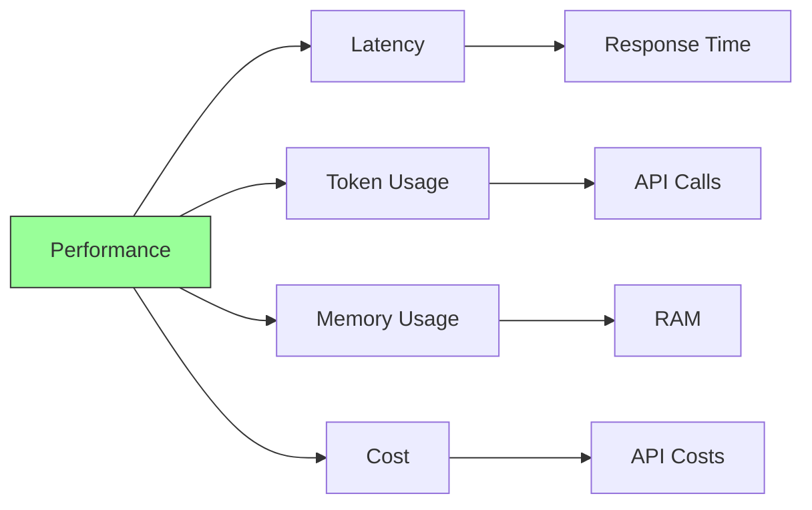

# Performance Reference

Guide to optimizing Forge agent performance.

## Table of Contents

- [Performance Factors](#performance-factors)
- [Token Optimization](#token-optimization)
- [Memory Optimization](#memory-optimization)
- [Latency Reduction](#latency-reduction)
- [Cost Optimization](#cost-optimization)
- [Benchmarking](#benchmarking)
- [Best Practices](#best-practices)

---

## Performance Factors

### Main Performance Metrics



**Key Metrics:**

1. **Latency:** Time to respond
2. **Token Usage:** Tokens consumed per request
3. **Memory Usage:** RAM consumed
4. **Cost:** Money spent on API calls

---

## Token Optimization

### Reduce Context Size

Tokens directly impact latency and cost:

```go
// ✅ Good: Reasonable context window
memory := memory.NewConversationMemory(4000)

// ❌ Bad: Unnecessarily large context
memory := memory.NewConversationMemory(30000)
```

**Token Costs:**

| Context Tokens | Latency Impact | Cost Impact |
|----------------|----------------|-------------|
| 1,000 | Low | Low |
| 4,000 | Medium | Medium |
| 8,000 | High | High |
| 16,000+ | Very High | Very High |

### Optimize System Prompt

```go
// ✅ Good: Concise system prompt
systemPrompt := "You are a Python expert. Write clean, type-hinted code."

// ❌ Bad: Verbose system prompt
systemPrompt := `You are a Python programming expert assistant.
You should always write clean code that follows best practices.
Always include type hints in your function signatures.
Make sure to follow PEP 8 style guidelines.
Provide detailed explanations for everything you do.
Always consider edge cases and error handling...`
```

**Impact:**
- Concise: ~15 tokens
- Verbose: ~100+ tokens
- Multiplied by every request

### Prune Aggressively

```go
// Configure aggressive pruning
memory := memory.NewConversationMemory(
    3000, // Lower limit
    memory.WithPruningStrategy(memory.OldestFirst),
)
```

**Pruning Strategies:**

```go
// Oldest first (fast, simple)
memory.WithPruningStrategy(memory.OldestFirst)

// Keep important messages (slower, smarter)
memory.WithPruningStrategy(memory.ImportanceBasedPruning)
```

### Limit Tool Descriptions

```go
// ✅ Good: Concise description
"description": "Performs arithmetic: add, subtract, multiply, divide"

// ❌ Bad: Verbose description
"description": `This tool performs arithmetic operations including
addition, subtraction, multiplication, and division. You can use it
whenever you need to calculate numbers. It supports both integers
and floating point numbers...`
```

---

## Memory Optimization

### Choose Appropriate Token Limits

```go
// ✅ Good: Match model context
// GPT-4: 8K context → ~6K memory
memory := memory.NewConversationMemory(6000)

// ❌ Bad: Exceeds model context
memory := memory.NewConversationMemory(10000) // Model only has 8K!
```

### Clear Stale Conversations

```go
// Clear memory after conversation ends
if conversationComplete {
    memory.Clear()
}
```

### Use Appropriate Data Structures

```go
// ✅ Good: Slice for sequential access
type ConversationMemory struct {
    messages []Message
}

// ❌ Bad: Map when order matters
type ConversationMemory struct {
    messages map[int]Message
}
```

---

## Latency Reduction

### Use Faster Models

```go
// Fast but less capable
provider := openai.NewProvider("gpt-3.5-turbo", apiKey)

// Slower but more capable
provider := openai.NewProvider("gpt-4", apiKey)

// Balanced
provider := openai.NewProvider("gpt-4-turbo-preview", apiKey)
```

**Model Latency Comparison:**

| Model | Avg Latency | Capability |
|-------|-------------|------------|
| gpt-3.5-turbo | ~1-2s | Good |
| gpt-4-turbo | ~3-5s | Excellent |
| gpt-4 | ~5-10s | Excellent |

### Use Streaming

Stream responses for perceived performance:

```go
stream, err := provider.Stream(ctx, messages)
if err != nil {
    log.Fatal(err)
}

for chunk := range stream {
    if chunk.Error != nil {
        log.Printf("Error: %v", chunk.Error)
        break
    }
    // Display chunk immediately
    fmt.Print(chunk.Content)
}
```

**Benefits:**
- User sees progress immediately
- Feels faster even if total time is same
- Better UX for long responses

### Reduce Max Iterations

```go
// ✅ Good: Reasonable limit for simple tasks
agent, err := core.NewAgent(
    provider,
    memory,
    tools,
    core.WithMaxIterations(5),
)

// ❌ Bad: Unnecessarily high for simple tasks
core.WithMaxIterations(30)
```

**Iteration Guidelines:**

| Task Complexity | Recommended Iterations |
|----------------|----------------------|
| Simple chat | 3-5 |
| Tool usage | 5-10 |
| Complex reasoning | 10-15 |
| Very complex | 15-20 |

### Parallel Tool Execution

(Future feature - under consideration)

```go
// Future: Execute independent tools in parallel
results := agent.ExecuteToolsParallel(ctx, tools)
```

---

## Cost Optimization

### Choose Cost-Effective Models

```go
// Development: Cheaper model
provider := openai.NewProvider("gpt-3.5-turbo", apiKey)

// Production: Balance cost and quality
provider := openai.NewProvider("gpt-4-turbo-preview", apiKey)
```

**Pricing (approximate per 1K tokens):**

| Model | Input | Output | Use Case |
|-------|-------|--------|----------|
| gpt-3.5-turbo | $0.001 | $0.002 | Development, simple tasks |
| gpt-4-turbo | $0.01 | $0.03 | Production, complex tasks |
| gpt-4 | $0.03 | $0.06 | Highest quality needed |

### Minimize Context

Every token costs money:

```go
// Track token usage
type TokenTracker struct {
    totalTokens int64
    mu          sync.Mutex
}

func (t *TokenTracker) Track(messages []message.Message) {
    t.mu.Lock()
    defer t.mu.Unlock()
    
    tokens := 0
    for _, msg := range messages {
        tokens += len(msg.Content) / 4 // Rough estimate
    }
    
    t.totalTokens += int64(tokens)
}
```

### Set Response Limits

```go
provider := openai.NewProvider(
    "gpt-4",
    apiKey,
    openai.WithMaxTokens(500), // Limit response length
)
```

**Example Cost Calculation:**

```
Request with 2000 tokens context + 500 token response:
- Input: 2000 tokens × $0.01 = $0.02
- Output: 500 tokens × $0.03 = $0.015
- Total: $0.035 per request

100 requests/day = $3.50/day = $105/month
```

### Cache System Prompts

(Future optimization)

```go
// Future: Cached system prompt (cheaper)
provider := openai.NewProvider(
    "gpt-4",
    apiKey,
    openai.WithSystemPromptCaching(true),
)
```

### Monitor Costs

```go
type CostTracker struct {
    inputTokens  int64
    outputTokens int64
    mu           sync.Mutex
}

func (c *CostTracker) Track(input, output int) {
    c.mu.Lock()
    defer c.mu.Unlock()
    c.inputTokens += int64(input)
    c.outputTokens += int64(output)
}

func (c *CostTracker) EstimateCost(model string) float64 {
    c.mu.Lock()
    defer c.mu.Unlock()
    
    // GPT-4 pricing
    inputCost := float64(c.inputTokens) / 1000 * 0.03
    outputCost := float64(c.outputTokens) / 1000 * 0.06
    
    return inputCost + outputCost
}
```

---

## Benchmarking

### Basic Benchmark

```go
func BenchmarkAgent_SimpleRequest(b *testing.B) {
    provider := openai.NewProvider("gpt-4", apiKey)
    memory := memory.NewConversationMemory(4000)
    tools := []core.Tool{tool.NewTaskCompletion()}
    
    agent, _ := core.NewAgent(provider, memory, tools)
    executor := cli.NewExecutor()
    
    b.ResetTimer()
    
    for i := 0; i < b.N; i++ {
        ctx := context.Background()
        agent.Run(ctx, executor)
        memory.Clear() // Reset for next iteration
    }
}
```

### Benchmark Tool Execution

```go
func BenchmarkCalculator_Execute(b *testing.B) {
    calc := NewCalculator()
    args := map[string]interface{}{
        "operation": "add",
        "a":         5.0,
        "b":         3.0,
    }
    ctx := context.Background()
    
    b.ResetTimer()
    
    for i := 0; i < b.N; i++ {
        calc.Execute(ctx, args)
    }
}
```

### Memory Benchmark

```go
func BenchmarkMemory_Add(b *testing.B) {
    mem := memory.NewConversationMemory(10000)
    msg := message.User("Test message")
    
    b.ResetTimer()
    
    for i := 0; i < b.N; i++ {
        mem.Add(msg)
    }
}

func BenchmarkMemory_Prune(b *testing.B) {
    mem := memory.NewConversationMemory(10000)
    
    // Fill with messages
    for i := 0; i < 1000; i++ {
        mem.Add(message.User(fmt.Sprintf("Message %d", i)))
    }
    
    b.ResetTimer()
    
    for i := 0; i < b.N; i++ {
        mem.Prune(5000)
    }
}
```

### Profiling

```bash
# CPU profiling
go test -cpuprofile=cpu.prof -bench=.

# Memory profiling
go test -memprofile=mem.prof -bench=.

# Analyze profiles
go tool pprof cpu.prof
go tool pprof mem.prof
```

---

## Best Practices

### 1. Right-Size Context Window

```go
// ✅ Good: Match to use case
// Simple chat: Small context
memory := memory.NewConversationMemory(2000)

// Complex reasoning: Larger context
memory := memory.NewConversationMemory(8000)

// ❌ Bad: Always use maximum
memory := memory.NewConversationMemory(32000)
```

### 2. Use Appropriate Models

```go
// ✅ Good: Model matches task complexity
// Simple: GPT-3.5
// Complex: GPT-4

// ❌ Bad: Always use most expensive
provider := openai.NewProvider("gpt-4", apiKey) // For simple tasks
```

### 3. Limit Iterations

```go
// ✅ Good: Reasonable limits
core.WithMaxIterations(10)

// ❌ Bad: No practical limit
core.WithMaxIterations(100)
```

### 4. Stream for Long Responses

```go
// ✅ Good: Stream long-form content
if generatingLongContent {
    stream, _ := provider.Stream(ctx, messages)
    // Display chunks as they arrive
}

// ❌ Bad: Wait for complete long response
response, _ := provider.Complete(ctx, messages)
```

### 5. Monitor Performance

```go
// ✅ Good: Track metrics
tracker := &PerformanceTracker{}
tracker.RecordRequest(latency, tokens, cost)
tracker.ReportMetrics()

// ❌ Bad: No monitoring
// Just hope it's fast enough
```

### 6. Clear Memory When Done

```go
// ✅ Good: Clean up
if sessionEnded {
    memory.Clear()
}

// ❌ Bad: Keep growing indefinitely
// Memory grows without bounds
```

### 7. Use Efficient Data Structures

```go
// ✅ Good: Efficient for access pattern
type ConversationMemory struct {
    messages []Message // Sequential access
}

// ❌ Bad: Wrong structure for pattern
type ConversationMemory struct {
    messages map[string]Message // Random access overhead
}
```

---

## Performance Checklist

### Before Production

- [ ] Benchmark typical requests
- [ ] Measure token usage
- [ ] Estimate monthly costs
- [ ] Test with production data volume
- [ ] Profile memory usage
- [ ] Set appropriate timeouts
- [ ] Configure context limits
- [ ] Choose right model
- [ ] Enable monitoring
- [ ] Set up cost alerts

### Optimization Steps

1. **Measure:** Benchmark current performance
2. **Identify:** Find bottlenecks
3. **Optimize:** Apply targeted improvements
4. **Verify:** Benchmark again
5. **Monitor:** Track in production

---

## Performance Monitoring

### Metrics to Track

```go
type Metrics struct {
    RequestCount     int64
    TotalLatency     time.Duration
    TotalTokens      int64
    ErrorCount       int64
    AverageLatency   time.Duration
    mu               sync.Mutex
}

func (m *Metrics) Record(latency time.Duration, tokens int, err error) {
    m.mu.Lock()
    defer m.mu.Unlock()
    
    m.RequestCount++
    m.TotalLatency += latency
    m.TotalTokens += int64(tokens)
    
    if err != nil {
        m.ErrorCount++
    }
    
    m.AverageLatency = m.TotalLatency / time.Duration(m.RequestCount)
}

func (m *Metrics) Report() {
    m.mu.Lock()
    defer m.mu.Unlock()
    
    fmt.Printf("Requests: %d\n", m.RequestCount)
    fmt.Printf("Avg Latency: %v\n", m.AverageLatency)
    fmt.Printf("Total Tokens: %d\n", m.TotalTokens)
    fmt.Printf("Error Rate: %.2f%%\n", 
        float64(m.ErrorCount)/float64(m.RequestCount)*100)
}
```

### Alert Thresholds

```go
const (
    MaxLatency      = 10 * time.Second
    MaxTokensPerReq = 5000
    MaxErrorRate    = 0.05 // 5%
)

func (m *Metrics) CheckThresholds() []string {
    var alerts []string
    
    if m.AverageLatency > MaxLatency {
        alerts = append(alerts, 
            fmt.Sprintf("High latency: %v", m.AverageLatency))
    }
    
    avgTokens := m.TotalTokens / m.RequestCount
    if avgTokens > MaxTokensPerReq {
        alerts = append(alerts,
            fmt.Sprintf("High token usage: %d", avgTokens))
    }
    
    errorRate := float64(m.ErrorCount) / float64(m.RequestCount)
    if errorRate > MaxErrorRate {
        alerts = append(alerts,
            fmt.Sprintf("High error rate: %.2f%%", errorRate*100))
    }
    
    return alerts
}
```

---

## See Also

- [Configuration Reference](configuration.md) - Configuration options
- [API Reference](api-reference.md) - API documentation
- [Architecture Overview](../architecture/overview.md) - System design
- [Testing Reference](testing.md) - Benchmarking and testing