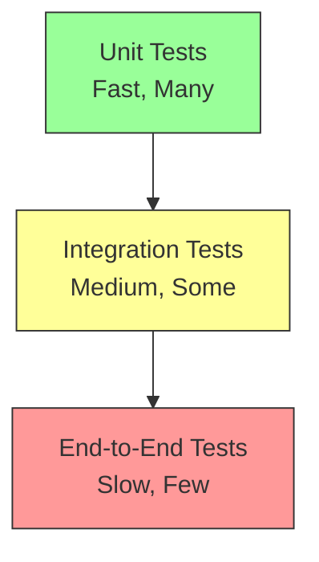

# Testing Reference

Complete guide to testing Forge agents and components.

## Table of Contents

- [Testing Strategy](#testing-strategy)
- [Unit Testing](#unit-testing)
- [Integration Testing](#integration-testing)
- [Mocking](#mocking)
- [Test Patterns](#test-patterns)
- [Best Practices](#best-practices)

---

## Testing Strategy

### Test Pyramid



**Forge Testing Approach:**

1. **Unit Tests (Most):** Individual components
2. **Integration Tests (Some):** Components working together
3. **E2E Tests (Few):** Full agent workflows

---

## Unit Testing

### Testing Tools

```go
func TestCalculator_Execute(t *testing.T) {
    calc := NewCalculator()
    
    args := map[string]interface{}{
        "operation": "add",
        "a":         5.0,
        "b":         3.0,
    }
    
    result, err := calc.Execute(context.Background(), args)
    
    assert.NoError(t, err)
    assert.Equal(t, "Result: 8", result)
}
```

### Table-Driven Tests

Recommended for testing multiple scenarios:

```go
func TestCalculator_AllOperations(t *testing.T) {
    tests := []struct {
        name      string
        operation string
        a, b      float64
        want      string
        wantErr   bool
    }{
        {
            name:      "addition",
            operation: "add",
            a:         5,
            b:         3,
            want:      "Result: 8",
            wantErr:   false,
        },
        {
            name:      "subtraction",
            operation: "subtract",
            a:         10,
            b:         4,
            want:      "Result: 6",
            wantErr:   false,
        },
        {
            name:      "division by zero",
            operation: "divide",
            a:         5,
            b:         0,
            want:      "",
            wantErr:   true,
        },
    }
    
    calc := NewCalculator()
    
    for _, tt := range tests {
        t.Run(tt.name, func(t *testing.T) {
            args := map[string]interface{}{
                "operation": tt.operation,
                "a":         tt.a,
                "b":         tt.b,
            }
            
            result, err := calc.Execute(context.Background(), args)
            
            if tt.wantErr {
                assert.Error(t, err)
            } else {
                assert.NoError(t, err)
                assert.Equal(t, tt.want, result)
            }
        })
    }
}
```

### Testing Memory

```go
func TestConversationMemory_Add(t *testing.T) {
    mem := memory.NewConversationMemory(1000)
    
    msg := message.User("Hello")
    err := mem.Add(msg)
    
    assert.NoError(t, err)
    assert.Equal(t, 1, len(mem.GetMessages()))
}

func TestConversationMemory_Prune(t *testing.T) {
    mem := memory.NewConversationMemory(100) // Small limit
    
    // Add many messages
    for i := 0; i < 50; i++ {
        mem.Add(message.User(fmt.Sprintf("Message %d", i)))
    }
    
    // Memory should have pruned automatically
    messages := mem.GetMessages()
    assert.Less(t, len(messages), 50)
}

func TestConversationMemory_PreservesSystemMessage(t *testing.T) {
    mem := memory.NewConversationMemory(100)
    
    // Add system message
    systemMsg := message.System("You are a helpful assistant")
    mem.Add(systemMsg)
    
    // Add many user messages to trigger pruning
    for i := 0; i < 50; i++ {
        mem.Add(message.User(strings.Repeat("x", 100)))
    }
    
    // System message should still be there
    messages := mem.GetMessages()
    assert.Equal(t, "system", messages[0].Role)
}
```

### Testing Tool Parameters

```go
func TestCalculator_Parameters(t *testing.T) {
    calc := NewCalculator()
    params := calc.Parameters()
    
    // Verify structure
    assert.Equal(t, "object", params["type"])
    
    // Verify properties exist
    properties := params["properties"].(map[string]interface{})
    assert.Contains(t, properties, "operation")
    assert.Contains(t, properties, "a")
    assert.Contains(t, properties, "b")
    
    // Verify required fields
    required := params["required"].([]string)
    assert.Contains(t, required, "operation")
    assert.Contains(t, required, "a")
    assert.Contains(t, required, "b")
    
    // Verify operation enum
    operation := properties["operation"].(map[string]interface{})
    enum := operation["enum"].([]string)
    assert.Contains(t, enum, "add")
    assert.Contains(t, enum, "subtract")
    assert.Contains(t, enum, "multiply")
    assert.Contains(t, enum, "divide")
}
```

---

## Integration Testing

### Testing Agent with Mock Provider

```go
func TestAgent_BasicConversation(t *testing.T) {
    // Create mock provider
    mockProvider := &MockProvider{
        responses: []string{
            "Hello! How can I help you?",
        },
    }
    
    mem := memory.NewConversationMemory(1000)
    tools := []core.Tool{
        tool.NewTaskCompletion(),
    }
    
    agent, err := core.NewAgent(mockProvider, mem, tools)
    assert.NoError(t, err)
    
    // Create mock executor
    mockExecutor := &MockExecutor{
        inputs: []string{"Hello"},
    }
    
    // Run agent
    ctx := context.Background()
    err = agent.Run(ctx, mockExecutor)
    assert.NoError(t, err)
    
    // Verify conversation
    messages := mem.GetMessages()
    assert.Greater(t, len(messages), 0)
}
```

### Testing Tool Integration

```go
func TestAgent_UsesTool(t *testing.T) {
    mockProvider := &MockProvider{
        responses: []string{
            `[I'll use the calculator]
            
<tool>
{
  "server_name": "local",
  "tool_name": "calculator",
  "arguments": {"operation": "add", "a": 5, "b": 3}
}
</tool>`,
            `The result is 8`,
        },
    }
    
    mem := memory.NewConversationMemory(1000)
    calc := NewCalculator()
    tools := []core.Tool{calc, tool.NewTaskCompletion()}
    
    agent, err := core.NewAgent(mockProvider, mem, tools)
    assert.NoError(t, err)
    
    mockExecutor := &MockExecutor{
        inputs: []string{"What is 5 + 3?"},
    }
    
    ctx := context.Background()
    err = agent.Run(ctx, mockExecutor)
    assert.NoError(t, err)
    
    // Verify tool was called
    messages := mem.GetMessages()
    hasToolResult := false
    for _, msg := range messages {
        if msg.Role == "tool" && strings.Contains(msg.Content, "calculator") {
            hasToolResult = true
            break
        }
    }
    assert.True(t, hasToolResult)
}
```

### Testing Error Recovery

```go
func TestAgent_RecoversFromToolError(t *testing.T) {
    mockProvider := &MockProvider{
        responses: []string{
            // First: Try tool (will fail)
            `<tool>
{
  "server_name": "local",
  "tool_name": "calculator",
  "arguments": {"operation": "divide", "a": 10, "b": 0}
}
</tool>`,
            // Second: See error and explain
            `[I see the division by zero error]
            
<tool>
{
  "server_name": "local",
  "tool_name": "task_completion",
  "arguments": {"result": "Division by zero is undefined"}
}
</tool>`,
        },
    }
    
    mem := memory.NewConversationMemory(1000)
    tools := []core.Tool{
        NewCalculator(),
        tool.NewTaskCompletion(),
    }
    
    agent, err := core.NewAgent(mockProvider, mem, tools)
    assert.NoError(t, err)
    
    mockExecutor := &MockExecutor{
        inputs: []string{"What is 10 / 0?"},
    }
    
    ctx := context.Background()
    err = agent.Run(ctx, mockExecutor)
    assert.NoError(t, err) // Should not error, agent recovers
    
    // Verify error was in conversation
    messages := mem.GetMessages()
    hasError := false
    for _, msg := range messages {
        if strings.Contains(msg.Content, "Error:") {
            hasError = true
            break
        }
    }
    assert.True(t, hasError)
}
```

---

## Mocking

### Mock Provider

```go
type MockProvider struct {
    responses []string
    calls     int
    mu        sync.Mutex
}

func (m *MockProvider) Complete(ctx context.Context, messages []message.Message) (*Response, error) {
    m.mu.Lock()
    defer m.mu.Unlock()
    
    if m.calls >= len(m.responses) {
        return nil, fmt.Errorf("no more mock responses")
    }
    
    response := m.responses[m.calls]
    m.calls++
    
    return &Response{
        Content: response,
    }, nil
}

func (m *MockProvider) Stream(ctx context.Context, messages []message.Message) (<-chan StreamChunk, error) {
    // Not implemented for basic tests
    return nil, fmt.Errorf("streaming not supported in mock")
}
```

### Mock Executor

```go
type MockExecutor struct {
    inputs        []string
    outputs       []string
    thinking      []string
    inputIndex    int
    mu            sync.Mutex
}

func (m *MockExecutor) GetInput(ctx context.Context, prompt string) (string, error) {
    m.mu.Lock()
    defer m.mu.Unlock()
    
    if m.inputIndex >= len(m.inputs) {
        return "", io.EOF
    }
    
    input := m.inputs[m.inputIndex]
    m.inputIndex++
    return input, nil
}

func (m *MockExecutor) DisplayOutput(ctx context.Context, content string) error {
    m.mu.Lock()
    defer m.mu.Unlock()
    
    m.outputs = append(m.outputs, content)
    return nil
}

func (m *MockExecutor) DisplayThinking(ctx context.Context, thinking string) error {
    m.mu.Lock()
    defer m.mu.Unlock()
    
    m.thinking = append(m.thinking, thinking)
    return nil
}
```

### Mock Tool

```go
type MockTool struct {
    name          string
    returnValue   string
    returnError   error
    calls         int
    lastArgs      map[string]interface{}
    mu            sync.Mutex
}

func (m *MockTool) Name() string {
    return m.name
}

func (m *MockTool) Description() string {
    return "Mock tool for testing"
}

func (m *MockTool) Parameters() map[string]interface{} {
    return map[string]interface{}{
        "type": "object",
        "properties": map[string]interface{}{
            "input": map[string]interface{}{
                "type": "string",
            },
        },
    }
}

func (m *MockTool) Execute(ctx context.Context, args map[string]interface{}) (string, error) {
    m.mu.Lock()
    defer m.mu.Unlock()
    
    m.calls++
    m.lastArgs = args
    
    if m.returnError != nil {
        return "", m.returnError
    }
    
    return m.returnValue, nil
}

func (m *MockTool) IsLoopBreaking() bool {
    return false
}

func (m *MockTool) GetCalls() int {
    m.mu.Lock()
    defer m.mu.Unlock()
    return m.calls
}
```

---

## Test Patterns

### Testing with Context Timeout

```go
func TestAgent_RespectsTimeout(t *testing.T) {
    mockProvider := &MockProvider{
        responses: []string{
            // Infinite loop - never calls task_completion
            "[Let me think...]",
            "[Still thinking...]",
            "[More thinking...]",
        },
    }
    
    mem := memory.NewConversationMemory(1000)
    tools := []core.Tool{tool.NewTaskCompletion()}
    
    agent, err := core.NewAgent(mockProvider, mem, tools)
    assert.NoError(t, err)
    
    mockExecutor := &MockExecutor{
        inputs: []string{"Hello"},
    }
    
    // Set short timeout
    ctx, cancel := context.WithTimeout(context.Background(), 100*time.Millisecond)
    defer cancel()
    
    err = agent.Run(ctx, mockExecutor)
    assert.Error(t, err)
    assert.True(t, errors.Is(err, context.DeadlineExceeded))
}
```

### Testing Concurrent Access

```go
func TestMemory_ConcurrentAccess(t *testing.T) {
    mem := memory.NewConversationMemory(10000)
    
    var wg sync.WaitGroup
    errors := make(chan error, 100)
    
    // Concurrent writes
    for i := 0; i < 50; i++ {
        wg.Add(1)
        go func(id int) {
            defer wg.Done()
            msg := message.User(fmt.Sprintf("Message %d", id))
            if err := mem.Add(msg); err != nil {
                errors <- err
            }
        }(i)
    }
    
    // Concurrent reads
    for i := 0; i < 50; i++ {
        wg.Add(1)
        go func() {
            defer wg.Done()
            _ = mem.GetMessages()
        }()
    }
    
    wg.Wait()
    close(errors)
    
    // No errors should occur
    for err := range errors {
        t.Errorf("Concurrent access error: %v", err)
    }
}
```

### Testing Tool Call Parsing

```go
func TestParseToolCall(t *testing.T) {
    tests := []struct {
        name    string
        content string
        want    *ToolCall
        wantErr bool
    }{
        {
            name: "valid tool call",
            content: `<tool>
{
  "server_name": "local",
  "tool_name": "calculator",
  "arguments": {"a": 5, "b": 3}
}
</tool>`,
            want: &ToolCall{
                ServerName: "local",
                ToolName:   "calculator",
                Arguments:  map[string]interface{}{"a": 5.0, "b": 3.0},
            },
            wantErr: false,
        },
        {
            name:    "missing tool tags",
            content: `{"tool_name": "calculator"}`,
            want:    nil,
            wantErr: true,
        },
        {
            name: "invalid JSON",
            content: `<tool>
{invalid json}
</tool>`,
            want:    nil,
            wantErr: true,
        },
    }
    
    for _, tt := range tests {
        t.Run(tt.name, func(t *testing.T) {
            got, err := ParseToolCall(tt.content)
            
            if tt.wantErr {
                assert.Error(t, err)
            } else {
                assert.NoError(t, err)
                assert.Equal(t, tt.want, got)
            }
        })
    }
}
```

---

## Best Practices

### 1. Use Table-Driven Tests

```go
// ✅ Good: Test many scenarios easily
tests := []struct{
    name string
    input string
    want string
}{
    {"case1", "input1", "output1"},
    {"case2", "input2", "output2"},
}

// ❌ Bad: Separate test for each case
func TestCase1(t *testing.T) { /* ... */ }
func TestCase2(t *testing.T) { /* ... */ }
```

### 2. Test Error Cases

```go
// ✅ Good: Test both success and error
func TestTool_Execute(t *testing.T) {
    tests := []struct{
        name    string
        args    map[string]interface{}
        wantErr bool
    }{
        {"valid", validArgs, false},
        {"invalid", invalidArgs, true},
    }
    // ...
}

// ❌ Bad: Only test happy path
func TestTool_Execute(t *testing.T) {
    result, _ := tool.Execute(ctx, args)
    assert.Equal(t, want, result)
}
```

### 3. Use Descriptive Test Names

```go
// ✅ Good: Clear what is being tested
func TestCalculator_DivisionByZero_ReturnsError(t *testing.T)

// ❌ Bad: Vague test name
func TestCalculator(t *testing.T)
```

### 4. Keep Tests Independent

```go
// ✅ Good: Each test creates its own dependencies
func TestA(t *testing.T) {
    tool := NewTool()
    // test A
}

func TestB(t *testing.T) {
    tool := NewTool()
    // test B
}

// ❌ Bad: Shared state between tests
var sharedTool = NewTool()

func TestA(t *testing.T) {
    sharedTool.DoSomething()
}

func TestB(t *testing.T) {
    sharedTool.DoSomethingElse()
}
```

### 5. Use Subtests for Organization

```go
func TestCalculator(t *testing.T) {
    calc := NewCalculator()
    
    t.Run("addition", func(t *testing.T) {
        // Test addition
    })
    
    t.Run("subtraction", func(t *testing.T) {
        // Test subtraction
    })
    
    t.Run("division", func(t *testing.T) {
        t.Run("normal", func(t *testing.T) {
            // Test normal division
        })
        
        t.Run("by_zero", func(t *testing.T) {
            // Test division by zero
        })
    })
}
```

### 6. Mock External Dependencies

```go
// ✅ Good: Mock external API
provider := &MockProvider{
    responses: []string{"response"},
}

// ❌ Bad: Call real API in tests
provider := openai.NewProvider("gpt-4", realAPIKey)
```

### 7. Test Concurrent Behavior

```go
// ✅ Good: Test thread safety
func TestMemory_ThreadSafe(t *testing.T) {
    var wg sync.WaitGroup
    for i := 0; i < 100; i++ {
        wg.Add(1)
        go func() {
            defer wg.Done()
            memory.Add(message.User("test"))
        }()
    }
    wg.Wait()
}
```

### 8. Use Assert Helpers

```go
import "github.com/stretchr/testify/assert"

// ✅ Good: Clear assertions
assert.NoError(t, err)
assert.Equal(t, expected, actual)
assert.True(t, condition)

// ❌ Bad: Manual checks
if err != nil {
    t.Errorf("unexpected error: %v", err)
}
```

---

## Running Tests

### Run All Tests

```bash
go test ./...
```

### Run Specific Package

```bash
go test ./pkg/agent
```

### Run with Coverage

```bash
go test -cover ./...
```

### Run with Verbose Output

```bash
go test -v ./...
```

### Run Specific Test

```bash
go test -run TestCalculator_Execute ./pkg/tool
```

### Run with Race Detector

```bash
go test -race ./...
```

---

## See Also

- [API Reference](api-reference.md) - Component APIs
- [How-To: Test Custom Tools](../how-to/test-tools.md) - Testing guide
- [Contributing Guide](../../CONTRIBUTING.md) - Development setup
- [Examples](../examples/) - Example implementations